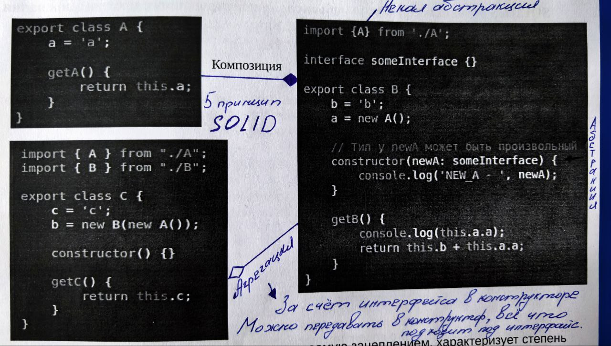

# Object oriented programming

- [Что такое ООП?](#oop)
- [Класс в ООП](#class-in-the-oop)
- [Объект в ООП](#object-in-the-oop)
- [Абстрактный класс и метод](#abstract-class)
- [Композиции, агрегирования, наследования, ассоциации](#composition-aggregation-inheritance-association)
- [Что такое сайд-эффекты?](#side-effects)
- [Принципы SOLID](#solid)

## OOP

> `Объектно-ориентированное программирование` — это парадигма, или методология, разработки, которая организует структуру программы вокруг объектов, взаимодействующих друг с другом.

> `Парадигма` — это группа идей, правил и понятий, которые определяют стиль/подход к написанию кода. Это позволяет привести его к общему виду, что облегчает разработку и чтение кода, а также помогает избежать возможных ошибок.

Основные принципы ООП включают:

- `Инкапсуляция`: Скрытие внутреннего состояния объекта и предоставление доступа к нему только через методы. Это помогает защищать данные и уменьшать зависимости.

- `Наследование`: Возможность создавать новые классы на основе существующих, унаследовав их свойства и методы. Это способствует повторному использованию кода.

- `Полиморфизм`: Способность объектов разных классов обрабатывать одни и те же команды по-разному. Это позволяет использовать единообразный интерфейс для работы с различными объектами.

[Вернуться к началу статьи](#object-oriented-programming)

---

## Class in the OOP

> `Класс` в объектно-ориентированном программировании (ООП) — это шаблон или модель, используемая для создания объектов. Он определяет свойства (атрибуты) и методы (функции), которые объекты этого класса будут иметь. Класс служит основой для создания экземпляров объектов, которые могут взаимодействовать друг с другом.

Основные компоненты класса:

- `Атрибуты`: Это переменные, которые хранят состояние объекта. Например, в классе "Автомобиль" могут быть атрибуты, такие как "цвет", "марка" и "год выпуска".

- `Методы`: Это функции, определенные внутри класса, которые определяют поведение объектов. Например, метод "поехать" может изменять местоположение автомобиля.

- `Конструктор`: Это специальный метод, который вызывается при создании нового объекта. Он обычно используется для инициализации атрибутов объекта.

- `Экземпляр (объект)`: Это конкретный объект, созданный на основе класса. Каждый экземпляр может иметь свои собственные значения атрибутов, но будет обмениваться поведением, определенным в классе.

```typescript
class Car {
	// Описание атрибутов класса
	color: string
	make: string
	year: number

	// Конструктор для инициализации объекта
	constructor(color: string, make: string, year: number) {
		this.color = color
		this.make = make
		this.year = year
	}

	// Метод класса
	drive(): void {
		console.log('The car is driving!')
	}
}

// Создание объекта класса Car
const myCar = new Car('red', 'Toyota', 2020)
myCar.drive() // Вывод: The car is driving!
```

[Вернуться к началу статьи](#object-oriented-programming)

---

## Object in the OOP

> `Объект` в объектно-ориентированном программировании (ООП) — это индивидуальная сущность, созданная на основе класса. Объекты представляют собой экземпляры класса и обладают состоянием (значениями атрибутов) и поведением (методами), определенными в классе.

> Каждый объект имеет свои уникальные данные и может взаимодействовать с другими объектами. Использование объектов позволяет разработчикам моделировать реальные вещи и концепции в коде.

Основные характеристики объектов:

- `Состояние`: Это значения атрибутов объекта, которые определяют его текущее состояние. Например, у объекта автомобиля могут быть такие атрибуты, как цвет, марка и год выпуска.

- `Поведение`: Это методы, которые описывают, что объект может делать. Например, метод "поехать" для объекта автомобиля определяет его возможность перемещения.

- `Инкапсуляция`: Объект может скрывать свои внутренние данные и предоставлять доступ к ним только через методы, что помогает защищать данные от некорректного использования.

- `Идентичность`: Каждый объект уникален, даже если он создан на основе одного и того же класса с одинаковыми значениями атрибутов.

```typescript
class Car {
	constructor(color, make, year) {
		this.color = color
		this.make = make
		this.year = year
	}

	drive() {
		console.log('The car is driving!')
	}
}

// Создание объекта на основе класса Car
const myCar = new Car('red', 'Toyota', 2020)
myCar.drive() // Вывод: The car is driving!
```

[Вернуться к началу статьи](#object-oriented-programming)

---

## Abstract class

> `Абстрактный класс` в TypeScript — это класс, который не может быть инстанцирован напрямую. Он предназначен для создания подклассов и может содержать как абстрактные, так и конкретные методы.

> `Абстрактный метод` — это метод, который не имеет реализации в абстрактном классе и должен быть реален в классах-наследниках.

```typescript
abstract class Animal {
	// Абстрактный метод, без реализации
	abstract makeSound(): string

	// Конкретный метод с реализацией
	move(): void {
		console.log('Animal is moving')
	}
}

class Dog extends Animal {
	// Реализация абстрактного метода
	makeSound(): string {
		return 'Гав!'
	}
}

class Cat extends Animal {
	// Реализация абстрактного метода
	makeSound(): string {
		return 'Мяу!'
	}
}

// Пример использования
const dog = new Dog()
const cat = new Cat()

console.log(dog.makeSound()) // Вывод: Гав!
dog.move() // Вывод: Animal is moving

console.log(cat.makeSound()) // Вывод: Мяу!
cat.move() // Вывод: Animal is moving
```

> `Статический метод` — это метод, который принадлежит самому классу, а не его экземплярам (объектам). Это означает, что его можно вызывать без создания экземпляра класса. Статические методы обычно используются для утилитарных функций, которые не требуют состояния объекта.

```typescript
class MathUtils {
	// Статический метод
	static add(a: number, b: number): number {
		return a + b
	}

	// Статический метод
	static multiply(a: number, b: number): number {
		return a * b
	}
}

// Пример использования
const sum = MathUtils.add(5, 10)
const product = MathUtils.multiply(5, 10)

console.log(`Сумма: ${sum}`) // Вывод: Сумма: 15
console.log(`Произведение: ${product}`) // Вывод: Произведение: 50
```

[Вернуться к началу статьи](#object-oriented-programming)

---

## Composition, aggregation, inheritance, association

> Отношения между классами в объектно-ориентированном программировании можно разделить на несколько основных типов: композицию, агрегацию, наследование и ассоциацию.

1. `Наследование`

- Наследование — это механизм, позволяющий одному классу (подклассу) наследовать свойства и методы другого класса (суперкласса).
- Особенности:
  - Используется для создания иерархий классов.
  - Подкласс может иметь дополнительные свойства и методы, которые отсутствуют в суперклассе.
  - Позволяет переопределять методы суперкласса, обеспечивая различное поведение.
  - Поддерживает принцип «переиспользования кода».

2. `Композиция`

- Композиция - это тип отношений при котором один объект может принадлежать только
  другому объекту и никому другому. При композиции образуется сильная связь между
  объектами.
- Особенности:
  - Если содержащий объект уничтожается, все его компоненты также уничтожаются.
  - Строгое отношение, чаще всего применяется, когда части не могут существовать без целого.
  - Обеспечивает высокий уровень связанности между классами.

```typescript
export class A {
	a = 'a'

	getA() {
		return this.a
	}
}

////////////////////////// композиция //////////////////////////

import { A } from './a' // Некая абстракция 5 принцип SOLID

export class B {
	b = 'b'
	a = new A()

	constructor() {}

	getB() {
		return this.b + this.a.a
	}
}
```

3. `Агрегация`

- Агрегация - это тип отношений, когда один объект является частью другого. Агрегация
  образует слабую связь между объектами. Все зависимые классы инициализирующий вне
  основного объекта.
- Особенности:
  - Если агрегирующий объект уничтожается, его части могут продолжать существовать.
  - Более слабая связь между классами по сравнению с композицией.

```typescript
import { A } from './a'

interface SomeInterface {}

export class B {
	b = 'b'
	a = new A()

	// За счет интерфейса в конструкторе, мы можем передавать туда всё, что подходит под данный интерфейс.
	constructor(newA: SomeInterface) {} // интерфейс - это некая абстракция

	getB() {
		return this.b + this.a.a
	}
}

////////////////////////// агрегация //////////////////////////

import { A } from './a'
import { B } from './b'

export class C {
	c = 'c'
	b = new B(new A())

	getC() {
		return this.c + this.b
	}
}
```

4. `Ассоциация`

- Ассоциация - это такой тип, при котором объекты будут ссылаться друг на друга. При этом
  они остаются полностью независимыми друг от друга.
- Особенности:
  - Может быть однонаправленной или двунаправленной.
  - Указывает на наличие связи между объектами, но не подразумевает владения.
  - Уровень связанности может варьироваться от слабой до сильной.



> В объектно-ориентированном программировании (ООП) `композиция` и `наследование` — это два различных подхода к организации иерархий классов и связей между объектами.

1. Определение:

- `Наследование` (Inheritance): Позволяет создать новый класс на основе существующего, наследуя его свойства и методы. Новый класс называется производным (или подклассом), а класс, от которого он наследует, — базовым (или супер-классом).

- `Композиция` (Composition): Позволяет создавать сложные объекты путем объединения нескольких объектов, используя их функциональность. В этом случае один объект содержит ссылки на другие объекты и делегирует выполнение определенных задач.

2. Степень связанности:

- `Наследование` подразумевает более сильную связанность между классами. Подкласс зависит от реализации суперкласса.

- `Композиция` более гибкая, так как отношения между объектами можно легко менять, не затрагивая саму структуру этих объектов.

3. Изменяемость:

- `Наследование` может привести к проблемам при изменении базового класса, так как это может повлиять на все подклассы.

- `Композиция` позволяет более легко изменять или заменять компоненты без сильного влияния на остальную часть программы.

4. Переиспользование кода:

- `Наследование` предоставляет возможность переиспользования кода, но может вести к избыточной сложности, особенно при глубокой иерархии классов.

- `Композиция` позволяет использовать разные объекты, что способствует более модульной архитектуре приложения и облегчает тестирование.

[Вернуться к началу статьи](#object-oriented-programming)

---

## Side effects

> `Сайд-эффекты` (или побочные эффекты) в программировании, в том числе в объектно-ориентированном программировании (ООП), — это изменения состояния или взаимодействия с внешними системами, которые происходят в результате выполнения функции или метода, помимо возврата значения. Сайд-эффекты могут влиять на поведение программы и сложность ее тестирования и сопровождения.

Примеры сайд-эффектов:

- `Изменение состояния объекта`: Если метод изменяет внутренние поля объекта (например, устанавливает значение атрибутов), это считается сайд-эффектом.

- `Вывод данных`: Если метод выводит данные на экран или записывает их в файл, это также является сайд-эффектом, так как он влияет на внешнее состояние.

- `Изменение глобальных переменных`: Если метод изменяет глобальные переменные, это может привести к неожиданным последствиям в других частях программы.

- `Взаимодействие с внешними системами`: Вызов услуги API, совершение действий с базой данных или взаимодействие с пользователем могут вызывать сайд-эффекты.

Для чего важно учитывать сайд-эффекты:

- `Прогнозируемость и понимание кода`: Если методы имеют побочные эффекты, их поведение может быть менее предсказуемым. Это может затруднить понимание того, что происходит в коде.

- `Тестирование`: Методы с сайд-эффектами сложнее тестировать, так как необходимо учитывать влияние этих изменений на систему в целом. Это делает юнит-тестирование более сложным.

- `Управление состоянием`: Сайд-эффекты могут привести к неявному изменению состояния, что затрудняет отладку и управление состоянием приложения.

- `Чистота функции`: В функциональном программировании предпочтительно избегать сайд-эффектов и создавать "чистые" функции, которые возвращают значения только на основе входных данных, а не изменяют состояние. Это помогает сделать код более понятным и предсказуемым.

> `Мутации` в объектно-ориентированном программировании (ООП) считаются сайд-эффектом. Когда мы говорим о мутации, мы имеем в виду изменения внутреннего состояния объекта, такие как изменение значений его свойств или атрибутов. Когда вы изменяете состояние объекта, это может привести к неожиданным последствиям в других частях программы.

```typescript
class Counter {
	private count: number

	constructor(initialCount: number) {
		this.count = initialCount
	}

	public increment() {
		this.count++ // Это мутация и сайд-эффект
	}

	public getCount(): number {
		return this.count
	}
}

// Пример использования
const counter = new Counter(0)
console.log(counter.getCount()) // 0

counter.increment() // Изменение состояния объекта
console.log(counter.getCount()) // 1
```

[Вернуться к началу статьи](#object-oriented-programming)

---

## SOLID

> Принципы `SOLID` — это набор пяти основных принципов объектно-ориентированного проектирования, которые помогают разработчикам создавать гибкие, поддерживаемые и надежные программные системы. Каждая буква в акрониме SOLID обозначает определенный принцип

1. `S — Single Responsibility Principle (SRP)`: Принцип единственной ответственности. Каждый класс должен иметь лишь одну причину для изменения, то есть выполнять только одну задачу.

2. `O — Open/Closed Principle (OCP)`: Принцип открытости/закрытости. Сущности программы (классы, модули и функции) должны быть открыты для расширения, но закрыты для изменения. Это значит, что можно добавлять новый функционал, не меняя уже существующий код.

3. `L — Liskov Substitution Principle (LSP)`: Принцип подстановки Лисков. Объекты подкласса должны быть заменяемы объектами суперкласса без изменения желаемых свойств программы (правильности выполнения программы).

4. `I — Interface Segregation Principle (ISP)`: Принцип разделения интерфейса. Крупные интерфейсы следует разбивать на более мелкие и специфичные, чтобы клиенты не были вынуждены зависеть от методов, которые они не используют.

5. `D — Dependency Inversion Principle (DIP)`: Принцип инверсии зависимостей. Модули верхнего уровня не должны зависеть от модулей нижнего уровня. Оба должны зависеть от абстракций (например, интерфейсов). Абстракции не должны зависеть от деталей; детали должны зависеть от абстракций.

[Вернуться к началу статьи](#object-oriented-programming)

---
