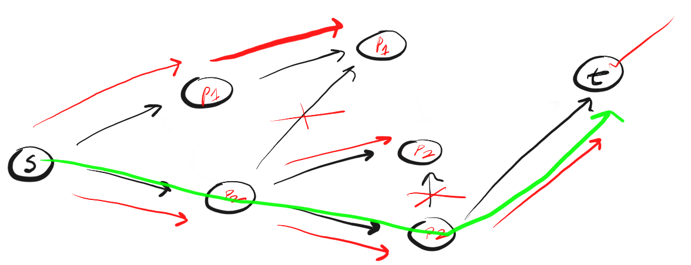

# Algorithms

`Обход графа` - это переход от одной его вершины к другой в поисках свойств связей этих вершин. 
Связи (линии, соединяющие вершины) называются направлениями, путями, гранями или ребрами графа. 
Вершины графа также именуются узлами.
Двумя основными алгоритмами обхода графа являются поиск в глубину (Depth-First Search, DFS) и поиск в ширину (Breadth-First Search, BFS).

- `O-большое - количество выполненных операций`
- `V - количество вершин`
- `Е - количество ребер`

### `Поиск числа в массиве`
Все алгоритмы поиска делятся на:
 - поиск в неупорядоченном множестве данных;
 - поиск в упорядоченном множестве данных.

`Линейный или последовательный поиск` – простейший алгоритм поиска. 
По сути, это метод полного перебора, он уступает другим алгоритмам. 
Алгоритм ищет элемент в заданной структуре данных, пока не достигнет конца структуры. 
При нахождении элемента возвращается его позиция. Если элемент не найден, возвращаем -1. 
Временная сложность линейного поиска равна O(N).

### `Сортировка массива пузырьком`
Алгоритм сортировки `“пузырьком”` состоит в повторении проходов по массиву с помощью вложенных циклов. 
При каждом проходе по массиву сравниваются между собой пары “соседних” элементов. 
Если числа какой-то из сравниваемых пар расположены в неправильном порядке – происходит обмен (перезапись) значений ячеек массива.

### `Поиск в глубину и ширину`

- Поиск в глубину `DFS`. Двигаемся по определенному пути до конца. 
Если конец пути — это искомая вершина, мы закончили. 
Если нет, возвращаемся назад и двигаемся по другому пути до тех пор, пока не исследуем все варианты. 
Мы следуем этому алгоритму применительно к каждой посещенной вершине. 
Необходимость многократного повторения процедуры указывает на необходимость использования рекурсии для реализации алгоритма.

> 

- Поиск в ширину BFS. 
Cледует концепции «расширяйся, поднимаясь на высоту птичьего полета» («go wide, bird’s eye-view»). 
Вместо того чтобы двигаться по определенному пути до конца, BFS предполагает движение вперед по одному соседу за раз. 
Вместо следования по пути, BFS подразумевает посещение ближайших к s соседей за одно действие (шаг), затем посещение соседей соседей и так до тех пор, пока не будет обнаружено еще.
  
Поиск в ширину BFS определяет:
1. Существует ли путь от узла `А` до узла `B`.
2. Ищет кратчайший путь.

> 

> Чем DFS(глубина) отличается от BFS(ширина)? Мне нравится думать, что DFS идет напролом, а BFS не торопится, а изучает все в пределах одного шага.

Поиск в глубину и поиск в ширину используются для обхода графа. 
`DFS` двигается по граням туда и обратно, а BFS распространяется по соседям в поисках цели. 
`DFS` использует стек, а `BFS` — очередь.  
Время выполнения обоих составляет `O(V + E)`, а пространственная сложность — `O(V)`. 
Данные алгоритмы имеют разную философию, но одинаково важны для работы с графами

### `Oбход деревьев разных типов`
Делается путем поиск в глубину и ширину.
`Бинарный поиск` - ищет от центра(середины), потом от середины оставшегося и так далее(исключается половина).

### `Нахождение пути в графе`
Делается путем поиск в глубину и ширину.
Алгоритм Дейкстры(поиск быстрейшего пути). Алгоритм дает вес графам. 
- `Дейкстры` - взвешенный граф(быстрый маршрут)
- `BFS(ширина)` - не взвешенный граф(короткий маршрут)

### `Рекурсивный спуск`
Метод, который вызывает себя для каждой вершины (грани - стрелка(абстракция)).
Бинарное дерево — дерево в котором не более двух граней для вершин.

### `Численные методов`
Методы решения математических задач в численном виде.
Решение систем линейных уравнений;
- интерполирование и приближённое вычисление функций;
- численное интегрирование;
- численное решение системы нелинейных уравнений;
- численное решение обыкновенных дифференциальных уравнений;
- численное решение уравнений в частных производных (уравнений математической физики);
- решение задач оптимизации.

### `NP-полные и NP-трудные задачи и подходы к их решению`
Задача называется `NP-трудной` если каждая задача из `NP` полиномиальное сводится к ней.
В классе NP выделяются `NP-полные` задачи. Задача называется `NP-полной`, если она входит в `NP` и каждая задача из `NP` полиномиально сводится к ней. 
`NP-полные` задачи понимаются как самые трудные задачи из класса NP.
Существуют две общие категории подходов к проблеме отыскания приемлемого алгоритма решения `NP-полной` задачи.

-  `Решение не идеальное, а лучшее`

[Вернуться к началу статьи](#algorithms)

