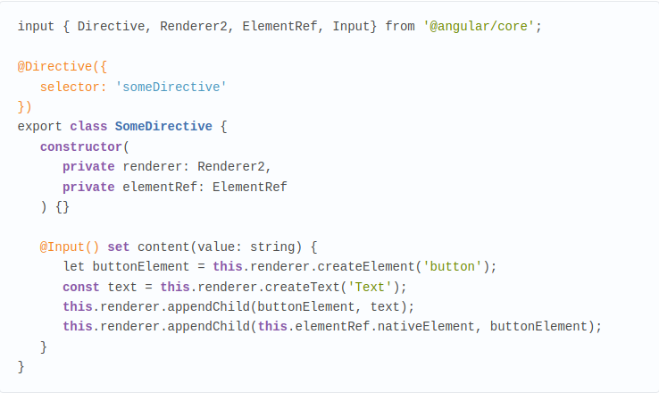
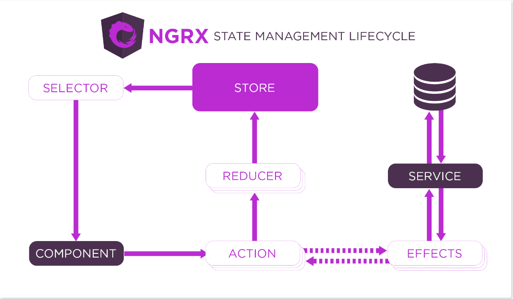

# Angular

- [Что такое Angular?](#angular)
- [Директивы. Типы директив](#directives-types-of-directives)
- [Cпособы привязки данных в Angular. Data Binding](#data-binding)
- [Директивы Input(), Output()](#directives-input-output)
- [Пайпы](#pipes)
- [Life cycle hooks](#life-cycle-hooks)
- [Сервисы](#services-in-angular)
- [Модульность в Angular](#modules-in-angular-lazy-loading)
- [Observable. Отличия от Promise.](#observable-vs-promise)
- [Динамические элементы](#dynamic-elements)
- [Subject и его разновидности. Schedulers](#subject-schedulers)
- [Dependency Injection](#dependency-injection)
- [Маршрутизация в Angular](#routing-in-angular)
- [Директивы ng-template, ngTemplateOutlet, ng-container, ng-content](#ng-template-ngtemplateoutlet-ng-container-ng-content)
- [Организация шаринга данных. NgRx](#organization-of-data-sharing)
- [Redux/Flux pattern](#redux-flux-pattern)
- [Observer pattern](#observer-pattern)
- [Сборка в Angular](#assembly-in-angular)
- [Virtual DOM](#virtual-dom)
- [Опция trackBy](#trackby)
- [Reactive Forms в Angular](#reactive-forms-angular)

### **`Angular`**
> Angular - это открытая платформа для разработки веб-приложений, созданная компанией Google. Она позволяет разработчикам создавать динамические одностраничные приложения (SPA) с использованием HTML, CSS и JavaScript. Angular предоставляет множество инструментов и функций, таких как двустороннее связывание данных, инъекция зависимостей, маршрутизация и многие другие, что делает процесс разработки более эффективным и продуктивным.

#### Что такое Angular CLI?
> Angular CLI `Command Line Interface` - это инструмент командной строки, предоставляемый Angular, который упрощает и автоматизирует процесс создания, развертывания и тестирования приложений Angular. Он позволяет разработчикам создавать новые проекты, компоненты, сервисы, директивы и многое другое, используя простые команды в терминале. Кроме того, Angular CLI предоставляет мощные инструменты для сборки и оптимизации приложений, включая функции, такие как автоматическая минификация и сжатие файлов, анализ размера бандла и многое другое. Это существенно упрощает процесс разработки и повышает производительность.

#### Команды Angular CLI выполняют следующие действия:
- `ng new` - создает новый проект Angular с настройками по умолчанию в указанной директории. Например, ng new my-app создаст новый проект Angular в директории my-app.
- `ng generate` - создает новый компонент, сервис, директиву или другой элемент приложения Angular. Например, ng generate component my-component создаст новый компонент с именем my-component.
- `ng serve` - запускает локальный сервер разработки, который автоматически перезагружает приложение при изменении кода. Приложение будет доступно по адресу `http://localhost:4200`.
- `ng build` - собирает приложение Angular в оптимизированные файлы JavaScript, CSS и HTML, которые можно развернуть на сервере. Например, ng build --prod соберет приложение в режиме продакшена.

> Каждая из этих команд имеет множество опций и флагов для настройки поведения. Вы можете узнать больше о командах Angular CLI, запустив команду ng help в терминале.

#### Что такое компонент? Как объявляется?
> Компоненты в Angular - это основные строительные блоки веб-приложений, которые позволяют разбить интерфейс на небольшие, независимые и переиспользуемые части. Каждый компонент содержит свой собственный шаблон (HTML), стили (CSS) и логику (TypeScript). Компоненты позволяют создавать модульные приложения, которые могут быть легко поддерживаемы и масштабируемы.

> Для объявления компонента в Angular, необходимо создать класс TypeScript, который определяет логику компонента, и декоратор @Component, который содержит метаданные компонента, такие как селектор, шаблон, стили и другие свойства. Например, вот простой компонент Angular:
```typescript
    import { Component } from '@angular/core';
    
    @Component({
      selector: 'app-hello-world',
      template: '<h1>Hello World!</h1>',
      styles: ['h1 { color: red; }']
    })
    export class HelloWorldComponent {}
```
#### Для чего нужны:
- `selector` - это свойство компонента в Angular, которое определяет селектор CSS, который будет использоваться для выбора элемента DOM, который будет заменен компонентом. Этот селектор может быть использован в HTML-разметке для создания экземпляра компонента.
- `template/templateUrl` - это свойство компонента в Angular, которое определяет шаблон, который будет использоваться для отображения компонента. `template` содержит сам шаблон в виде строки, а templateUrl содержит ссылку на файл шаблона. Шаблон определяет структуру и содержание компонента.
- `styles/styleUrls` - это свойство компонента в Angular, которое определяет стили, которые будут применены к компоненту. styles содержит стили в виде строки, а styleUrls содержит ссылки на файлы со стилями. Стили могут быть применены к компоненту, чтобы изменить его внешний вид.
- `providers` - это свойство компонента в Angular, которое определяет список провайдеров зависимостей, которые будут использоваться в компоненте. Провайдеры могут быть использованы для внедрения зависимостей в компонент, таких как сервисы или другие компоненты.
- `changeDetection` - это свойство компонента в Angular, которое определяет, как Angular будет обнаруживать изменения в компоненте. Это свойство определяет стратегию обнаружения изменений, которая может быть `OnPush`, `Default` или `Manual`. Стратегия `OnPush` означает, что Angular будет обнаруживать изменения только тогда, когда входные данные компонента изменятся, а `Default` означает, что Angular будет обнаруживать изменения при любом изменении в компоненте. Стратегия Manual означает, что обнаружение изменений будет происходить только вручную с помощью метода `detectChanges()`.

#### Что такое модуль? Как объявляется?
> Модуль в Angular - это логическая группа компонентов, директив, сервисов и других функциональных элементов, которые работают вместе для выполнения определенной задачи в приложении.

> Модуль объявляется с помощью декоратора `@NgModule`. Этот декоратор принимает объект, который определяет метаданные модуля, такие как его имя, импортированные модули, объявленные компоненты, директивы и сервисы.

```typescript
    import { NgModule } from '@angular/core';
    import { BrowserModule } from '@angular/platform-browser';
    import { AppComponent } from './app.component';
    
    @NgModule({
      imports: [BrowserModule],
      declarations: [AppComponent],
      bootstrap: [AppComponent]
    })
    export class AppModule { }
```

#### Свойства модуля в Angular, которые определяют различные аспекты приложения:
- `imports` : это свойство определяет список модулей, которые будут импортированы в текущий модуль. Это позволяет использовать функциональность других модулей в текущем модуле.
- `declarations` : это свойство определяет список компонентов, директив которые будут использоваться в текущем модуле. Это позволяет Angular знать о компонентах, которые должны быть доступны в текущем модуле.
- `entryComponents` : это свойство определяет список компонентов, которые должны быть созданы динамически. Это используется, когда компонент создается программно вместо того, чтобы быть включенным в шаблон.
- `schemas` : это свойство определяет схему, используемую для проверки шаблона компонента. Схема может быть `NO_ERRORS_SCHEMA`, которая отключает проверку схемы, или `CUSTOM_ELEMENTS_SCHEMA`, которая позволяет использовать пользовательские элементы в шаблоне.
- `providers` : это свойство определяет список сервисов, которые будут доступны в текущем модуле. Это позволяет использовать сервисы в компонентах и других сервисах в текущем модуле.
- `forRoot` : это метод, который используется для настройки модуля, который может быть импортирован в другие модули. Это позволяет передавать конфигурационные данные и сервисы в модуль при его импорте в другие модули. Например, `RouterModule.forRoot(routes)` используется для настройки маршрутизации в приложении.

[Вернуться к началу статьи](#angular)

---

### Directives. Types of directives
Директивы используются для изменения внешнего вида или поведения элемента DOM.
Директива представляет класс с директивными метаданными. В TypeScript для прикрепления метаданных к классу применяется декоратор `@Directive`.
В Angular есть три типа директив:
- `Компоненты`: компонент по сути также является директивой, а декоратор `@Component` расширяет возможности декоратора `@Directive` с помощью добавления функционала по работе с шаблонами.
- `Собственные`: Директива - это обычный класс на TS, к которому применяется декоратор Directive, соответственно нам надо импортировать эту директиву из "angular/core". При применении декоратора @Directive необходимо определить селектор CSS, с которым будет ассоциирована директива. Селектор CSS для атрибута должен определяться в квадратных скобках. Надо подключить директиву в AppModule.
- `Структурные`: они изменяют структуру DOM с помощью добавления, изменения или удаления элементов html. Например, это директивы `ngFor` и `ngIf`.
Директива `ngIf` позволяет удалить или, наоборот, добавить элемент при определенном условии.
Директива `ngFor` позволяет перебрать в шаблоне элементы массива.
С помощью директивы `ngSwitch` можно встроить в шаблон конструкцию `switch..case` и в зависимости от ее результата выполнения выводить тот или иной блок.
```HTML
  <div [ngSwitch]="car">
    <p *ngSwitchCase="'Audi'">This is Audi</p>
    <p *ngSwitchCase="'BMW'">This is BMW</p>
    <p *ngSwitchCase="'Mercedes'">This is Mercedes</p>
  </div>
```
- `Атрибутивные`: они изменяют поведение уже существующего элемента, к которому они применяются. Например, `ngModel`, `ngStyle`, `ngClass`.
Директива `ngClass позволяет определить набор классов, которые будут применяться к элементу. В качестве значения она принимает набор классов в следующем виде:
```HTML
  <div [ngClass]="{'label': true}">Some text</div>
  <div [ngClass]="['label', 'label-small']">Some text</div>
```
Директива `ngStyle` позволяет задать набор стилей, которые применяются к элементу. В качестве значения директива принимает js-объект, в котором ключи - названия свойств CSS.
```HTML
  <div [ngStyle]="elementStyles">Some text</div>
  <div [ngStyle]="{color: 5 < 10 ? 'green' ? 'red' }">Some text</div>
```

[Вернуться к началу статьи](#angular)

---

### Data Binding
Angular поддерживает механизм привязки, благодаря которому различные части шаблона могут быть привязаны к некоторым значениям, определенным в компоненте.
В Angular есть четыре формы привязки данных:
- `Интерполяция`: привязка элемента DOM к значению компонента (односторонняя). В двойных фигурных скобках указывается выражение, к которому идет привязка:
```HTML 
  {{ выражение }} 
  <p>Hello, {{name}}</p>
  <p>{{'Hello,' + name}}</p>
```
- `Атрибуты`: привязка свойства элемента DOM к значению компонента (односторонняя).
```HTML
  <td [attr.colspan]="2 + 1">Table Cell Content</td>
  <p [class]="classes">Some text.</p>
  <div [style.width.%]="isHalf ? 50 : 100">Some text.</p>
```
- `Шаблонные переменные`: шаблонной переменной называется ссылка на HTML-элемент, директиву или компонент в пределах текущего представления. Инициализация и использование такой переменной осуществляется прямо в шаблоне. Объявление шаблонной переменной начинается с символа #.
```HTML
  <input type="text" #name />
  <p>Name: {{name.value}}</p>
```
- `Обработка событий`. Привязка метода компонента к событию в DOM (генерация события в DOM вызывает метод на компоненте)(односторонняя). Наиболее распространенные события:
  - click - нажатие кнопки мыши;
  - mouseover / mouseout - наведение/уход курсора мыши на/с элемента;
  - change - изменение состояние элемента, применяется к полям формы;
  - focus / blur - элемента получает / теряет фокус;
  - keydown / keyup - возникает, когда нажимается / отпускается клавиша. Для отслеживания нажатия Enter используется (keyup.enter).
```HTML
  <button (click)="showContacts()">Show Contacts List</button>
  <button on-click="showContacts()">Show Contacts List</button>
```
- `Двусторонняя привязка`: когда элемент DOM привязан к значению на компоненте, при этом изменения на одном конце привязки сразу приводят к изменениям на другом конце.
```HTML
  <contacts-item [(name)] = "contactPerson"></contacts-item>
  Запись [(name)] = "contactPerson" означает, что при изменении name в компоненте <contacts-item> его значение будет присвоено свойству contactPerson компонента, в который входит <contacts-item>.
  <input type="text" [(ngModel)]="contactPerson">
  При изменении поля его значение помещается в свойство contactPerson. [(NgModel)] находится в FormsModule, поэтому перед тем, как ее использовать, импортируйте FormsModule библиотеки @angular/forms.
```

[Вернуться к началу статьи](#angular)

---

### Directives Input, Output.
В Angular компоненты могут взаимодействовать друг с другом с помощью `Input()` и `Output()` свойств.
> Input свойство позволяет передавать данные из родительского компонента в дочерний компонент. Для этого в дочернем компоненте нужно определить свойство с помощью декоратора `@Input()`. Затем в родительском компоненте можно передать значение в это свойство, используя синтаксис привязки данных `[property]="value"`.
```typescript
    // Дочерний компонент
    import { Component, Input } from '@angular/core';
    
    @Component({
      selector: 'app-child',
      template: '<p>{{ message }}</p>'
    })
    export class ChildComponent {
      @Input() message: string;
    }
    
    // Родительский компонент
    import { Component } from '@angular/core';
    
    @Component({
      selector: 'app-parent',
      template: '<app-child [message]="parentMessage"></app-child>'
    })
    export class ParentComponent {
      parentMessage = 'Hello from parent';
    }
    // В этом примере мы передаем значение parentMessage из родительского компонента в свойство message дочернего компонента ChildComponent.
```
> Output свойство позволяет передавать данные из дочернего компонента в родительский компонент. Для этого в дочернем компоненте нужно определить событие с помощью декоратора `@Output()`. Затем в дочернем компоненте можно вызвать это событие, используя метод `emit()` и передавая данные в качестве аргумента. В родительском компоненте можно подписаться на это событие, используя синтаксис событий `(event)="handler($event)"`. Например:
```typescript
    // Дочерний компонент
    import { Component, EventEmitter, Output } from '@angular/core';
    
    @Component({
      selector: 'app-child',
      template: '<button (click)="sendMessage()">Send message</button>'
    })
    export class ChildComponent {
      @Output() messageEvent = new EventEmitter<string>();
    
      sendMessage() {
        this.messageEvent.emit('Hello from child');
      }
    }
    
    // Родительский компонент
    import { Component } from '@angular/core';
    
    @Component({
      selector: 'app-parent',
      template: '<app-child (messageEvent)="receiveMessage($event)"></app-child><p>{{ message }}</p>'
    })
    export class ParentComponent {
      message: string;
    
      receiveMessage($event) {
        this.message = $event;
      }
    }
    // В этом примере мы создаем событие messageEvent в дочернем компоненте ChildComponent и вызываем его при нажатии на кнопку. Затем в родительском компоненте ParentComponent мы подписываемся на это событие и обрабатываем полученные данные в методе receiveMessage().
```

[Вернуться к началу статьи](#angular)

---

### Pipes
Фильтры позволяют провести некоторую предобработку перед выводом данных на страницу, например, отсортировать или как-то изменить набор данных.
Общий способ использования фильтров: `{{expression | filter}}`
Используя фильтры lowercase и uppercase, мы можем приводить содержимое к нижнему и верхнему регистру соответственно.
Наиболее часто используемые:
  - date - преобразование даты;
  - number - преобразование числа;
  - uppercase / lowercase - приведение строкового значения в верхний / нижний регистр;
  - slice - используется для ограничения вывода информации, в качестве параметров принимает начало и конец интервала отображаемых данных, применяется совместно с директивой *ngFor.
  - currency - форматирование валюты
  - orderBy упорядочивает набор объектов по определенному свойству
```HTML
  <p>Transformed date: {{exampleDate | date : 'dd.MM.yyyy'}}</p>
  <p *ngFor="let user of list | slice : 0 : 1">{{user}}</p>
```
К одному значению допустимо применение нескольких фильтров.
```HTML 
  {{someString | pipe1 | pipe2 | pipe3 | ... }}
```
Angular позволяет создавать свои собственные пайпы.

[Вернуться к началу статьи](#angular)

---

### Life cycle hooks
 - `ngOnChanges`: вызывается до метода ngOnInit() при начальной установке свойств, которые связаны механизмом привязки, а также при любой их переустановке или изменении их значений. Данный метод в качестве параметра принимает объект класса SimpleChanges, который содержит предыдущие и текущие значения свойства.
 - `ngOnInit`: вызывается один раз после установки свойств компонента, которые участвуют в привязке. Выполняет инициализацию компонента.
 - `ngDoCheck`: вызывается при каждой проверке изменений свойств компонента сразу после методов ngOnChanges и ngOnInit
 - `ngAfterContentInit`: вызывается один раз после метода ngDoCheck() после вставки содержимого в представление компонента кода html
 - `ngAfterContentChecked`: вызывается фреймворком Angular при проверке изменений содержимого, которое добавляется в представление компонента. Вызывается после метода ngAfterContentInit() и после каждого последующего вызова метода ngDoCheck().
 - `ngAfterViewInit`: вызывается фреймворком Angular после инициализации представления компонента, а также представлений дочерних компонентов. Вызывается только один раз сразу после первого вызова метода ngAfterContentChecked()
 - `ngAfterViewChecked`: вызывается фреймворком Angular после проверки на изменения в представлении компонента, а также проверки представлений дочерних компонентов. Вызывается после первого вызова метода ngAfterViewInit() и после каждого последующего вызова ngAfterContentChecked()
 - `ngOnDestroy`: вызывается перед тем, как фреймворк Angular удалит компонент.
Каждый такой метод определен в отдельном интерфейсе, который называется по имени метода без префикса "ng".

[Вернуться к началу статьи](#angular)

---

### Services in Angular
Сервис — это класс, который используется для хранения состояния приложения или иных данных, которые в последующем могут быть использованы компонентами, директивами или другими сервисами. Объявлению класса сервиса предшествует декоратор `@Injectable()`.
Angular сервисы существуют в приложении в пределах свой области видимости в единственном экземпляре, что позволяет использовать их для взаимодействия компонентов и длительного хранения данных.

[Вернуться к началу статьи](#angular)

---

### Modules in Angular. Lazy loading.
Angular модуль представляет собой класс, который предваряется декоратором `@NgModule()` и используется для конфигурации Injector организации взаимосвязанных компонентов, директив и фильтров.
Angular приложение имеет модульную архитектуру и состоит, по крайней мере, из одного корневого модуля, который отвечает за загрузку приложения.
В больших и сложных приложениях модули используются для структурирования кода по определенному признаку. Так, по назначению модуль может быть:
 - корневой;
 - функциональный;
 - маршрутизации;
 - поставки сервисов и других внешних зависимостей.

`Ленивая загрузка (Lazy loading)` - это техника, при которой вы загружаете часть веб-страницы в более поздний момент времени, когда эта часть действительно необходима.
Первое, что вам нужно сделать, прежде чем реализовывать ленивую загрузку, это найти и разделить приложения на более мелкие модули. Убедитесь, что в основной модуль добавлен только необходимый функционал, а затем разместите остальные части приложения в его внутренних модулях.

[Вернуться к началу статьи](#angular)

---

### Observable vs promise.
`Promise` выполниться всегда(с ошибкой или успешно).
`Observable` — на него нужно обязательно подписаться.
`Observable` предпочтительнее `Promise`, поскольку он включает в себя функции Promise и имеет больший функционал. С Observable не имеет значения, хотите ли вы обрабатывать 0, 1 или несколько событий. Вы можете использовать один и тот же API. Observable также имеет преимущество перед Promise в том, что запрос может быть отменен. Если результат HTTP-запроса на сервер или какая-либо другая дорогостоящая асинхронная операция больше не требуется, Observable позволяет отменить подписку, а Promise в конечном итоге вызовет успешный или неудачный обратный вызов даже если результат вам уже не требуется.

[Вернуться к началу статьи](#angular)

---

### Dynamic elements
Вместо прямой работы с DOM-элементом Angular предоставляет следующие абстракции — `Renderer, TemplateRef, ElementRef и ViewContainerRef`. С помощью них можно создавать динамический контент.

#### Renderer
Используется в основном для манипуляций над уже существующими элементами, например для изменения стилей элемента, атрибутов и параметров элемента.
Методы Renderer:
 - Позволяет создать элемент DOM и опционально указать для него пространство имен.
```typescript
  createElement(name: string, namespace?: string): any

  let inputElement = this.renderer.createElement('input');
```
 - Используются для вставки/удаления созданных или существующих элементов в DOM.
```typescript
  appendChild(parent: any, newChild: any): void
  insertBefore(parent: any, newChild: any, refChild: any): void
  removeChild(parent: any, oldChild: any): void

  let inputElement = this.renderer.createElement('input');
  this.renderer.appendChild(parent, inputElement);
```
 - Используются для изменения атрибутов или параметров DOM-элемента, например, для установки значения checkbox.
```typescript
  setAttribute(el: any, name: string, value: string, namespace?: string): void
  removeAttribute(el: any, name: string, namespace?: string): void
  setProperty(el: any, name: string, value: any): void

  this.renderer.setAttribute(inputElement, 'value', 'Hello from renderer'); this.renderer.setProperty(inputElement, 'checked', true);
```
 - Создает текстовый DOM-элемент, который можно добавит как дочерний в нужный элемент.
```typescript
  createText(value: string): any

  let buttonElement = this.renderer.createElement('button');
  const text = this.renderer.createText('Text');
  this.renderer.appendChild(buttonElement, text);
```
- Устанавливает или удаляет класс для DOM-элемента.
```TypeScript
  addClass(el: any, name: string): void
  removeClass(el: any, name: string): void

  this.renderer.addClass(buttonElement, 'btn-large');
```
Это далеко не все, что предоставляет Renderer, но, даже используя указанные методы уже можно динамически создавать и изменять элементы DOM.

#### Доступ к элементу через DI
Данный способ довольно часто используется при создании собственных директив. Для того чтобы получить доступ к элементу (контейнеру) директивы, надо добавить в конструктор директивы приватную переменную с типом `ElementRef`.
> 

Для поиска элементов в DOM ангуляр предоставляет ряд декораторов — `@ViewChild/@ViewChildren` и `@ViewChildren/@ContentChildren`. Директива @ViewChild отличается от @ViewChildren тем, что первая всегда вернет вам только один элемент, в то время как вторая позволяет вам находить несколько элементов, возвращая вам объект типа `QueryList`.

`QueryList` представляет из себя итерируемый интерфейс, а также позволяет подписываться на изменение элементов через механизм Observable. Декораторы @ViewChildren и @ContentChildren необходимо использовать в обработчике ngAfterViewInit жизненного цикла компонента, так как раньше QuryList просто будет не определен.

Пара директив @ViewChildren/@ContentChildren ведет себя аналогичным образом и отличается от связки @ViewChild/@ViewChildren только тем, что @ViewChildren ищет элементы просто в DOM-дереве, в то время как @ViewChild ищет элементы в ShadowDom.
```TypeScript
@ViewChild('[query params]', { read: [referenceType], descendants: boolean });
```
 - `query params` – элемент который ищем. Может быть, как имя шаблона, html элемент или компонент/директива.
 - `descendants` – определяет искать элемент только среди прямых потомков или смотреть глубже.
- `read` — указание типа возвращаемого элемента. 

Обычно указание данного параметра не является необходимым, так как ангуляр довольно сообразителен и, если вы ищете шаблон, он вернет вам TemplateRef, если вы ищете html элемент, ангуляр вернет вам ElementRef. Но в некоторых случая, например, когда вам надо получить ViewContainerRef, вам придётся указать тип возвращаемого элемента.

#### TemplateRef
Ангуляр предоставляет свою нотацию описания шаблонов, а также позволяет манипулировать шаблоном и его содержимым. С этой абстракцией вы могли познакомиться, если создавали свои собственные структурные директивы наподобие ngIf и ngFor. Для доступа к шаблону мы воспользуемся типом TemplateRef — это ссылка на элемент ng-template в вашем компоненте или директиве.

#### ViewContainerRef
`ViewContainerRef` представляет собой ссылку на контейнер компонента или директивы и, кроме доступа к элементу, позволяет создавать два типа View — Host Views (View элементы, создаваемые на основе компонентов) и Embedded Views (View элементы, создаваемые на основе готовых шаблонов). Все создаваемые элементы имеют базовый тип View, который является основным строительным блоком для Angular приложений и представляет собой сгруппированные DOM-элементы, с которыми ангуляр работает как с единым целым и позволяет привязывать эту группу к Change Detection механизму.
ViewContainerRef методы:

Он позволяет создавать новые View-элементы на основе готовых шаблонов и вставляет результат в DOM-контейнер. В качестве параметров можно также передать контекст, данные из которого можно использовать в шаблоне, и индекс, по которому можно разместить создаваемый элемент.
```TypeScript
  createEmbeddedView(templateRef: TemplateRef, context?: C, index?: number): EmbeddedViewRef
```

Создает View элемент на основе экземпляра компонента и вставляет его в DOM, возвращая нам указатель на созданный компонент. Для создания элемента необходимо сначала получить фабрику компонента и инжектор.
```TypeScript
  createComponent(componentFactory: ComponentFactory, index?: number, injector?: Injector, projectableNodes?: any[][], ngModule?: NgModuleRef): ComponentRef
```

Удаляет все View элементы в контейнере
```TypeScript 
  clear(): void
```

Вставляет View-элемент, в заданную позицию контейнера
```TypeScript
  insert(viewRef: ViewRef, index?: number): ViewRef
```

Удаляет View-элемент по указанному индексу. Если индекс не задан, будет удален последний View-элемент.
```TypeScript
  remove(index?: number): void
```

Удаляет View-элемент из DOM
```TypeScript
  destroy (index?: number): ViewRef
```

[Вернуться к началу статьи](#angular)

---

### Subject, Schedulers,
`Subject` является разновидностью объектов Observable. Особенность Subject в том, что он может отправлять данные одновременно множеству "потребителей", которые могут регистрироваться уже в процессе исполнения Subject, в то время как исполнение стандартного Observable осуществляется уникально для каждого его вызова.
Создание происходит с помощью new Subject(). Далее регистрируются обработчики вызовом метода subscribe(), принимающего подобно обычному Observable три функции: next(), error() и complete().
- `BehaviorSubject` хранит в себе последнее отправленное им значение. Так, каждому новому обработчику в момент регистрации (вызов subscribe()) будет отправлено это значение. Начальное значение задается в момент создания RxJS BehaviorSubject.
```TypeScript
  const sbj = new BehaviorSubject<number>(5);
  sbj.subscribe(vl => console.log(`1st: ${vl}`)); 1st: 5
```
- `ReplaySubject` способны хранить заданное количество последних значений, которое задается при создании объекта. Все новые "потребители" сразу же получают по очереди все n указанных значений RxJS ReplaySubject.
```TypeScript
  const sbj = new ReplaySubject(2);
  sbj.next(5);
  sbj.subscribe(vl => console.log(`1st: ${vl}`));
```
- `AsyncSubject` "потребителям" передается только последнее значение объекта и только, когда он завершит свое выполнение (вызов complete()).
```TypeScript
  const sbj = new AsyncSubject();
  sbj.subscribe(vl => console.log(`Async: ${vl}`));
  setTimeout(() => sbj.unsubscribe(), 3000);
```
Для управления временем и очередностью выполнения операций в объектах Observable, имеются RxJS Schedulers.
Сперва выполняется текущий синхронный код (callstack), далее очередь микрозадач (Promise), и если нет другого синхронного кода - очередь макрозадач (готовый для исполнения код, обернутый функциями setTimeout() и setInterval() или AJAX-запросы).Учитывая описанное выше, вполне логично, что имеются следующие типы RxJS Schedulers:
  - queue - добавляет операцию в callstack;
  - asap - регистрирует операцию в очереди микрозадач;
  - async - регистрирует операцию в очереди макрозадач;
  - animationFrame - отвечает за действия, выполняемые перед перерисовкой

[Вернуться к началу статьи](#angular)

---

### Dependency Injection
### Dependency Injection в Angular. Способы объявления. Di токены. Декораторы @SkipSelf, @Host, @Optional.
`Dependency Injection (DI)` - шаблон проектирования, который упрощает создание веб-приложений и ограничивает тесную связь. Самый простой пример DI в Angular - это использованием компонентом сервиса, чаще всего для получения данных.
Все сервисы регистрируются Injector-ом, который является частью механизма DI в Angular. Возможные значения свойства providedIn:
 - 'root' - экземпляр сервиса будет создан на уровне приложения в корневом инжекторе;
 - 'platform' - сервис будет инициализирован в инжекторе платформы;
 - 'any' - для каждого асинхронно загружаемого модуля будет создан свой экземпляр сервиса, все остальные модули имеют собственный один на всех экземпляр.

Самый главный - root injector. Он регистрирует все сервисы, которые определяются на уровне модулей. Дочерние injector-ы создаются в том случае, если есть хотя бы один сервис, который определен только в пределах компонента.
```TypeScript
  @Injectable({providedIn: 'root'})
```
Когда компоненту требуется сервис, то его поиск начинается с самого нижнего injector-а и далее вверх по иерархии, то есть сначала проверяется уровень самого компонента.
Для создания injection token, по которому injector идентифицирует запрашиваемый сервис, используется класс InjectionToken, конструктор которого в качестве первого параметра принимает строковое описание, а в качестве второго - объект с дополнительной конфигурацией (по умолчанию undefined).
В конфигурации можно указать только свойства providedIn и factory. Свойство factory должно определять функцию, которая возвращает значение для создаваемого injection token.
 - `@SkipSelf()` позволяет пропустить инжектор текущего уровня и начать поиск зависимости со следующего далее по иерархии инжектора.
 - `@Host()` обозначает текущий уровень как последний при поиске зависимости, относительно которой он применяется. Часто @Host() используется совместно с декоратором
 - `@Optional()` задает null в качестве значения внешней зависимости, если она не доступна на текущем уровне или вовсе отсутствует, и не генерирует исключение.

[Вернуться к началу статьи](#angular)

---

### Routing in Angular.
```TypeScript
// app.module.ts
// I
import { RouterModule } from '@angular/router'

@NgModule({
  imports: [
      // II
    RouterModule.forRoot([{
            path: 'welcome',
            component: WelcomeComponent
        }, {
            path: '',
            redirectTo: 'welcome',
            pathMatch: 'full'
        }, {
            path: '**',
            component: PageNotFoundComponent
        }
    ]),

/// III (index.html)
```

`Свойства Routes:`
- `path` - путь для маршрута
- `component` - компонент для URL
- `pathMatch` - задает соответствие URL свойству PATH ('full', 'prefix'); свойство обязательно при наличии redirectTo
- `redirectTo` - редирект на другой URL
- `children` - для задания дочерних маршрутов, которые отображают дополнительные компоненты во вложенных элементах router-outlet, содержащихся в шаблоне компонента активации
- `outlet` - для поддержки множественных компонентов outlet
- `resolve` - определяет действия, которые должны быть совершены перед активацией маршрута
- `canActive` - управляем активацией маршрута
- `canActiveChild` - управляем активацией дочернего маршрута
- `canDeactivate` - управляем тем, когда маршрут может деактивироваться для активации нового маршрута
- `loadCildren` - для настройки модуля, который загружается только в случае необходимости
- `canLoad` - загрузка модулей по требованию

`Директивы RouterOutlet.`

Именно корневой компонент обеспечивает навигацию между разными компонентами. RouterOutlet - директива (<router-outlet>) станет заполнителем, где роутер отобразит view (при этом все предыдущие компоненты будут удалены).

`Именованные элементы router-outlet.`

`<router-outlet></router-outlet>` может быть несколько. Отсюда следует, что по одному маршруту можно вывести несколько компонентов, загрузив их в разные `router-outlet`.
Чтобы отличать элементы router-outlet используется атрибут `name`. `<router-outlet></router-outlet>` без атрибута `name` является первичным, что равносильно `outlet: "primary"`.
```HTML
  <div>
    <router-outlet name="left"></router-outlet>
  </div>
  <div>
    <router-outlet name="right"></router-outlet>
  </div>
```
```TypeScript
let routing = RouterModule.forChild([
    {
        path: "",
        component: TestComponent,
        children: [
            {
                path: "",
                children: [
                    // свойство outlet используется для назначения router-outlet
                    { outlet: "primary", path: "", component: FirstComponent, },
                    { outlet: "left", path: "", component: SecondComponent, },
                    { outlet: "right", path: "", component: SecondComponent, },
                ]
            },
```

[Вернуться к началу статьи](#angular)

---

### ng-template, ngTemplateOutlet, ng-container, ng-content
Директивы `ng-template` и связанная `ngTemplateOutlet` очень мощные инструменты Angular, которые часто используются с `ng-container`.

#### Angular директива ng-template
`ng-template` директива 'отрисовывает' Angular шаблон: это означает, что содержимое этого тега будет содержать часть шаблона, которая затем может быть использована вместе с другими шаблонами для формирования окончательного шаблона компонента. Директива `ng-template` используется под капотом в `ngIf`, `ngFor` и `ngSwitch` директивах.
```TypeScript
  @Component({
    selector: 'app-root',
    template: `
          <ng-template>
              <button class="tab-button"
                      (click)="login()">{{loginText}}</button>
              <button class="tab-button"
                      (click)="signUp()">{{signUpText}}</button>
          </ng-template>
    `})
  export class AppComponent {
    public loginText = 'Login';
    public signUpText = 'Sign Up';
    public lessons = ['Lesson 1', 'Lessons 2'];

    public login(): void {
          console.log('Login');
      }

    public signUp(): void {
          console.log('Sign Up');
      }
  }
```
ВАЖНО!!! Изначально ng-template ничего не рендерит, мы просто определяем шаблон, но пока не используем его

#### ng-template директива и ngIf
```HTML
  <div class="lessons-list" *ngIf="lessons else loading">
      ...
  </div>

  <ng-template #loading>
      <div>Loading...</div>
  </ng-template>
```
Очень частый случай: мы показываем альтернативный шаблон `loading` пока данные не будут получены с бэка. Как вы видите условие `else` указывает на шаблон, который имеет имя `loading`. Имя привязано через переменную шаблона `#loading`.

Помимо шаблона для `else`, использование `ngIf` также неявно создает второй `ng-template`.
```HTML
  <ng-template [ngIf]="lessons" [ngIfElse]="loading">
      <div class="lessons-list">
          ...
      </div>
  </ng-template>

  <ng-template #loading>
      <div>Loading...</div>
  </ng-template>
```
`*ngIf` имеет более лаконичный синтаксис. Что же происходит под капотом `*ngIf`:
 - элемент, к которому была применена структурная директива был перемещен в ng-template
 - выражение `*ngIf` было разделено на две отдельные директивы `[ngIf]` и `[ngIfElse]` с использованием `Input` синтаксиса
`ngFor` и `ngSwitch` работают схожим образом.

Отметьте, что мы не можем использовать несколько структурных директив на одном элементе.

#### Директива ng-container
Директива `ng-container` позволяет применить структурную директиву к разделу страницы, не создавай при этом дополнительный элемент (тег).

Итак, чтобы не создавать дополнительный `div` мы можем воспользоваться директивой `ng-container` (в разметке тега `ng-container` вы не увидите) и уже на ней применить структурную директиву:
```HTML
  <ng-container *ngIf="lessons">
      <div class="lesson" *ngFor="let lesson of lessons">
          <div class="lesson-detail">
              {{ lesson | json }}
          </div>
      </div>
  </ng-container>
```

Есть еще важная черта директивы `ng-container`, она может предоставить заполнитель для инжектирования динамического шаблона на страницу.

#### Создание динамических шаблонов с директивой ngTemplateOutlet
Возможность создавать ссылки на шаблоны и указывать в их другие директивы, такие как `ngIf` это только начало.
Мы также можем взять сам шаблон и создать его экземпляр где угодно на странице, используя `ngTemplateOutlet` директиву:
```HTML
  <ng-container *ngTemplateOutlet="loading"></ng-container>
```
Здесь мы используем `ng-container` и структурный директиву `ngTemplateOutlet` для создания шаблона `loading`, который мы определили выше при помощи переменной шаблона `#loading`.

#### Контекст шаблона
Один вопрос насчет шаблона - что мы видим внутри него? Имеет ли шаблон свою собственную область видимости? Какие переменный может видеть шаблон?

Внутри тела `ng-template` мы имеем доступ к тому же контексту, который виден во внешнем шаблоне, например, переменной lessons (то есть `ng-template` экземпляр имеет доступ к тому же контексту, в которой он встроен).

Но каждый шаблон также может определить свой собственный набор входящих переменных! Фактически, каждый шаблон имеет связанный объект контекста, содержащий все входные переменные специфичный для шаблоны.
```TypeScript
  @Component({
    selector: 'app-root',
    template: `
      <ng-template #estimateTemplate let-lessonsCounter="estimate">
          <div> Approximately {{lessonsCounter}} lessons ...</div>
      </ng-template>

      <ng-container
          *ngTemplateOutlet="estimateTemplate; context: templateCtx"
      >
      </ng-container>
  `})
  export class AppComponent {

    public totalEstimate = 10;
    public templateCtx = {
          estimate: this.totalEstimate
      };

  }
```
Особенности:

 - входящая переменная названа `lessonsCounter`, и определена в `ng-template` через префикс `let-`
 - переменная `lessonsCounter` видна внутри `ng-template`, но не снаружи
 - значение переменной `lessonsCounter` равно выражение, которое присвоено `let-lessonsCounter`
 - это выражение берется по объекту контекста, который передан `ngTemplateOutlet` вместе с шаблоном
 - объект контекста должен иметь свойство `estimate`, чтобы его значение отображалось внутри шаблона
 - объект контекста передан `ngTemplateOutlet` через свойство context

Пример выше отрендерит:
```HTML
  Approximately 10 lessons ...
```
Отличный пример того как определять и создавать наши собственные шаблоны.

#### Переменные шаблона
Декоратор `@ViewChild` позволяет нам получить доступ к дочернему компоненту из родительского компонента.

#### Настраиваем компоненты с Частичными Шаблонами @Inputs
Возьмем таб контейнер и разрешим пользователям настраивать внешний вид кнопок вкладок (в контексте статьи автор просто передает через декоратор `Input` 'пользовательский' шаблон с кнопками дочернему компоненту; если его не передать будет использован дефолтный шаблон с кнопками).

Определим шаблон с кнопками в **родительском компоненте**:
```TypeScript
  @Component({
    selector: 'app-root',
    template: `      
      <ng-template #customTabButtons>
          <div class="custom-class">
              <button class="tab-button" (click)="login()">
                  {{loginText}}
              </button>
              <button class="tab-button" (click)="signUp()">
                  {{signUpText}}
              </button>
          </div>
      </ng-template>
      <tab-container [headerTemplate]="customTabButtons"></tab-container>
  `})
  export class AppComponent implements OnInit {}
```
Затем в компоненте таб контейнера определим входящее свойство, котороя также является шаблоном с именем `headerTemplate`.
```TypeScript
  @Component({
      selector: 'tab-container',
      template: `

      <ng-template #defaultTabButtons>
        <div class="default-tab-buttons">
            ...
        </div>
      </ng-template>

      <ng-container
        *ngTemplateOutlet="headerTemplate ? headerTemplate : defaultTabButtons"
      >
      </ng-container>
  ... rest of tab container component ...
  `})
  export class TabContainerComponent {
      @Input() public headerTemplate: TemplateRef<any>;
  }
```
Пара вещей, которые стоит отметить:

 - шаблон по умолчанию для кнопок назван `defaultTabButtons`
 - этот шаблон будет использован, если входящее свойство `headerTemplate` не undefined
 - если свойство определено, то пользовательский входящий шаблон переданные через `headerTemplate` будет использован для показа кнопок
 - шаблон с кнопками создается внутри `ng-container` и с использованием `ngTemplateOutlet`

По сути мы будем использовать пользовательский шаблон, если он есть, или шаблон по умолчанию.

#### Заключение
Корневые директивы ng-container, ng-template и ngTemplateOutlet объединяются вместе, чтобы позволить нам создавать высоко динамичные и настраиваемые компоненты.

[Вернуться к началу статьи](#angular)

---

### Organization of data sharing.
### Организация шаринга данных: Observable Data Services, ngstore.
`NgRx Store` (хранилище) представляет собой глобальное состояние Angular приложения и является одним большим объектом. В приложении может быть только одно хранилище. За работу с хранилищем отвечает отдельно устанавливаемый модуль @ngrx/store.
Хранилище в NgRx представлено сервисом Store и выполняет функции:
 - хранение состояния приложения и предоставление к нему доступа;
 - предоставление возможности обновить состояние через заранее определенные действия;
 - регистрация функций, вызов которых будут осуществлен при любом изменении состояния.
Формирование глобального состояния в NgRx Store происходит путем объединения более мелких состояний, которые возвращают зарегистрированные в приложении редюсеры. Делается это с использованием `ActionReducerMap<State>`.
> 

[Вернуться к началу статьи](#angular)

---

### Redux. Flux pattern.
`Redux` — библиотека управления состоянием для приложений, написанных на JavaScript.Библиотека NgRx реализует принцип работы Redux для Angular приложений.
Цель достигается благодаря заложенным в библиотеке нескольким фундаментальным принципам:
 - Наличие единственного источника данных о состоянии - хранилища (store);
 - Доступно только для чтения, изменить ничего напрямую нельзя. Изменения возможны только при отправке action (действия).
 - Действие (action) — это JavaScript-объект, который лаконично описывает суть изменения. Единственное требование к объекту действия — это наличие свойства type, значением которого обычно является строка.
 - Создатели действий (action creators): функции, которые создают действия
 - Reducer функция (чистые функции), которая получает действие и в соответствии с этим действием изменяет состояние хранилища
 - Хранилище (store) — это объект, который:
    - Содержит состояние приложения;
    - Отображает состояние через getState();
    - Может обновлять состояние через dispatch();
    - Позволяет регистрироваться (или удаляться) в качестве слушателя изменения состояния через subscribe().

`Flux-архитектура` — архитектурный подход или набор шаблонов программирования для построения пользовательского интерфейса веб-приложений, сочетающийся с реактивным программированием и построенный на однонаправленных потоках данных. Flux является архитектурным решением.
Основной отличительной особенностью Flux является односторонняя направленность передачи данных между компонентами Flux-архитектуры. Архитектура накладывает ограничения на поток данных, в частности, исключая возможность обновления состояния компонентов самими собой.

В минимальном варианте Flux-архитектура может содержать три слоя, взаимодействующие по порядку:
 - Actions (действия)
 - Stores (хранилища)
 - Views (представления)

Обычно между действиями и хранилищами добавляют Dispatcher (диспетчер).
Действия. (actions) — выражение событий (часто используются просто имена — строки). Диспетчеры передают действия нижележащим компонентам (хранилищам) по одному. Новое действие не передаётся пока предыдущее полностью не обработано компонентами. Действия поступают асинхронно, но их диспетчеризация является синхронным процессом. Кроме имени (name), действия могут иметь полезную нагрузку (payload), содержащую относящиеся к действию данные.
Диспетчер (dispatcher) предназначен для передачи действий хранилищам. В упрощённом варианте диспетчер может вообще не выделяться, как единственный на всё приложение.
Хранилища (store) является местом, где сосредоточено состояние (state) приложения. Остальные компоненты, согласно Flux, не имеют значимого состояния. Изменение состояния хранилища происходит строго на основе данных действия (чистая функция).
Представления (view) — компонент, обычно отвечающий за выдачу информации пользователю. Во Flux-архитектуре, которая может технически не касаться внутреннего устройства представлений вообще, это — конечная точка потоков данных.

[Вернуться к началу статьи](#angular)

---

### Observer pattern.
`Наблюдатель (Observer)` — поведенческий шаблон проектирования. Также известен как «подчинённые» (Dependents). Реализует у класса механизм, который позволяет объекту этого класса получать оповещения об изменении состояния других объектов и тем самым наблюдать за ними.
Классы, на события которых другие классы подписываются, называются субъектами (Subjects), а подписывающиеся классы называются наблюдателями (Observers).
Похожие шаблоны: «издатель-подписчик», «посредник», «одиночка».
Определяет зависимость типа один ко многим между объектами таким образом, что при изменении состояния одного объекта все зависящие от него оповещаются об этом событии.
При реализации шаблона «наблюдатель» обычно используются следующие классы:
1.	Observable — интерфейс, определяющий методы для добавления, удаления и оповещения наблюдателей;
1.	Observer — интерфейс, с помощью которого наблюдатель получает оповещение;
2.	ConcreteObservable — конкретный класс, который реализует интерфейс Observable;
3.	ConcreteObserver — конкретный класс, который реализует интерфейс Observer.

Шаблон «наблюдатель» применяется в тех случаях, когда система обладает следующими свойствами:
1.	существует как минимум один объект, рассылающий сообщения;
2.	имеется не менее одного получателя сообщений, причём их количество и состав могут изменяться во время работы приложения;
3.	позволяет избежать сильного зацепления взаимодействующих классов.

[Вернуться к началу статьи](#angular)

---

### Assembly in Angular
### Как устроена сборка в Angular. (treeshake  - при сборке выкидывает лишнее).

Под сборкой подразумевается процесс компиляции и компоновки исходного кода, результатом является готовое для разворачивания на web-сервере приложение.
Для сборки приложения в Angular используется команда ng build модуля Angular CLI. По умолчанию результат сборки помещается в директорию /dist/{app}/browser, где {app} - имя текущего проекта.
Для оптимизации процесса сборки, применительно к ng build используется флаг --prod.
Оптимизированная сборка включает в себя:
 - AoT-компиляцию;
 - активацию режима production путем вызова метода enableProdMode() в файле main.ts;
 - объединение всех файлов в несколько больших;
 - минификацию;
 - удаление неиспользуемого кода.

В режиме production приложение работает гораздо быстрее за счет отключения специфических для режима development проверок, например, за счет отключения двойного запуска механизма отслеживания изменений.
ng build принимает множество параметров, самые распространенные из которых:
 - watch - собирает приложение в режиме отслеживания изменений, что означает его пересборку при любом изменении исходных файлов;
 - deploy-url - задает начало пути для файлов стилей и скриптов, запрашиваемых из файла index.html
 - configuration - указывает конфигурацию сборки, описанную в angular.json; обычно новые конфигурации создаются для разных сред развертывания для возможности задания другого значения переменной environment.

Environment Файл /src/environments/environment.ts содержит переменную environment, которая используется для хранения и использования в приложении специфичных для окружения значений.
Проксирование для перенаправления HTTP-запросов на другой адрес, в Angular предусмотрен механизм проксирования.
Сначала необходимо в директории src создать файл proxy.conf.json следующего содержания. Описанное в файле правило указывает, что все запросы, которые начинаются с/, будут перенаправлены по адресу, указанному в свойстве target. Свойство secure задает протокол запроса: если равно true - https, если false — http.
Теперь прокисрование будет применяться при запуске приложения с помощью команды ng serve.
В proxy.conf.json может быть определено несколько правил.
Различие jit и aot компиляции в angular.
Для запуска в браузере приложение должно быть предварительно обработано компилятором Angular, который конвертирует код исходных файлов в исполняемый JavaScript.

Механизм Angular compile реализован в двух режимах:
1.	JiT-компиляция (Just-in-TIme);
2.	AoT-компиляция (Ahead-of-Time).

В режиме JiT (по умолчанию) приложение компилируется в момент его запуска в браузере. Angular поочередно компилирует каждый компонент и только после этого начинает отображение пользователю интерфейса.
При компиляции JiT, в машинный код преобразовывается не весь исходный код, а только та его часть, которая необходима для работы приложения в данный момент времени. Далее, если осуществляется вызов функции, которая еще не была преобразована в машинный код, сначала осуществляется ее преобразование, а потом она уже используется в месте вызова.
Описанный подход позволяет значительно уменьшить использование ЦПУ и сделать приложение более быстрым за счет компиляции только того кода, который нужен в настоящий момент.
В режиме AoT компиляция происходит в момент сборки приложения. При сборке приложения с флагом —prod AoT-компиляция используется по умолчанию.
Преимущества Angular AoT:

 - Быстрая загрузка в браузере. Меньше времени тратится за счет того, что:
 - Приложение компилируется до загрузки в браузер;
 - В сборку не включается компилятор Angular, конечные файлы имеют меньший размер;
 - Выполняется меньше AJAX-запросов на получение исходных HTML- и CSS-файлов, поскольку они включаются в строковом виде.
 - Обнаружение ошибок при сборке. Имеется возможность исправить все ошибки до запуска приложения в режиме эксплуатации.
 - Повышенная безопасность. Поскольку HTML- и CSS-файлы включаются в процессе Angular compile в файлы JavaScript, то нет возможности просмотреть шаблоны, что снижает риск осуществления атак.

Компиляцию Angular AoT можно разделить на три стадии:
 - Анализ. В процессе анализа формируются данные, необходимые для генерации кода. Это файлы определения типов *.d.ts и файлы, содержащие информацию о метаданных, указанных в декораторах *.metadata.json. Также процесс анализа включает в себя некоторую оптимизацию кода.
 - Генерация кода. На этой стадии интерпретируются все файлы, сгенерированные на стадии анализа.
 - Валидация. На стадии валидации компилятор шаблонов использует компилятор TypeScript для проверки правильности использования свойств и методов компонентов и сервисов в шаблонах.

Как видно, AoT-компиляция имеет гораздо больше преимуществ перед JiT-компиляцией. Но сборка Angular AoT занимает гораздо больше времени. Поэтому рекомендуется при разработке использовать режим JiT, а для сборки версии и последующего ее развертывания — AoT.
IVY
Angular Ivy компилятор, который пришел на смену View Engine.
Преимущества Angular Ivy:
 - Более быстрая сборка за счет того, что зависимые компоненты и директивы теперь не включаются в зависящий компонент, вместо этого в зависящем компоненте указываются ссылки на зависимости, Таким образом, при изменении одной из зависимостей нужно перекомпилировать только ее;
 - Меньший размер файлов сборки из-за преобразования всех декораторов в статические методы класса;
 - Меньший размер бандла. Компилятор Ivy был разработан для удаления частей Angular, которые не используются с помощью treeshaking, и для уменьшения количества кода, генерируемого для компонент Angular.
 - Более быстрое тестирование. TestBed пересобирается только после изменений
 - Усовершенствованная отладка;
 - Улучшен байндинг стилей и CSS классов. С Ivy стили сливаются предсказуемо.
 - Использование динамической загрузки.

Ivy работает только с AoT-компиляцией. Для активации/деактивации Angular Ivy в уже созданном проекте, необходимо в файле tsconfig.app.json изменить значение параметра enableIvy.

---

### Virtual DOM
- Virtual DOM - это концепция, используемая во многих современных JavaScript-фреймворках, включая React и Vue.js. Она заключается в том, что браузерный DOM, который представляет собой иерархию элементов на странице, имитируется в памяти приложения в виде виртуального дерева.

- Когда происходят изменения в состоянии приложения, Virtual DOM сравнивает виртуальное дерево с предыдущей версией и определяет, какие изменения необходимо внести в реальный DOM. Затем только эти изменения применяются к реальному DOM, что позволяет избежать перерисовки всей страницы при каждом изменении состояния.

- Таким образом, Virtual DOM ускоряет процесс обновления страницы, и повышает производительность приложения. Кроме того, он упрощает процесс разработки, поскольку разработчикам не нужно беспокоиться о том, какие именно изменения произошли в DOM, а просто обновлять виртуальное дерево в соответствии с изменениями в состоянии приложения.

[Вернуться к началу статьи](#angular)

---

### trackBy
> `trackBy` - это опция, которая используется в Angular для оптимизации производительности при работе со списками данных.

> Когда Angular рендерит список данных, он может использовать trackBy для отслеживания изменений в элементах списка. Если изменения произошли только в одном элементе списка, Angular может обновить только этот элемент, а не перерисовывать весь список заново.

> trackBy принимает функцию, которая принимает два аргумента: индекс элемента в списке и сам элемент. Функция должна возвращать уникальный идентификатор элемента. Этот идентификатор используется Angular для отслеживания изменений в элементах списка.

```html
    <ng-container *ngFor="let item of items; trackBy: trackByFn">
      <div>{{ item.name }}</div>
    </ng-container>
```
```typescript
    trackByFn(index, item) { return item.id }
```

[Вернуться к началу статьи](#angular)

---

### Reactive Forms Angular
> Reactive Forms в Angular - это инструмент для создания форм, который использует реактивное программирование. Reactive Forms предоставляет более гибкий и мощный способ создания форм, чем Template-Driven Forms.

> Основным компонентом `Reactive Forms`является `FormGroup`, который представляет собой группу элементов управления формы. Каждый элемент управления представлен в `FormGroup` в виде `FormControl`. `FormControl` представляет собой отдельный элемент управления формы, такой как текстовое поле или флажок.

> `FormGroup` и `FormControl` предоставляют множество методов и свойств для работы с элементами управления формы. Например, `setValue` и `patchValue` используются для установки значения элемента управления, а `valueChanges` используется для получения потока значений элемента управления.

> `Reactive Forms` также позволяет создавать вложенные `FormGroup` и `FormControl`, что делает создание сложных форм более простым и понятным.

> `FormArray` - это класс в Reactive Forms в Angular, который представляет собой группу элементов управления формы. Он позволяет создавать массивы элементов управления и управлять ими в реактивном стиле.
> `FormArray`  используется для создания форм, которые содержат несколько элементов одного типа, например, список контактов или список задач. Каждый элемент в FormArray является экземпляром FormControl, FormGroup или другого FormArray.
> `FormArray` имеет множество методов, которые позволяют добавлять, удалять и изменять элементы в массиве. Он также предоставляет методы для валидации и управления состоянием элементов массива.

Пример использования FormArray:
```typescript
    import { Component } from '@angular/core';
    import { FormArray, FormControl, FormGroup } from '@angular/forms';
    
    @Component({
      selector: 'app-form-array-example',
      template: `
        <form [formGroup]="form">
          <div formArrayName="items">
            <div *ngFor="let item of items.controls; let i = index" [formGroupName]="i">
              <input formControlName="name">
              <input formControlName="age">
            </div>
          </div>
          <button (click)="addItem()">Add Item</button>
        </form>
      `,
    })
    export class FormArrayExampleComponent {
      form = new FormGroup({
        items: new FormArray([]),
      });
    
      get items(): FormArray {
        return this.form.get('items') as FormArray;
      }
    
      addItem() {
        const item = new FormGroup({
          name: new FormControl(''),
          age: new FormControl(''),
        });
        this.items.push(item);
      }
    }
// В этом примере мы создаем форму, которая содержит FormArray с именем items. 
// Мы используем метод controls для получения массива элементов в FormArray и метод formGroupName для связывания каждого элемента с его соответствующим FormGroup. 
// Метод addItem добавляет новый элемент в массив при нажатии на кнопку.
```

> Для использования `Reactive Forms` в Angular необходимо импортировать модуль `ReactiveFormsModule` и добавить его в список импортов в модуле приложения.

[Вернуться к началу статьи](#angular)

---

#### Ресурсы

* [Маршрутизация в Angular](https://proweb63.ru/help/angular/ng-routing-doc)
* [Директивы ng-template, ngTemplateOutlet и ng-container](https://proweb63.ru/help/angular/angular-directives-nt-tpl-ng-cnt)
