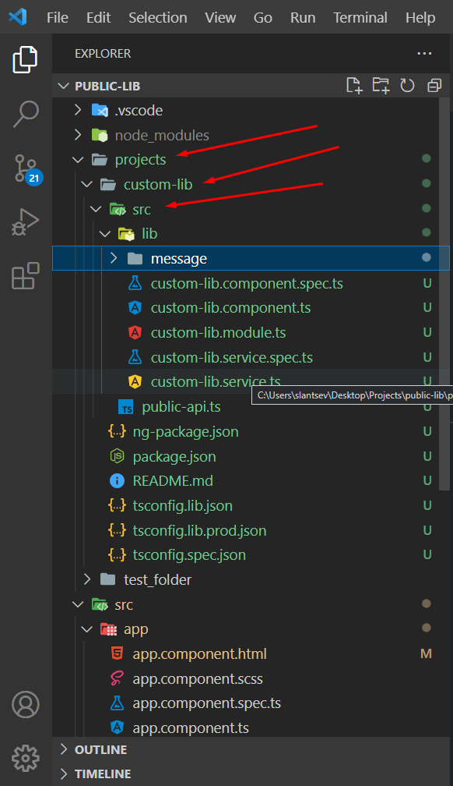
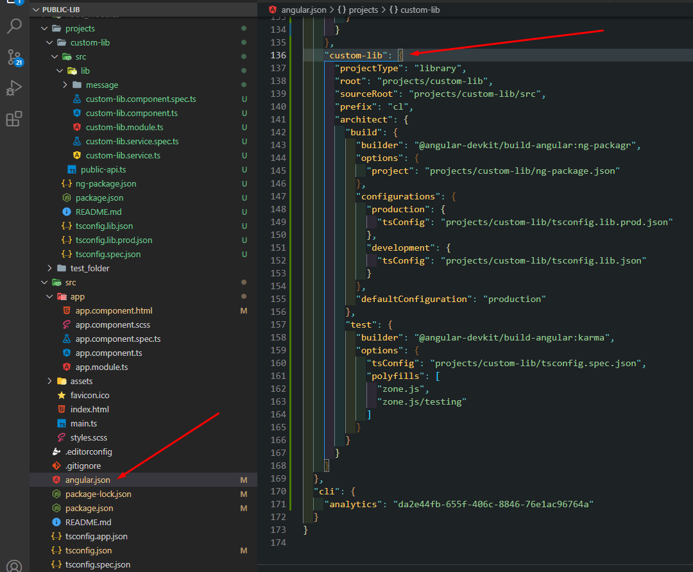
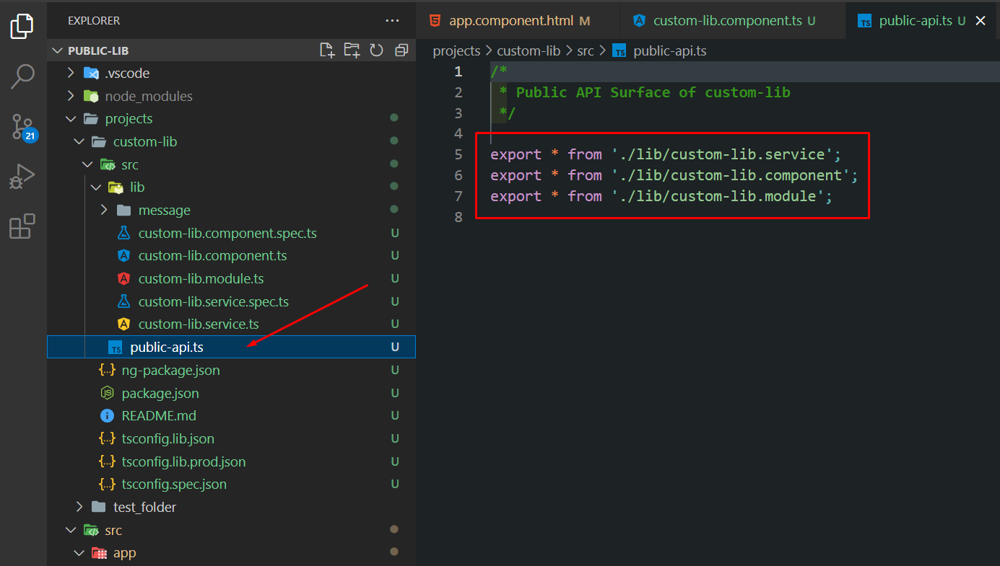
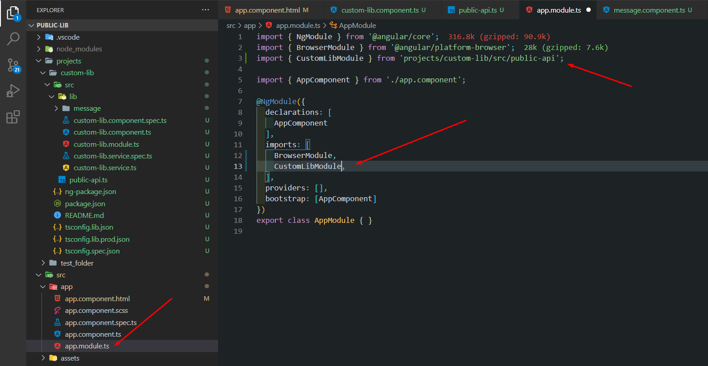

# Создание своей библиотеки в Angular проекте.

Для создания библиотеки используйте команду:
```TypeScript
ng g library @library/custom-lib --prefix=cl --skip-ts-config
```
 - `ng g library` - создаст в существующим проекте библиотеку
 - `@library` - корневая директория
 - `custom-lib` - название библиотеки
 - `--prefix cl` - добавит префикс, который будет подставляться к селектору компонентов (cl-custom-lib)



После создания библиотеки, часть данных о ней попадает в angular.json вашего приложения. Там будут храниться настройки библиотеки.



В файле `public-api.ts` прописываются экспорты, то есть то, что будут использовать другие приложения из данной библиотеки.



**`ВАЖНО! Всё то, что планируется к использаванию другими приложениями, не достаточно просто задекларировать в модуле.`**
**`Так же необходимо добавить этот component/service/module в файл public-api.ts и экспортировать этот component/service/module.`**
**`То есть, всё что public, то экспортируется.`**

### Далее необходимо собрать библиотеку
Добавляем в `package.json` приложения следующую команду
```json
  "build:library": "./node_modules/.bin/ng build @library/custom-lib --configuration production"
```
> ВАЖНО! Данный префикс `--configuration production` актуален для angular 12 версии.

> Таким образом мы получим папку `dist` и далее сможем подключить библиотеку к приложению.

> Для того чтобы связать библиотеку и ваше приложение, необходимо добавить в `app.module.ts` вашего приложения основной модуль библиотеки.



## Для удобства разработки

Для удобства разработки библиотеки, можно добавить следующую команду в файл `package.json` :
```JSON
  "НАЗВАНИЕ_БИБЛИОТЕКИ" : "ng build НАЗВАНИЕ_БИБЛИОТЕКИ --watch"
```        
1. Запускаем скрипт npm НАЗВАНИЕ_БИБЛИОТЕКИ
2. Запускаем скрипт npm start

Таким образом мы сможем в реальном времени отслеживать изменения в нашей библиотеке и приложении.
