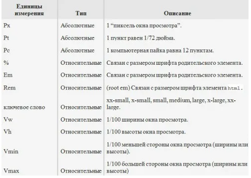

# CSS

- [Display](#display)
- [Margin](#margin)
- [Vertical-align](#vertical-align)
- [Padding](#padding)
- [Box-sizing](#box-sizing)
- [Шрифты](#fonts)
- [Поток документа](#stream-document)
- [Position](#position)
- [Flexbox](#flexbox)
- [Box-shadow](#box-shadow)
- [Background](#background)
- [Keyframes](#keyframes)
- [Transform](#transform)
- [Единицы измерения](#units-of-measurement)
- [Footer](#footer)
- [Центрирование элементов](#center-the-element)
- [Media queries](#media-queries)
- [Responsive, adaptive, fluid design](#responsive-adaptive-fluid-design)
- [CSS selectors](#css-selectors)
- [Контекст наложения. z-index](#z-index)
- [Inline flexbox](#inline-flexbox)
- [Приоритет селекторов](#priority-of-selectors)
- [Web-safe шрифты](#web-safe)
- [Browser prefixes](#browser-prefixes)
- [Sprite](#sprite)
- [Сетка](#grid)
- [@Use vs @Import](#use-vs-import)

## Display

### 3 основных значения display.

- `display: none` - Элемент не показывается, вообще. Как будто его и нет.
- `display: block` - Блочные элементы располагаются один над другим, вертикально (если нет особых свойств позиционирования, например `float`).
  Блок стремится расшириться на всю доступную ширину. Можно указать ширину и высоту явно.
  Значение display многие элементы имеют по умолчанию: `<div>`, заголовок `<h1>`, параграф `<p>`.
- `display: inline` - Элементы располагаются на той же строке, последовательно.
  Ширина и высота элемента определяются по-содержимому. Поменять их нельзя.
  Например, инлайновые элементы по умолчанию: `<span>`, `<a>`.

[Вернуться к началу статьи](#css)

---

## Margin

Отрицательное значение для margin это:

- валидное, допустимое значение
- не имеет воздействия на поток
- имеет отличную поддержку браузерами от `IE6`.
- `margin-left/top` сдвигают элемент влево-вверх, на другие элементы это учитывают.
- `margin-right/bottom` указывают другим элементам, что блок меньше по размеру, чем он на самом деле.

### margin collapsing

Отступы `margin-top` и `margin-bottom` иногда объединяются в один, с размером равным наибольшему из них (или размеру одного, если они равны).
Это поведение известно как схлопывание внешних отступов (margin collapsing).

Это может происходить из-за:

- Если отсутствуют границы.
- Если отсутствуют внутренние отступы.

[Вернуться к началу статьи](#css)

---

## Vertical-align

Свойство `vertical-align` управляет вертикальным выравниванием элементов внутри своих родителей.
Оно применяется к строчным элементам и к ячейкам таблиц. У него десять возможных значений:

- `baseline` - Значение baseline для строчных элементов выравнивает базовую линию текущего элемента по базовой линии родительского.
- `sub` - Значение sub для строчных элементов выравнивает базовую линию текущего элемента по базовой линии нижнего индекса родительского элемента.
- `super` - Значение super для строчных элементов выравнивает базовую линию текущего элемента по базовой линии верхнего индекса родительского элемента.
- `text-top` - Значение text-top для строчных элементов выравнивает верхнюю границу текущего элемента по верхней линии шрифта родительского элемента.
- `text-bottom` - Значение text-bottom для строчных элементов выравнивает нижнюю границу текущего элемента по нижней границе шрифта родительского элемента.
- `middle` - Значение middle для строчных элементов выравнивает середину текущего элемента посередине родительского элемента. Середина родительского элемента подсчитывается следующим образом: берётся высота символа x, делится пополам и добавляется к базовой линии.
- `top` - Значение top для строчных элементов выравнивает верхнюю границу текущего элемента по верхней границе всей строки, на которой находится элемент. Это значение необязательно связано со шрифтовыми элементами в строке.
- `bottom` - Значение bottom для строчных элементов выравнивает нижнюю границу текущего элемента по нижней границе всей строки, на которой находится элемент.
- `расстояние (vertical-align: 100px)` - Указанное значение для строчных элементов передвигает базовую линию текущего элемента на указанное расстояние относительно базовой линии родительского элемента. На примере ниже, розовый квадрат имеет следующие стили.
- `проценты (vertical-align: 200%)` - Указание значения в процентах для строчных элементов передвигает базовую линию текущего элемента относительно базовой линии родительского элемента на расстояние, равное заданному проценту от высоты строки родительского элемента.

[Вернуться к началу статьи](#css)

---

## Padding

Свойство `padding` устанавливает внутренние отступы/поля со всех сторон элемента.
Область отступов это пространство между содержанием элемента и его границей.
Отрицательные значения не допускаются
Свойство `padding` краткая форма записи свойств, чтобы не писать отдельное правило для каждой стороны `(padding-top, padding-right, padding-bottom, padding-left)`.

[Вернуться к началу статьи](#css)

---

## Box-sizing

Согласно спецификации CSS ширина блока складывается из ширины содержимого `width`, значений `margin`, `padding` и `border`. Аналогично обстоит и с высотой блока.
Свойство `box-sizing` позволяет изменить этот алгоритм, чтобы свойства `width` и `height` задавали размеры не содержимого, а размеры блока.

- `box-sizing: content-box | border-box`
- `content-box` - Основывается на стандартах CSS, при этом свойства width и height задают ширину и высоту содержимого и не включают в себя значения margin, padding и border.
- `border-box` - Свойства width и height включают в себя значения padding и border, но не margin.

[Вернуться к началу статьи](#css)

---

## Fonts

`Абсолютные единицы` являются фиксированными и относятся к каким-либо физическим единицам измерения. После того как они были заданы, размер не меняется.
`Относительные единицы` не имеют фактического значения. Их размер определяется относительно родительского элемента.
Это означает, что размер шрифта можно изменить в HTML путем изменения размеров связанного элемента.

> 

Формат цвета шрифта:

- Шестнадцатеричная форма. Например, `#0d6efd`, `#d63384`
- Текстовое название: `red`, `green`, `blue`.
- Формат RGB: `rbg(255, 87, 51)`.
- Формат RGBA: `rbga(255, 87, 51, 0.3)`. Значение цвета RGB представляет красный, зеленый и синий источники света. Значение цвета RGBA - это расширение RGB с альфа-каналом (непрозрачность).

### Подключение шрифтов:

- В корневой папке сайта создаём папку fonts и копируем туда наш `шрифт.ttf`. В самом низу файла стилей style.css прописываем правило:

```CSS
    @font-face {
        // название шрифта(чтобы не запутаться лучше указать название папки со шрифтом)
        font-family: "RalewayRegular";
        // адрес шрифта и тип
        src: url("../fonts/RalewayRegular.ttf") format("truetype");
        font-style: normal;
        font-weight: normal;
    }

    h1{
      // А также в файле стилей задаём правило для всех заголовков:
      font-family: "RalewayRegular";
    }
```

- Один из самых популярных ресурсов с бесплатными шрифтами `Google-font`.
  Шрифты можно подключить через link за пять минут.

```HTML
    <!DOCTYPE html>
    <html lang="ru">
      <head>
        <meta charset="utf-8" />
        <title>Заголовок</title>
        <link href="https://fonts.googleapis.com/css?family=Rubik&display=swap" rel="stylesheet">
      </head>
      <body>
      </body>
    </html>
```

Если перейти по ссылке, указанной в link, мы увидим, что сервис просто возвращает набор CSS‑правил, которые встраиваются браузером в код страницы как стили.

- Использование шрифтов, имеющихся у пользователя локально.
- Браузер выбирает шрифт для страницы из установленных на компьютере пользователя. На разных операционных системах предустановлены разные шрифты, поэтому придётся перечислить и учесть их все.
- Браузер будет перебирать шрифты по порядку, пока не найдёт существующий в системе пользователя. На Mac ОС это будет шрифт `San Francisco`, на Windows — `Segoe UI`. Если не найдётся ничего из перечисленного, то будет выбран шрифт без засечек, установленный в браузере по умолчанию

[Вернуться к началу статьи](#css)

---

## Stream document

### Поток документа

Потоком документа в HTML называется порядок вывода элементов на страницу.

1. Из полученного от сервера HTML-документа формируется DOM (Document Object Model).
2. Загружаются и распознаются стили, формируется CSSOM (CSS Object Model).
3. На основе DOM и CSSOM формируется дерево рендеринга, или render tree — набор объектов рендеринга (Webkit использует термин «renderer», или «render object», а Gecko — «frame»). Render tree дублирует структуру DOM, но сюда не попадают невидимые элементы (например —<head>, или элементы со стилем display:none;). Также, каждая строка текста представлена в дереве рендеринга как отдельный renderer. Каждый объект рендеринга содержит соответствующий ему объект DOM (или блок текста), и рассчитанный для этого объекта стиль. Проще говоря, render tree описывает визуальное представление DOM.
4. Для каждого элемента render tree рассчитывается положение на странице — происходит layout. Браузеры используют поточный метод (flow), при котором в большинстве случаев достаточно одного прохода для размещения всех элементов (для таблиц проходов требуется больше).
5. Наконец, происходит отрисовка всего этого добра в браузере — painting.

[Вернуться к началу статьи](#css)

---

## Position

Свойство position — это универсальное свойство.
Оно позволяет установить или изменить положение элемента и содержит четыре возможных значения:

- static (значение по умолчанию)
- relative
- absolute
- fixed

Часто используется наряду с четырьмя свойствами координат:

- left
- right
- top
- bottom

- `static` - Это значение `position` по умолчанию: статичные элементы просто следуют естественному потоку.
  Любые значения `left`, `right`, `top` или `bottom` не оказывают влияния.
- `relative` - Когда `position` установлено относительно, элемент может перемещаться относительно его текущей позиции.
- `absolute` - Когда position устанавливается абсолютно, элемент может перемещаться относительно первого `позиционированного предка`.
  `Позиционированный элемент` — это тот, у которого значение `position` установлено как `relative`, `absolute` или `fixed`.
  Таким образом, если положение не задано статичным, то элемент позиционированный.
  Характеристикой `позиционированного элемента` является то, что он может выступать в качестве точки отсчёта для своих дочерних элементов.
- `fixed` - Когда `position` задано как `fixed`, оно действует как абсолютное: вы можете установить координаты слева/справа и сверху/снизу.
  Единственное отличие состоит в том, что точкой отсчёта является окно просмотра. Это означает, что фиксированный элемент не перемещается со страницей, он фиксируется на экране.
- CSS-свойство `z-index` определяет положение позиционированного элемента и его дочерних элементов или флекс-элементов по оси `z`.
  Перекрывающие элементы с большим значением `z-index` будут накладываться поверх элементов с меньшим `z-index`.

[Вернуться к началу статьи](#css)

---

## Flexbox

`Flexbox` (или просто flex) — это способ позиционирования элементов в CSS.
`Flexbox` состоит из гибкого контейнера `flex container` и гибких элементов `flex items.
Гибкие элементы могут выстраиваться в строку или столбик, а оставшееся свободное пространство распределяется между ними различными способами.

Flex-элементы во flex-контейнере могут иметь определенное направление, а именно они могут располагаться в виде строк или в виде столбцов.

### `flex-direction`

Для управления направлением элементов CSS3 предоставляет свойство `flex-direction`. Оно определяет направление элементов и может принимать следующие значения:

- `row` : значение по умолчанию, при котором элементы располагаются в виде строки слева направо
- `row-reverse` : элементы также располагаются в виде стоки только в обратном порядке справа налево
- `column` : элементы располагаются в столбик сверху вниз
- `column-reverse` : элементы располагаются в столбик в обратном порядке снизу вверх

### `flex-wrap`

Свойство `flex-wrap` определяет, будет ли flex-контейнер несколько рядов элементов (строк или столбцов) в случае если его размеры недостаточны, чтобы вместить в один ряд все элементы.

Это свойство может принимать следующие значения:

- `nowrap` : значение по умолчанию, которое определяет flex-контейнер, где все элементы располагаются в одну строку (при расположении в виде строк) или один столбец (при расположении в столбик)
- `wrap` : если элементы не помещаются во flex-контейнер, то создает дополнительные ряды в контейнере для размещения элементов. При расположении в виде строки создаются дополнительные строки, а при расположении в виде столбца добавляются дополнительные столбцы
- `wrap-reverse` : то же самое, что и значение wrap, только элементы располагаются в обратном порядке

### `flex-flow`

Свойство flex-flow позволяет установить значения сразу для обоих свойств flex-direction и flex-wrap. Оно имеет следующий формальный синтаксис:

```
 flex-flow: [flex-direction] [flex-wrap];
```

Причем второе свойство - flex-wrap можно в принципе опустить, тогда для него будет использоваться значение по умолчанию - `nowrap`.

### `order`

Свойство order позволяет установить группу для flex-элемента, позволяя тем самым переопределить его позицию внутри flex-контейнера. В качестве значения свойство принимает числовой порядок группы.
К одной группе может принадлежать несколько элементов.
Например, элементы в группе 0 располагаются перед элементами с группой 1, а элементы с группой 1 располагаются перед элементами с группой 2 и так далее.

### `Выравнивание элементов - justify-content`

Иногда мы можем сталкиваться с тем, что пространство flex-контейнеров по размеру отличается от пространства, необходимого для flex-элементов. Например:

- flex-элементы не используют все пространство flex-контейнера
- flex-элементам требуется большее пространство, чем доступно во flex-контейнере. В этом случае элементы выходят за пределы контейнера.

Для управления этими ситуациями мы можем применять свойство justify-content. Оно выравнивает элементы вдоль основной оси - main axis (при расположении в виде строки по горизонтали, при расположении в виде столбца - по вертикали) и принимает следующие значения:

- `flex-start` : значение по умолчанию, при котором первый элемент выравнивается по левому краю контейнера(при расположении в виде строки) или по верху (при расположении в виде столбца), за ним располагается второй элемент и так далее.
- `flex-end`: последний элемент выравнивается по правому краю (при расположении в виде строки) или по низу (при расположении в виде столбца) контейнера, за ним выравнивается предпоследний элемент и так далее
- `center` : элементы выравниваются по центру
- `space-between` : если в стоке только один элемент или элементы выходят за границы flex-контейнера, то данное значение аналогично flex-start. В остальных случаях первый элемент выравнивается по левому краю (при расположении в виде строки) или по верху (при расположении в виде столбца), а последний элемент - по правому краю контейнера (при расположении в виде строки) или по низу (при расположении в виде столбца). Все оставшееся пространство между ними равным образом распределяется между остальными элементами
- `space-around` : если в строке только один элемент или элементы выходят за пределы контейнера, то его действие аналогично значению center. В ином случае элементы равным образом распределяют пространство между левым и правым краем контейнера, а расстояние между первым и последним элементом и границами контейнера составляет половину расстояния между элементами.

### `Выравнивание элементов - align-items`

Свойство `align-items` также выравнивает элементы, но уже по поперечной оси (cross axis) (при расположении в виде строки по вертикали, при расположении в виде столбца - по горизонтали). Это свойство может принимать следующие значения:

- `stretch` : значение по умолчанию, при котором flex-элементы растягиваются по всей высоте (при расположении в строку) или по всей ширине (при расположении в столбик) flex-контейнера
- `flex-start` : элементы выравниваются по верхнему краю (при расположении в строку) или по левому краю (при расположении в столбик) flex-контейнера
- `flex-end` : элементы выравниваются по нижнему краю (при расположении в строку) или по правому краю (при расположении в столбик) flex-контейнера
- `center` : элементы выравниваются по центру flex-контейнера
- `baseline` : элементы выравниваются в соответствии со своей базовой линией

### `Выравнивание элементов - align-self`

Свойство align-self позволяет переопределить значение свойства align-items для одного элемента. Оно может принимать все те же значения плюс значение auto:
auto: значение по умолчанию, при котором элемент получает значение от свойства `align-items`, которое определено в flex-контейнере. Если в контейнере такой стиль не определен, то применяется значение `stretch`.

- `stretch`
- `flex-start`
- `flex-end`
- `center`
- `baseline`

### `Выравнивание строк и столбцов. align-conten`

Свойство `align-content` управляет выравниванием рядов (строк и столбцов) во flex-контейнере и поэтому применяется, если свойство flex-wrap имеет значение wrap или wrap-reverse.
Свойство `align-content` может иметь следующие значения:

- `stretch` : значение по умолчанию, при котором строки (столбцы) растягиваются, занимая все свободное место
- `flex-start` : строки (столбцы) выравниваются по началу контейнера (для строк - это верхний край, для столбцов - это левый край контейнера)
- `flex-end` : строки (столбцы) выравниваются по концу контейнера (строки - по нижнему краю, столбцы - по правому краю)
- `center` : строки (столбцы) позиционируются по центру контейнера
- `space-between` : строки (столбцы) равномерно распределяются по контейнеру, а между ними образуются одинаковые отступы. Если же имеющегося в контейнере места недостаточно, то действует аналогично значению flex-start
- `space-around` : строки (столбцы) равным образом распределяют пространство контейнера, а расстояние между первой и последней строкой (столбцом) и границами контейнера составляет половину расстояния между соседними строками (столбцами).

Стоит учитывать, что это свойство имеет смысл, если в контейнере две и больше строки (столбца).

### `Управление элементами. flex-basis, flex-shrink и flex-grow`

Кроме свойств, устанавливающих выравнивание элементов относительно границ flex-контейнера, есть еще три свойства, которые позволяют управлять элементами:

- `flex-basis` : определяет начальный размер flex-элемента
- `flex-shrink` : определяет, как flex-элемент будет уменьшаться относительно других flex-элементов во flex-контейнере
- `flex-grow` : определяет, как flex-элемент будет увеличиваться относительно других flex-элементов во flex-контейнере

`flex-basis` - Flex-контейнер может увеличиваться или уменьшаться вдоль своей центральной оси, например, при изменении размеров браузера, если контейнер имеет нефиксированные размеры.
И вместе с контейнером также могут увеличиваться и уменьшаться его flex-элементы.
Свойство flex-basis определяет начальный размер flex-элемента до того, как он начнет изменять размер, подстраиваясь под размеры flex-контейнера.

Это свойство может принимать следующие значения:

- `auto` : начальный размер flex-элемента устанавливается автоматически
- `content` : размер flex-элемента определяется по его содержимому, в то же время это значение поддерживается не всеми современными браузерами, поэтому его пока стоит избегать
- `числовое значение` : мы можем установить конкретное числовое значение для размеров элемента

`flex-shrink` - Если flex-контейнер имеет недостаточно места для размещения элемента, то дальнейшее поведение этого элемента мы можем определить с помощью свойства flex-shrink.
Оно указывает, как элемент будет усекаться относительно других элементов.
В качестве значения свойство принимает число. По умолчанию его значение 1

В данном случае начальная ширина каждого элемента равна 200px, то есть совокупная ширина составляет 600px.
Однако ширина flex-контейнера составляет всего 400px.
То есть размер контейнера недостаточен для вмещения в него элементов, поэтому в действие вступает свойство flex-shrink, которое определено у элементов.

Для усечения элементов браузер вычисляет коэффициент усечения (shrinkage factor).
Он вычисляется путем перемножения значения свойства flex-basis на flex-shrink.
Таким образом, для трех элементов мы получим следующие вычисления:

```
    // первый элемент
    200px * 1 = 200
    // второй элемент
    200px * 2 = 400
    // третий элемент
    200px * 3 = 600
```

Таким образом, мы получаем, что для второго элемента коэффициент усечения в два раза больше, чем коэффициент для первого элемента.
А для третьего элемента коэффициент больше в три раза, чем у первого элемента.
Поэтому в итоге первый элемент при усечении будет в три раза больше, чем третий и в два раза больше, чем второй.

`flex-grow` - Свойство flex-grow управляет расширением элементов, если во flex-контейнере есть дополнительное место.
Данное свойство во многом похоже на свойство flex-shrink за тем исключением, что работает в сторону увеличения элементов.
В качестве значения свойство flex-grow принимает положительное число, которое указывает, во сколько раз элемент будет увеличиваться относительно других элементов при увеличении размеров flex-контейнера.
По умолчанию свойство flex-grow равно 0.

Итак, для каждого элемента есть базовые начальные размеры.
Здесь явным образом размеры для элементов не указаны, поэтому размер каждого элемента в данном случае будет складываться из размеров внутреннего содержимого, к которым добавляются внутренние отступы.

По мере растягивания контейнера будут увеличиваться элементы в соответствии со свойством flex-grow, которое указано для каждого элемента.
Пространство, на которое растягивается контейнер, считается дополнительным пространством.

Так как у первого элемента свойство flex-grow равно 0, то первый элемент будет иметь константные постоянные размеры. У второго элемента flex-grow равно 1, а третьего - 2. Таким образом, в сумме они дадут 0 + 1 + 2 = 3.
Поэтому второй элемент будет увеличиваться на 1/3 дополнительного пространства, на которое растягивается контейнер, а третий элемент будет получать 2/3 дополнительных пространства.

`flex` - Свойство flex является объединением свойств flex-basis, flex-shrink и flex-grow и имеет следующий формальный синтаксис:

```
  flex: [flex-grow] [flex-shrink] [flex-basis];
```

По умолчанию свойство flex имеет значение 0 1 auto.

Кроме конкретных значений для каждого из подсвойств мы можем задать для свойства flex одно из трех общих значений:

- `flex: none` : эквивалентно значению 0 0 auto, при котором flex-элемент не растягивается и не усекается при увеличении и уменьшении контейнера
- `flex: auto` : эквивалентно значению 1 1 auto
- `flex: initial` : эквивалентно значению 0 1 auto

[Вернуться к началу статьи](#css)

---

## Border

Устанавливает стиль границы вокруг элемента. Допустимо задавать индивидуальные стили для разных сторон элемента.

- `border-style: [none | hidden | dotted | dashed | solid | double | groove | ridge | inset | outset] {1,4} | inherit` - Устанавливает стиль границы вокруг элемента.
- `border-color: [цвет | transparent] {1,4} | inherit` - Устанавливает цвет границы.
- `border-width: [значение | thin | medium | thick] {1,4} | inherit` - Задает толщину границы одновременно на всех сторонах элемента или индивидуально для каждой стороны
- `border-radius: 50px 0 0 50px;` - Устанавливает радиус скругления уголков рамки.
- `border` - Универсальное свойство border позволяет одновременно установить толщину, стиль и цвет границы вокруг элемента.

### `Outline`

Универсальное свойство, одновременно устанавливающее цвет, стиль и толщину внешней границы на всех четырех сторонах элемента. В отличие от линии, задаваемой через border, свойство outline не влияет на положение блока и его ширину.
Также нельзя задать параметры линии на отдельных сторонах элемента, outline применяется сразу ко всем четырём сторонам.

```
 outline: outline-color || outline-style || outline-width | inherit
```

- `outline-color` - Задает цвет линии в любом допустимом для CSS формате.
- `outline-style` - Стиль линии.
- `outline-width` - Толщина границы.
- `inherit` - Наследует значение родителя.

[Вернуться к началу статьи](#css)

---

## Box-shadow

Добавляет тень к элементу.
Допускается использовать несколько теней, указывая их параметры через запятую, при наложении теней первая тень в списке будет выше, последняя ниже.
Если для элемента задается радиус скругления через свойство border-radius, то тень также получится с закругленными уголками.
Добавление тени увеличивает ширину элемента, поэтому возможно появление горизонтальной полосы прокрутки в браузере.

```
    box-shadow: 0 0 10px rgba(0,0,0,0.5); /* Параметры тени */
```

- `none` - Отменяет добавление тени.
- `inset` - Тень выводится внутри элемента. Необязательный параметр.
- `сдвиг по x` - Смещение тени по горизонтали относительно элемента. Положительное значение этого параметра задает сдвиг тени вправо, отрицательное — влево. Обязательный параметр.
- `сдвиг по y` - Смещение тени по вертикали относительно элемента. Положительное значение задает сдвиг тени вниз, отрицательное — вверх. Обязательный параметр.
- `размытие` - Задает радиус размытия тени. Чем больше это значение, тем сильнее тень сглаживается, становится шире и светлее. Если этот параметр не задан, по умолчанию устанавливается равным 0, тень при этом будет четкой, а не размытой.
- `растяжение` - Положительное значение растягивает тень, отрицательное, наоборот, ее сжимает. Если этот параметр не задан, по умолчанию устанавливается 0, при этом тень будет того же размера, что и элемент.
- `цвет` - Цвет тени в любом доступном CSS формате, по умолчанию тень черная. Необязательный параметр.

[Вернуться к началу статьи](#css)

---

## Background

Универсальное свойство background позволяет установить одновременно до пяти характеристик фона.
Значения могут идти в любом порядке, браузер сам определит, какое из них соответствует нужному свойству. Для подробного ознакомления смотрите информацию о каждом свойстве отдельно.
В CSS3 допустимо указывать параметры сразу нескольких фонов, перечисляя их через запятую.

```

CSS2.1 - background: [background-attachment || background-color || background-image || background-position || background-repeat] | inherit
CSS3 - background: [<фон>, ]* <последний_фон>
```

Здесь:

- `<фон> = [background-attachment || background-image || background-position || background-repeat] | inherit`
- `<последний_фон> = [background-attachment || background-color || background-image || background-position || background-repeat] | inherit`

Любые комбинации пяти значений, разделяемых между собой пробелом, определяющих стиль фона, в произвольном порядке.
Ни одно значение не является обязательным, поэтому неиспользуемые можно опустить. `inherit` наследует значение у родительского элемента.

[Вернуться к началу статьи](#css)

---

## Keyframes

`Keyframes` — это «ключевые кадры», на основе которых создается анимация для веб-страниц.
Они показывают, как будет выглядеть анимированный элемент в конкретный момент времени.
В языке стилей `CSS @keyframes` — это правило, которое описывает создание «ключевого кадра».

> Анимация в вебе подразумевает плавный переход объекта от одного состояния к другому.
> Эти состояния задаются кейфреймами.
> Если нужно показать, как изображение увеличивается в размере, у него должно быть минимум два ключевых кадра: в изначальном маленьком и в конечном большом размерах.
> Промежуточные варианты между этими состояниями отрисует сам браузер.
> сли изменение неравномерное, могут потребоваться и промежуточные кейфреймы.

- Свойство `animation-name` позволяет привязать к элементу одну или больше анимаций.

```
@keyframes <переменная> { [ from | to | <проценты> ] [, from | to | <проценты> ]* }
```

```CSS
    @keyframes box {
      from { left: 0; }
      to { left: 300px; }
    }

    @keyframes box {
      50% { left: 0; }
      90% { left: 300px; }
    }

    @keyframes box {
      from { left: 0; }
      50% { left: 150px}
      to { left: 300px; }
    }

```

```HTML
<html lang="ru-en">
 <head>
  <meta charset="utf-8">
  <title>@keyframes</title>
     <style>
         @keyframes go-left-right {        /* объявляем имя анимации: "go-left-right" */
             from { left: 0px; }             /* от: left: 0px */
             to { left: calc(100% - 50px); } /* до: left: 100%-50px */
         }

         .progress {
             animation: go-left-right 3s infinite alternate;
             /* применить анимацию "go-left-right" на элементе
                продолжительностью 3 секунды
                количество раз: бесконечно (infinite)
                менять направление анимации каждый раз (alternate)
             */

             position: relative;
             border: 2px solid green;
             width: 50px;
             height: 20px;
             background: lime;
         }
     </style>
 </head>
 <body>
    <div class="progress"></div>
 </body>
</html>
```

[Вернуться к началу статьи](#css)

---

## Transform

CSS-свойство `transform` позволяет вам поворачивать, масштабировать, наклонять или сдвигать элемент.
Оно модифицирует координатное пространство для CSS визуальной форматируемой модели.

Свойства

- `none` - Значение по умолчанию, означает отсутствие трансформации. Также отменяет трансформацию для элемента из группы трансформируемых элементов.
- `matrix(a, c, b, d, x, y)` - Смещает элементы и задает способ их трансформации, позволяя объединить несколько функций 2D-трансформаций в одной. В качестве трансформации допустимы поворот, масштабирование, наклон и изменение положения.
  Значение a изменяет масштаб по горизонтали. Значение от 0 до 1 уменьшает элемент, больше 1 — увеличивает.
  Значение c деформирует (сдвигает) стороны элемента по оси Y, положительное значение — вверх, отрицательное — вниз.
  Значение b деформирует (сдвигает) стороны элемента по оси X, положительное значение — влево, отрицательное — вправо.
  Значение d изменяет масштаб по вертикали. Значение меньше 1 уменьшает элемент, больше 1 — увеличивает.
  Значение x смещает элемент по оси X, положительное — вправо, отрицательное — влево.
  Значение y смещает элемент по оси Y, положительное значение — вниз, отрицательное — вверх.
- `translate(x,y)` - Сдвигает элемент на новое место, перемещая относительно обычного положения вправо и вниз, используя координаты X и Y, не затрагивая при этом соседние элементы. Если нужно сдвинуть элемент влево или вверх, то нужно использовать отрицательные значения.
- `translateX(n)` - Сдвигает элемент относительно его обычного положения по оси X.
- `translateY(n)` - Сдвигает элемент относительно его обычного положения по оси Y.
- `scale(x,y)` - Масштабирует элементы, делая их больше или меньше. Значения от 0 до 1 уменьшают элемент. Первое значение масштабирует элемент по ширине, второе — по высоте. Отрицательные значения отображают элемент зеркально.
- `scaleX(n)` - Функция масштабирует элемент по ширине, делая его шире или уже. Если значение больше единицы, элемент становится шире, если значение находится между единицей и нулем, элемент становится уже. Отрицательные значения отображают элемент зеркально по горизонтали.
- `scaleY(n)` - Функция масштабирует элемент по высоте, делая его выше или ниже. Если значение больше единицы, элемент становится выше, если значение находится между единицей и нулем — ниже. Отрицательные значения отображают элемент зеркально по вертикали.
- `rotate(угол)` - Поворачивает элементы на заданное количество градусов, отрицательные значения от -1deg до -360deg поворачивают элемент против часовой стрелки, положительные — по часовой стрелке. Значение rotate(720deg) поворачивает элемент на два полных оборота.
- `skew(x-угол,y-угол)` - Используется для деформирования (искажения) сторон элемента относительно координатных осей. Если указано одно значение, второе будет определено браузером автоматически
- `skewX(угол)` - Деформирует стороны элемента относительно оси X.
- `skewY(угол)` - Деформирует стороны элемента относительно оси Y.
- `initial` - Устанавливает значение свойства в значение по умолчанию.
- `inherit` - Наследует значение свойства от родительского элемента.

Допустимые значения:

- `matrix()` — любое число
- `translate(), translateX(), translateY()` — единицы длины (положительные и отрицательные), %
- `scale(), scaleX(), scaleY()` — любое число
- `rotate()` — угол (deg, grad, rad или turn)
- `skew(), skewX(), skewY()` — угол (deg, grad, rad)

Можно объединить несколько трансформаций одного элемента, перечислив их через пробел в порядке проявления

[Вернуться к началу статьи](#css)

---

## Units of measurement

### Единицы измерения

Особенности вычисления ширины и высоты.
Для определения ширины либо высоты объекта можно использовать любые единицы измерения длины в CSS.
Наиболее просты в понимании пикселы. Если вы используете процентную запись, имейте в виду, что в этом случае ширина объекта будет зависеть от ширины его родителя.
Если такового нет, то ширина элемента вычисляется, исходя из ширины окна браузера (при изменении пользователем ширины окна значение width будет пересчитано).

`Margin и padding`, заданные в процентах, вычисляются относительно ширины контейнера.
То есть padding 5% будет равен 5px, если ширина контейнера составляет 100px, или 50px, если ширина контейнера равна 1000px.
Не забывайте, что верхнее и нижнее значения вычисляются также по ширине контейнера.

Например, значение 1.5 значит, что высота строчки будет равна размеру шрифта `font-family`, помноженному на 1.5. длина — например, пиксели px, условные единицы шрифта em, дюймы in, пункты pt и так далее.
Проценты — например, line-height: 120% . За 100% берётся размера шрифта font-size.

Новые единицы — vw, vh, vmin, и vmax — работают аналогично существующим единицам длины, таким как px или em, но представляют собой процентные величины от текущей области просмотра браузера.

[Вернуться к началу статьи](#css)

---

## Footer

Варианты прижать подвал сайта (footer) в самый низ окна браузера.

1. Первый способ

- Footer прижимается вниз путем его абсолютного позиционирования и вытягивания высоты родительских блоков (html, body и .wrapper) на 100%.
  При этом контентному блоку .content нужно указать нижний отступ, который равен или больше высоты подвала, иначе последний закроет часть контента.

```CSS
    * {
      margin: 0;
      padding: 0;
    }
    html,
    body {
      height: 100%;
    }
    .wrapper {
      position: relative;
      min-height: 100%;
    }
    .content {
      padding-bottom: 90px;
    }
    .footer {
      position: absolute;
      left: 0;
      bottom: 0;
      width: 100%;
      height: 80px;
    }
```

2. Второй способ

- Footer прижимается вниз за счет вытягивания блока контента и его «родителей» на всю высоту окна браузера и подъема футера вверх через отрицательный отступ (margin-top) для избавления от появляющегося при этом вертикального скролла.
  В данном случае необходимо обязательно указать высоту подвала, и она должна быть равна величине отступа.

```CSS
    * {
      margin: 0;
      padding: 0;
    }
    html,
    body,
    .wrapper {
      height: 100%;
    }
    .content {
      box-sizing: border-box;
      min-height: 100%;
      padding-bottom: 90px;
    }
    .footer {
      height: 80px;
      margin-top: -80px;
    }
```

Благодаря свойству box-sizing: border-box, мы не позволяем блоку с классом .content превысить высоту 100%.
То есть в данном случае min-height: 100% + padding-bottom: 90px равняется 100% высоты окна браузера.

3. Третий способ
   Он хорош тем, что, в отличие от остальных способов (кроме 5-го), высота футера значения не имеет.

```CSS
    * {
      margin: 0;
      padding: 0;
    }
    html,
    body {
      height: 100%;
    }
    .wrapper {
      display: table;
      height: 100%;
    }
    .content {
      display: table-row;
      height: 100%;
    }
```

4. Четвертый способ
   Данный способ не похож ни на один из предыдущих, и его особенность заключается в использовании CSS-функции calc() и единицы измерения vh, которые поддерживаются только современными браузерами.
   Здесь необходимо знать точную высоту подвала.

```CSS
    * {
      margin: 0;
      padding: 0;
    }
    .content {
      min-height: calc(100vh - 80px);
    }
```

100vh — это высота окна браузера, а 80px — это высота футера.
И с помощью функции calc() мы вычитаем вторую величину из первой, тем самым прижимая футер к низу.
Узнать, какие браузеры поддерживают calc() и vh, вы можете на сайте caniuse.com по следующим ссылкам: поддержка функции calc(), поддержка единицы измерения vh.

5. Пятый способ (самый актуальный)
   Это лучший способ из всех представленных, однако работает он только в современных браузерах, котортые поддерживают CSS свойство flex.
   Как и в третьем способе, высота футера значения не имеет.

```CSS
    * {
      margin: 0;
      padding: 0;
    }
    html,
    body {
      height: 100%;
    }
    .wrapper {
      display: flex;
      flex-direction: column;
      height: 100%;
    }
    .content {
      flex: 1 0 auto;
    }
    .footer {
      flex: 0 0 auto;
    }
```

[Вернуться к началу статьи](#css)

---

## Center-the-element

- ЦЕНТРИРОВАНИЕ СТРОК ТЕКСТА

```CSS
    P { text-align: center }
    H2 { text-align: center }
```

- ЦЕНТРИРОВАНИЕ БЛОКА ИЛИ ИЗОБРАЖЕНИЯ

```CSS
    .block-text {
      margin-left: auto;
      margin-right: auto;
      width: 6em
   }
```

Этот метод также можно использовать для центрирования изображения: поместите его в собственный блок и примените свойства полей

```CSS
    .displayed {
      display: block;
      margin-left: auto;
      margin-right: auto
   }
```

- ВЕРТИКАЛЬНОЕ ЦЕНТРИРОВАНИЕ

```HTML
<html lang="ru-en">
    <div class=container3>
        <p>Этот абзац…
    </div>
<style>
    div.container3 {
        height: 10em;
        position: relative }              /* 1 */
    div.container3 p {
        margin: 0;
        position: absolute;               /* 2 */
        top: 50%;                         /* 3 */
        transform: translate(0, -50%) }   /* 4 */
</style>
</html>
```

```
1. Сделайте контейнер относительно позиционированным (position: relative), что превратит его в контейнер для абсолютно позиционированных элементов.
2. Сам элемент сделайте абсолютно позиционированным (position: absolute).
3. Поместите элемент посередине контейнера с помощью 'top: 50%'. (Заметьте, что '50%' здесь означают 50% высоты контейнера.)
4. Используйте translate, чтобы переместить элемент вверх на половину своей собственной высоты. ( '50%' в 'translate(0, -50%)' указывают на высоту самого элемента.)
```

- Начиная приблизительно с 2015-го года в нескольких реализациях CSS стала доступна новая техника

```CSS
    div.container5 {
      height: 10em;
      display: flex;
      align-items: center
   }
    div.container5 p {
      margin: 0
    }
```

- ВЕРТИКАЛЬНОЕ И ГОРИЗОНТАЛЬНОЕ ЦЕНТРИРОВАНИЕ

```HTML
<html lang="ru-en">
    <div class=container4>
        <p>Центр!
    </div>

<style>
    div.container4 {
        height: 10em;
        position: relative
    }
    div.container4 p {
        margin: 0;
        background: yellow;
        position: absolute;
        top: 50%;
        left: 50%;
        margin-right: -50%;
        transform: translate(-50%, -50%)
    }
</style>
</html>
```

Когда форматер CSS поддерживает 'flex'

```CSS
    div.container6 {
      height: 10em;
      display: flex;
      align-items: center;
      justify-content: center
    }
    div.container6 p {
      margin: 0
    }
```

- ЦЕНТРИРОВАНИЕ В ОБЛАСТИ ПРОСМОТРА
  Контейнером по умолчанию для абсолютно позиционированных элементов является область просмотра. (В случае c браузером это окно браузера).

```HTML
<html lang="ru-en">
<style>
    body {
        background: white
    }
    section {
        background: black;
        color: white;
        border-radius: 1em;
        padding: 1em;
        position: absolute;
        top: 50%;
        left: 50%;
        margin-right: -50%;
        transform: translate(-50%, -50%)
    }
</style>
</style>
    <section>
        <h1>Красиво выровнен по центру</h1>
        <p>Этот текстовый блок выровнен вертикально по центру.
        <p>И горизонтально, если окно достаточно широкое.
    </section>
</html>
```

[Вернуться к началу статьи](#css)

---

## Media queries

> CSS медиа-запросы `(media queries)`— это функция CSS 3, позволяющая рендерингу контента адаптироваться к различным условиям, таким как разрешение экрана

```CSS
    @media screen {
      /* стили будут применяться, когда условие истинно */
    }

    @media (min-width: 992px) and (max-width: 1199.98px) {}
```

В @media можно указывать определённые типы устройств:

- `all` – для всех;
- `print` – для принтеров и в режиме предварительного просмотра страницы перед печатью;
- `screen` – для устройств с экранами;
- `speech` – для программ чтения с экрана.

```CSS
   @media screen and (min-width: 1200px) and (orientation: landscape) {}
```

`aspect-ratio`
Характеристики aspect-ration, min-aspect-ratio и max-aspect-ratio позволяют задавать стили в зависимости от соотношения сторон viewport.

```CSS
    /* Minimum aspect ratio */
    @media (min-aspect-ratio: 9/16) {
      .header {
        background-color: #0dcaf0;
      }
    }

    /* Maximum aspect ratio */
    @media (max-aspect-ratio: 16/9) {
      .header {
        background: #ffc107;
      }
    }

    /* Exact aspect ratio */
    @media (aspect-ratio: 1/1) {
      .header {
        background: #6c757d;
      }
    }
```

`resolution`
Характеристики resolution, min-resolution и max-resolution можно использовать, когда нужно задать стили в зависимости от плотности пикселей устройства.

```CSS
    /* Default */
    p {
      font-size: 16px;
    }

    /* Minimum resolution */
    @media (min-resolution: 150dpi) {
      p {
        font-size: 14px;
      }
    }
```

- Медиа-запросы в <link> и @import

```HTML
    <link rel="stylesheet" media="screen and (max-width: 991.98px)" href="/assets/mobile.css">
    <link rel="stylesheet" media="screen and (min-width: 992px)" href="/assets/desktop.css">
```

- Кроме <link>, их также можно использовать в @import:

```
    @import url(mobile.css) screen and (max-width: 991.98px);
    @import url(desktop.css) screen and (min-width: 992px);
```

- Код JavaScript, учитывающий параметры устройств

```JS
    // например, проверим, соответствует ли указанный медиа-запрос (screen and (max-width: 543px)) устройству
    // результат проверки можно получить с помощью свойства matches (true или false)
    if (window.matchMedia('screen and (max-width: 543px)').matches) {
      // ... действия, если устройство отвечает медиа-запросу
    } else {
      // ... действия, если устройство не соответствует значениям медиа-запроса
    }
```

[Вернуться к началу статьи](#css)

---

## Responsive, adaptive, fluid design

> Подход Итана Маркотта предусматривает использование «резинового» макета (ширина, отступы и поля задаются в процентах), а адаптивный макет предполагает, что для каждого размера экрана у нас используются свои стилевые правила, в которых жестко заданы фиксированные размеры элементов (в пикселях).

[Вернуться к началу статьи](#css)

---

## CSS selectors

> `Селектор` (от англ. select — выбирать) — это шаблон, который позволяет обратиться к элементу или группе элементов веб-страницы, чтобы применить к ним стили CSS. Его указывают перед блоком со свойствами:

- Универсальный селектор

```CSS
    * {
      margin: 0;
      box-sizing: border-box;
    }
```

- Селектор по тегу (элементу)

```CSS
    a {
      text-decoration: none;
    }
```

- Селектор по идентификатору (id)

```HTML
    <p id="intro">Сегодня мы расскажем вам об Emmet.</p>
    <p id="article_content">В этой статье вы узнаете:</p>
```

```CSS
    #intro{
      color: red;
      font-weight: bold;
    }

    #article_content{
      font-family: sans-serif;
      font-weight: bold;
    }
```

- Селектор по тегу (элементу)

```HTML
    <p class="plain_text article">Сегодня мы расскажем вам про Emmet.</p>
```

```CSS
    .plain_text{
      font-size: 20px;
    }

    .article{
      font-family: "Montserrat";
    }
```

- Группа селекторов

```CSS
    .plain_text, p, h1, figure, div {
      margin-top: 0;
      margin-left: 0;
    }
```

- Выбрать всех потомков

```CSS
    figure img {
      margin-bottom: 20px;
    }
```

- Выбрать потомков первого уровня

```CSS
    .container > img {
      margin-bottom: 40px;
    }
```

- Выбрать все следующие элементы

```CSS
    .about_us > .card {
      background-color: #f2f3f5;
    }
```

- Выбрать первый следующий элемент

```CSS
    .about_us + .card {
      background-color: #f2f3f5;
    }
```

- CSS-селекторы по атрибуту
- Они позволяют выбрать элемент по имени атрибута, его значению или части значения.

```CSS
    [title] {
      font-weight: bold;
    }
```

[Вернуться к началу статьи](#css)

---

## Z-index

### Что такое Контекст наложения в css?

> Контекст наложения (z-index) в CSS определяет порядок расположения элементов в трехмерном пространстве на веб-странице. Он позволяет определить, какие элементы находятся более близко к зрителю и должны перекрывать другие элементы.
> Значение z-index можно задать для любого элемента в CSS. Чем выше значение z-index, тем ближе элемент к зрителю и тем выше приоритет. Элементы, имеющие более высокое значение z-index, будут находиться поверх элементов с меньшим значением z-index.
> Значение z-index может быть положительным или отрицательным числом. Если элементы имеют одинаковое значение z-index, тогда порядок их расположения на странице будет определяться тем, в каком порядке они находятся в HTML-коде.

> Важно помнить, что значение z-index работает только с элементами, которые позиционированы (position) как relative, absolute или fixed. Если элемент не имеет позиционирования, то значение z-index не будет иметь эффекта на его расположение на странице.

#### Свойства, которые создают новый контекст наложения в css.

> Некоторые свойства в CSS могут работать как контекст наложения (активировать у элементов определенный stacking context), что означает, что эти свойства создают новый слой, который может быть независимо запомнен и настроен внутри стека наложения элементов на странице.

Вот некоторые CSS свойства, которые создают контекст наложения:

- `position` с опцией absolute, fixed и sticky
- `opacity` с не единичным значением
- `transform`, `perspective` и `filter` с не стандартными значениями (не единица)
- `mix-blend-mode` с не стандартным значением (не normal)
- `isolation` с не стандартным значением (не auto)
- `mask` и `clip-path`

[Вернуться к началу статьи](#css)

---

## Inline flexbox

### Инлайновый flexbox?

> В CSS есть инлайновый flexbox, который называется “inline-flex”. Он является частью спецификации CSS Flexible Box Layout Module.

> Inline-flex применяется к элементу, который должен быть отображен как флекс-контейнер, но при этом сохранить свой инлайновый формат. Это означает, что все дочерние элементы, содержащиеся внутри контейнера, будут располагаться в соответствии с правилами flexbox.

Например, следующий CSS код задает контейнер в инлайновом формате:

```css
.container {
	display: inline-flex;
	justify-content: center;
	align-items: center;
}
```

> Здесь мы использовали свойство display с значением inline-flex, чтобы задать контейнер в инлайновом формате, а свойства justify-content и align-items для настройки выравнивания элементов в контейнере.
> Также стоит отметить, что поддержка inline-flex может отличаться в разных браузерах, поэтому при использовании этого свойства рекомендуется проводить тестирование на различных устройствах и браузерах.

[Вернуться к началу статьи](#css)

---

## Priority of selectors

### Приоритет селекторов.

> Приоритет селекторов в CSS - это система, которая определяет, какой стиль должен быть применен к элементу, если он имеет несколько стилей, заданных с помощью различных селекторов.
> Селекторы с более высоким приоритетом применяются к элементу вместо селекторов с более низким приоритетом.

Значения приоритета определяются следующим образом:

1. Встроенные стили (`Inline styles`) имеют наивысший приоритет, потому что они непосредственно применяются к элементу в его атрибуте `style`.
2. Селекторы ID (`#id`) имеют более высокий приоритет, чем селекторы классов (`.class`), псевдоклассы(`:hover`, `:active`, `:focus`), атрибуты(`[attr]`), и селекторы тегов.
3. Селекторы атрибутов и селекторы классов имеют одинаковый приоритет.
4. Селекторы тегов имеют наименьший приоритет.

### К какому типу относятся псевдо-классы (например, :before, :after)?

> Псевдо-классы в CSS относятся к классу селекторов, но на самом деле они не являются классами, которые определяются пользователем, а скорее дополнительными ключевыми словами, которые можно использовать в CSS правилах для стилизации элементов.
> Псевдоклассы начинаются с двоеточия “:” и используются для определения специфических состояний элемента, таких как :hover (когда курсор мыши находится над элементом), :active (когда элемен нажат), :focus (когда элемент находится в фокусе), а также :before и :after псевдо-элементы, которые добавляют контент до начала и после конца элемента соответственно.

> Обратите внимание, что псевдо-классы следует отличать от псевдо-элементов, что являются также дополнительными ключевыми словами в CSS селекторах, но добавляют новый элемент в DOM дерево на странице и используют двойное двоеточие (:😃, вместо одинарного (😃, например `::before` и `::after`.

[Вернуться к началу статьи](#css)

---

## Web-safe

### web-safe шрифты.

> Web-safe шрифты (иногда называются safe fonts) - это набор шрифтов, предустановленных на большинстве устройств и браузеров и соответственно доступных для использования веб-разработчиками. Они были разработаны для того, чтобы гарантировать совместимость шрифтов на всех устройствах и браузерах.

> Веб-разработчики используют web-safe шрифты для обеспечения согласованного визуального образа сайта на разных платформах и устройствах. При использовании web-safe шрифтов можно быть уверенным, что шрифт будет отображаться одинаково на всех устройствах и браузерах, что улучшает качество пользователя и удобство восприятия.

> Некоторые из самых распространенных web-safe шрифтов включают Arial, Times New Roman, Verdana, Georgia, или Helvetica. Они имеют широкое распространение и встроены в большинство операционных систем, что позволяет использовать их на сайтах без необходимости загрузки дополнительных шрифтов.

[Вернуться к началу статьи](#css)

---

## Browser prefixes

### Браузерные префиксы

> Браузерные префиксы (prefixes) - это добавление браузерами специфических для платформы префиксов к имени CSS свойства. Примеры таких префиксов: -moz- для Firefox, -webkit- для Safari и Chrome, -ms- для Internet Explorer, и -o- для Opera

> Браузерные префиксы используются для того, чтобы добавлять новые возможности в CSS или JavaScript до того, как они станут частью официального стандарта. Они позволяют веб-разработчикам проверять и экспериментировать с новыми функциями, даже если они еще не должны работать во всех браузерах.

```css
box-shadow: 3px 3px 3px #000;

-moz-box-shadow: 3px 3px 3px #000; /* Firefox */
-webkit-box-shadow: 3px 3px 3px #000; /* Safari and Chrome */
-ms-box-shadow: 3px 3px 3px #000; /* Internet Explorer */
-o-box-shadow: 3px 3px 3px #000; /* Opera */
```

> Таким образом, браузерные префиксы позволяют разработчикам использовать новые функции CSS и JavaScript на определенных браузерах, которые пока не поддерживают эти функции стандартным способом.

> `Autoprefixer` позволяет автоматически обрабатывать CSS код и добавлять соответствующие браузерные префиксы в зависимости от специфических особенностей каждого браузера. Он устраняет необходимость ручного написания и обновления множества префиксов для каждого браузера, что является утомительной и неэффективной задачей.

[Вернуться к началу статьи](#css)

---

## Sprite

### Спрайт (sprite)

> Спрайт (sprite) - это изображение, содержащее множество маленьких изображений, объединенных в одном файле. Использование спрайтов позволяет минимизировать количество запросов к серверу и уменьшить размер загрузки страницы. Вместо того, чтобы загружать отдельные изображения по отдельности, браузер загружает одно изображение, содержащее все нужные элементы, и затем использует CSS для отображения определенного куска картинки.

[Вернуться к началу статьи](#css)

---

## Grid

### Сетка

> `CSS-гриды` - это мощный инструмент в веб-разработке, который позволяет создавать гибкую и респонсивную сетку для расположения элементов на веб-странице. Гриды представляют собой двумерную систему, состоящую из горизонтальных и вертикальных линий, называемых треками

> `Грид-контейнер` (grid container) - это элемент HTML, к которому применяется CSS-свойство display: grid. Он определяет контекст для создания сетки с помощью CSS-гридов. Внутри грид-контейнера можно определить различные области, называемые ячейками (grid cells), и применять различные свойства для управления внешним видом и расположением элементов на сетке.

> `Грид-элемент` (grid item) - это дочерний элемент грид-контейнера, который помещается в ячейку сетки. Грид-элементы могут быть представлены разными HTML-элементами, такими как `<div>, <span>, `, и другими. Каждому грид-элементу можно задать определенные свойства, такие как grid-column и grid-row, для определения его позиции и размеров на сетке. Это позволяет гибко управлять размещением элементов внутри грида.

> Для задания количество и размеров строк и колонок в CSS Grid Layout используются следующие свойства:

1. `grid-template-rows` (для строк) и grid-template-columns (для колонок) - эти свойства позволяют определить количество и размеры строк и колонок в грид-контейнере. Например, чтобы создать грид с двумя строки, первая из которых занимает 100 пикселей, а вторая занимает автоматическую ширину, можно написать:

```css
grid-template-rows: 100px auto;
```

2. Аналогично, для определения трех колонок, где первая колонка занимает 200 пикселей, вторая - 1 долю от доступного пространства, а третья - автоматическую ширину, можно использовать:

```css
grid-template-columns: 200px 1fr auto;
```

3. `grid-row-gap` и `grid-column-gap` - эти свойства позволяют задать промежутки (зазоры) между строками и колонками соответственно. Например, чтобы установить промежуток в 10 пикселей между строками и 20 пикселей между колонками, можно использовать:

```css
grid-row-gap: 10px;
grid-column-gap: 20px;
```

4. grid-gap - это сокращенное свойство, которое задает промежутки одновременно для строк и колонок. Например, чтобы установить промежутки в 10 пикселей как для строк, так и для колонок, можно написать:

```css
grid-gap: 10px;
```

5. Или можно задать разные значения для промежутков между строками и колонками, используя два значения. Первое значение задает промежуток между строками, а второе - между колонками:

```css
grid-gap: 10px 20px;
```

> Для задания минимального и максимального размера строки или колонки в CSS Grid Layout можно использовать следующие свойства.

> `grid-template-rows` (для строк) и grid-template-columns (для колонок) - с помощью этих свойств можно задать размеры строк и колонок, включая минимальные и максимальные значения. Например, чтобы задать строку, которая имеет минимальную высоту 100 пикселей и может расширяться на доступное пространство, можно использовать следующий код:

```css
grid-template-rows: minmax(100px, auto);
```

> В этом примере minmax(100px, auto) задает минимальную высоту строки в 100 пикселей и максимальную высоту, которая будет автоматически расширяться.

> Чтобы задать колонку с минимальной шириной 200 пикселей и максимальной шириной 1 доля от доступного пространства, можно использовать следующий код:

```css
grid-template-columns: minmax(200px, 1fr);
```

Размещение элементов внутри сетки.

> Грид-линии (grid lines) в CSS Grid Layout - это упорядоченная система линий, которая определяет расположение и размеры ячеек в сетке.
> Грид-линии могут быть явно определены с помощью свойств grid-template-rows и grid-template-columns, где вы указываете размеры и положение грид-линий с помощью ключевых слов (например, auto, 1fr, min-content, max-content) или конкретных значений (например, 200px, 50%).

```css
.grid-container {
	display: grid;
	grid-template-rows: 100px 200px; /* Два значения, определяющие грид-линии строк */
	grid-template-columns: 1fr 50% 200px; /* Три значения, определяющие грид-линии колонок */
}
```

> Грид-область `grid area` в CSS Grid Layout - это прямоугольная область на сетке, ограниченная грид-линиями.
> Грид-области можно явно определить с помощью свойства grid-template-areas. Вы можете назначить имена грид-областей, используя произвольные идентификаторы и символы, представляющие части сетки. Затем вы можете задать расположение элемента, присваивая ему имя грид-области с помощью свойства grid-area.

```css
.grid-container {
	display: grid;
	grid-template-rows: 100px 100px 100px;
	grid-template-columns: 100px 100px 100px;
	grid-template-areas:
		'header header header'
		'sidebar content content'
		'footer footer footer';
}

.grid-item {
	grid-area: header;
}
```

> В CSS Grid Layout вы можете неявно задать имена для грид-областей при именовании грид-линий и наоборот. Для этого используются точки (.) в определениях грид-линий или имен грид-областей. Когда вы задаете имена грид-линий с помощью grid-template-rows и grid-template-columns, вы можете использовать точку, чтобы указать неявное имя для грид-области. То есть, если вы хотите, чтобы грид-области автоматически получили имена на основе грид-линий, вы можете просто поставить точку в определениях грид-линий. Например:

```css
.grid-container {
	display: grid;
	grid-template-rows: . . .; /* Неявные имена для грид-областей */
	grid-template-columns: . . .; /* Неявные имена для грид-областей */
}
```

В этом случае грид-области будут называться grid-area-1, grid-area-2, grid-area-3, и т.д., в соответствии с их позицией в сетке.

Наоборот, если вы хотите неявно задать имена для грид-линий, вы можете использовать точку в определении грид-области, используя свойство grid-area. Например:

```css
.grid-item {
	grid-area: .; /* Неявные имена для грид-линий */
}
```

> В этом случае грид-линии будут называться grid-column-1, grid-column-2, grid-column-3, и т.д., для столбцов, а для строк - grid-row-1, grid-row-2, grid-row-3, и т.д., в соответствии с именами грид-областей.

> Чтобы сделать сетку на основе CSS Grid Layout адаптивной, вы можете использовать свойства `auto-fill` и `auto-fit`. Оба этих свойства позволяют автоматически заполнять доступное пространство сетки, а также изменять количество колонок или строк в зависимости от размера контейнера. Вот как это работает:

- `auto-fill`: Это свойство автоматически добавляет новые колонки или строки, чтобы заполнить сетку доступным пространством. Оно сохраняет размеры элементов (грид-областей) неизменными, и если место в сетке достаточно, оно добавляет новые колонки или строки. Если места недостаточно, избыточные колонки или строки уменьшаются или скрываются. Например:

```css
.grid-container {
	display: grid;
	grid-template-columns: repeat(auto-fill, minmax(200px, 1fr));
}
```

- `auto-fit`: Это свойство аналогично auto-fill, но с одним отличием: если сетка не может содержать все элементы в доступном пространстве, auto-fit изменяет размеры элементов, чтобы они полностью заполнили сетку. Например:

```css
.grid-container {
	display: grid;
	grid-template-columns: repeat(auto-fit, minmax(200px, 1fr));
}
```

> Оба свойства `auto-fill` и `auto-fit` обеспечивают адаптивность сетки, позволяя элементам автоматически изменять свои позиции и размеры в зависимости от доступного пространства.

> В CSS Grid Layout существуют различные свойства, которые позволяют выравнивать элементы в сетке. Вот несколько основных свойств для выравнивания элементов в гриде:

1. `justify-items` и `align-items`: Эти свойства управляют выравниванием элементов внутри грид-ячеек по горизонтали (justify-items) и вертикали (align-items). Их значения могут быть:

- start (по умолчанию): выравнивание по началу (слева или вверх);
- end: выравнивание по концу (справа или вниз);
- center: выравнивание по центру;
- stretch: элементы растягиваются, чтобы заполнить ячейку полностью;
- baseline: выравнивание по базовой линии.

2. `justify-content` и `align-content`: Эти свойства управляют выравниванием контента грида внутри контейнера. Они влияют на распределение и выравнивание рядов (justify-content) и столбцов (align-content). Их значения могут быть:

- start: выравнивание по началу (слева или вверх);
- end: выравнивание по концу (справа или вниз);
- center: выравнивание по центру;
- stretch: контент растягивается, чтобы заполнить контейнер полностью;
- space-between: равномерное расстояние между элементами;
- space-around: равномерное расстояние вокруг элементов;
- space-evenly: равномерное расстояние между элементами и по краям.

3. `justify-self` и `align-self`: Эти свойства позволяют контролировать выравнивание отдельных элементов внутри сетки, переопределяя свойства justify-items и align-items для конкретного элемента. Они имеют те же значения, что и justify-items и align-items.

4. `place-items` и `place-content`: Эти свойства позволяют управлять одновременно горизонтальным и вертикальным выравниванием элементов внутри грида. Например:

- place-items: center: центрирование элементов по горизонтали и вертикали;
- place-content: space-between stretch: равномерное распределение элементов по горизонтали с растягиванием для заполнения контейнера.

> Функция `calc()` - это функция в CSS, которая позволяет выполнять арифметические операции над значениями свойств. `calc()` может использоваться в качестве значения для различных свойств, включая ширину (width), высоту (height), отступы (padding, margin), и другие.

> Стили в CSS могут быть импортированы в документ с помощью правила `@import`. Однако, применение `@import` для загрузки стилей не рекомендуется по нескольким причинам:

- Производительность: Когда браузер встречает правило @import, он приостанавливает парсинг CSS и загружает указанный файл стилей. Это может замедлить процесс отображения страницы, особенно если импортируется несколько файлов стилей. Браузер загружает их последовательно, что может привести к задержке отображения контента.

- Зависимость: Правило @import создает цепочку зависимостей между файлами стилей. Если один файл импортирует другой, то он должен дождаться загрузки и обработки внешнего файла, прежде чем продолжить отображение страницы. Это может повлиять на время загрузки страницы, особенно если существует несколько уровней вложенности.

- Блокирование рендеринга: Когда браузер встречает правило @import, он блокирует рендеринг страницы до тех пор, пока не загрузит все импортированные стили. Это может замедлить отображение контента, особенно при использовании синхронного импорта.

- Порядок: Если импортированные файлы стилей содержат правила с одинаковым селектором, будет применяться только последнее правило. Это может вызывать проблемы, если требуется изменить или переопределить определенные стили из импортированных файлов.

> Рекомендуется использовать <link> элемент с атрибутом rel="stylesheet", чтобы загружать внешние файлы стилей. Этот метод позволяет браузеру параллельно загружать и обрабатывать несколько файлов стилей, обеспечивая более эффективное отображение страницы.

[Вернуться к началу статьи](#css)

---

## Use vs Import

Основные отличия `@use` и `@import`:

1. `Структура пространства имен:`

- `@use` : Каждый файл, подключаемый с помощью @use, по умолчанию используется в своем собственном пространстве имен. Это позволяет избежать конфликтов имен. Например, если вы подключаете файл colors.scss, можно использовать его как colors.primary для доступа к переменной primary.
- `@import` : Все переменные, миксины и функции, импортированные с помощью @import, становятся доступны в текущем пространстве имен. Это может привести к конфликтам, если переменные с одинаковыми именами определены в разных файлах.

2. `Повторное использование`:

- `@use : Позволяет использовать файл только один раз. Если вы попытаетесь использовать один и тот же файл несколько раз, он будет подключен только при первом использовании.
- `@import`: Один и тот же файл может быть импортирован несколько раз, что может привести к дублированию кода и увеличению размера скомпилированных файлов.

3. `Локализация`:

- `@use`: Можно использовать as для создания алиасов, например, @use 'colors' as c;. Это позволяет использовать c.primary вместо colors.primary, что также помогает избежать конфликтов.
- `@import`: Не поддерживает возможность создания алиасов, что может усложнить управление именами и организациями стилей.

[Вернуться к началу статьи](#css)

---
