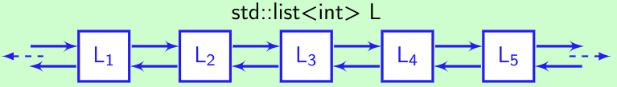

# Структуры данных

- [Скалярные типы и строки](#скалярные-типы-и-строки)
- [Массивы](#массивы)
- [Списки, словари (хэш-таблицы), множества](#списки-словари-хэш-таблицы-множества)
- [Кортежи](#кортежи)
- [Изменяемость типов данных](#изменяемость-типов-данных)
- [Сложности операций вставки и поиска](#сложности-операций-вставки-и-поиска)
- [Внутреннее устройство стандартных контейнеров](#внутреннее-устройство-стандартных-контейнеров)
- [Графы](#графы)
- [Деревья](#деревья)
- [Самобалансирующиеся деревья (АВЛ, красно-черное)](#самобалансирующиеся-деревья-авл-красно-черное)
- [Понимание вычислительной сложности О() поиска и вставки данных)](#понимание-вычислительной-сложности-о-поиска-и-вставки-данных)

## `Структуры данных` - это специализированные средства организации и хранения данных на компьютерах таким образом, чтобы мы могли более эффективно выполнять операции с сохраненными данными.

--- 
## Скалярные типы и строки
К стандартным скалярным типам относятся данные `целочисленного, вещественного, литерного и булевого типа`.
- `Целочисленный` тип определяет все целые числа в диапазоне от –32768 до +32767. Для их описания служит стандартный идентификатор integer. Байтовый тип аналогичен целочисленному, но охватывает более узкий диапазон значений от 0 до 255.
- `Вещественный` тип данных включает все положительные, отрицательные числа и ноль. Мантисса может содержать до 11 значащих цифр. Описывается стандартным идентификатором real. Если при выполнении арифметических выражений с данными типа real возникает переполнение по верхней границе диапазона, появляется сообщение об ошибке. При выходе значения за нижнюю границу переменной присваивается нулевое значение, и работа продолжается.
- `Булевый` тип данных описывается стандартным идентификатором boolean. Принимает только одно из двух значений: True или False .
- `Литерный` тип данных, идентификатор char. Константы и переменные этого типа могут принимать одно из значений кодовой таблицы ПЭВМ. Значение переменных и констант должно быть заключено в апострофы. Например, 'A', '+', '5', '' , ' ? ', ''''.
- `Скалярные` типы, определённые самим пользователем. К ним относятся перечисляемый и интервальный типы.
Перечисляемый тип задаётся непосредственно перечислением всех значений, которые может принимать переменная данного типа. Отдельные значения указываются через запятую, а весь список заключается в круглые скобки.
Интервальный тип позволяет задавать две константы, определяющие границы диапазона значений для данной переменной. Обе константы должны принадлежать одному из типов. Значение первой константы должно быть обязательно меньше второй.
- `Строковый` тип — тип данных, значениями которого является произвольная последовательность символов алфавита. Каждая переменная такого типа может быть представлена фиксированным количеством байтов либо иметь произвольную длину.

[Вернуться к началу статьи](#структуры-данных)

---
## Массивы
`Массив` — упорядоченный набор элементов, каждый из которых хранит одно значение, идентифицируемое с помощью одного или нескольких индексов. В простейшем случае массив имеет постоянную длину и хранит единицы данных одного и того же типа, а в качестве индексов выступают целые числа.

[Вернуться к началу статьи](#структуры-данных)

---
## Списки, словари (хэш-таблицы), множества
- `Список` — это абстрактный тип данных, представляющий собой упорядоченный набор значений. Если значение встречается несколько раз, каждое вхождение считается отдельным элементом. Списки используются для хранения наборов однотипных элементов. Списки хранят элементы в том порядке, в котором они были добавлены. Однонаправленный, двунаправленный, кольцевой.
- `Хэш-таблица` — структура, которая содержит пары ключ/значение. Она использует хэш-функцию для вычисления индекса в массиве из блоков данных, чтобы найти желаемое значение.
- `Хэш-функция` принимает строку символов в качестве вводных данных и выводит числовое значение. Для одного и того же ввода хэш-функция должна возвращать одинаковое число.

Когда вводится пара ключ/значение в хэш-таблицу, ключ проходит через хэш-функцию и превращается в число. В дальнейшем это число используется как фактический ключ,  который соответствует определенному значению. Когда вы снова введёте тот же ключ, хэш-функция обработает его и вернет такой же числовой результат. Затем этот результат будет использован для поиска связанного значения. Такой подход сокращает среднее время поиска.

`Множество` хранит значения данных без определенного порядка, не повторяя их. Оно позволяет не только добавлять и удалять элементы:
- Объединение комбинирует все элементы из двух разных множеств, превращая их в одно (без дубликатов).
- Пересечение анализирует два множества и  создает еще одно из тех элементов, которые присутствуют в обоих изначальных множествах.
- Разность выводит список элементов, которые есть в одном множестве, но отсутствуют в другом.
- Подмножество выдает булево значение, которое показывает, включает ли одно множество все элементы другого множества.

[Вернуться к началу статьи](#структуры-данных)

---
## Кортежи
`Кортеж` — упорядоченный набор фиксированной длины. Кортежи неизменяемые структуры данных. Так же как списки они могут состоять из элементов разных типов, перечисленных через запятую. Изменять его элементы нельзя.

[Вернуться к началу статьи](#структуры-данных)

---
## Изменяемость типов данных
Объекты, чье значение может измениться, называются изменяемыми; объекты, значение которых неизменяемо после их создания, называются неизменяемыми.
Изменчивость объекта определяется его типом; например, числа, строки и кортежи неизменны, а словари и списки изменчивы.

[Вернуться к началу статьи](#структуры-данных)

---
## Сложности операций вставки и поиска
- В случае с массивом (добавление в начало) необходимо пересчитать все индексы.
- ???

[Вернуться к началу статьи](#структуры-данных)

---
## Внутреннее устройство стандартных контейнеров
`Список` – ещё один последовательный контейнер:
> 

Каждый элемент хранится в своей области памяти независимо от других элементов.
Последовательный доступ к элементам списка:
 - доступ по индексу отсутствует: чтобы получить доступ к 4-му элементу, надо последовательно пройти первые 3 элемента
 - «медленный» доступ к произвольному элементу, «быстрый» к следующему/предыдущему
 - функция size() «перелистывает» весь список
 - Легко осуществляется добавление и удаление элементов:
 - операция не затрагивает никакие другие элементы, кроме тех с которыми она производится
 - меняются только ссылки на следующий и предыдущий элементы
 - при добавлении выделяется память для элемента контейнера, при удалении же освобождается

Множество специализированных функций для «перемещения» элементов.
Словарь — тип данных, представляющий собой коллекцию пар "ключ-значение". В рамках одного словаря ключи не повторяются. Словарь не запоминает порядок добавления элементов и вместо этого сохраняет элементы так, чтобы операции над содержимым словаря были максимально эффективны.

[Вернуться к началу статьи](#структуры-данных)

---
## Графы
 - С греческого граф — «пишу», «описываю». Граф — это множество точек (вершин, узлов), которые соединяются множеством линий (рёбер, дуг). Теория графов (то есть систем линий, соединяющих заданные точки).

 [Вернуться к началу статьи](#структуры-данных)

---
## Деревья
 - Это связный ациклический граф. Связность означает наличие маршрута между любой парой вершин, ацикличность — отсутствие циклов. Отсюда, в частности, следует, что число рёбер в дереве на единицу меньше числа вершин, а между любыми парами вершин имеется один и только один путь.

 [Вернуться к началу статьи](#структуры-данных)

---
## Самобалансирующиеся деревья (АВЛ, красно-черное)
- АВЛ-дерево - сбалансированное по высоте двоичное дерево поиска: для каждой его вершины высота её двух поддеревьев различается не более чем на 1. То есть, по сути - идеально сбалансированное дерево.
Для поддержания баланса, если при новой вставке высота поддеревьев различается больше, чем на 1, происходит балансировка (один из 4-х видов - малая левая, большая левая, малая правая, большая правая). Вид балансировки определяется ситуацией (в какую позицию относительно соседей вставлено).

- Красно-черное дерево - еще один вид самобалансирующихся деревьев, только дерево не идеально, а "примерно" сбалансированно. В каждую вершину добавляется еще одно поле - бит, отвечающий цвету (красный или черный). С помощью этого поддерживаются следующие свойства:

Разница. Так как в идеально сбалансированном дереве много ресурсов тратится на поддержание сбалансированности, рекомендуется использовать его в ситуации, когда вставка/удаление происходит существенно реже считывания. Красно-черные деревья, наоборот, тратят меньше ресурсов на поддержание сбалансированности (хотя здесь тоже есть перебалансировка), и их лучше использовать, когда вставка и чтение проиходят примерно с одинаковой частотой. Именно на основе красно-черных деревьев основываются большинство реализаций set и map из STL.

[Вернуться к началу статьи](#структуры-данных)

---
## Понимание вычислительной сложности О() поиска и вставки данных
O-большое — это количество операций. Сложность алгоритмов обычно оценивают по времени выполнения или по используемой памяти. Формально O(f(n)) означает, что время работы алгоритма растёт в зависимости от объёма входных данных не быстрее, чем некоторая константа, умноженная на f(n). O(n) — линейная сложность. O(log n) — логарифмическая сложность.  O(n2) — квадратичная сложность.

[Вернуться к началу статьи](#структуры-данных)
