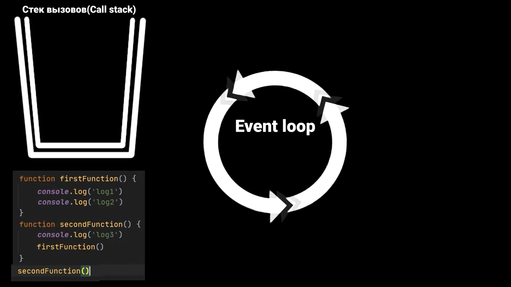
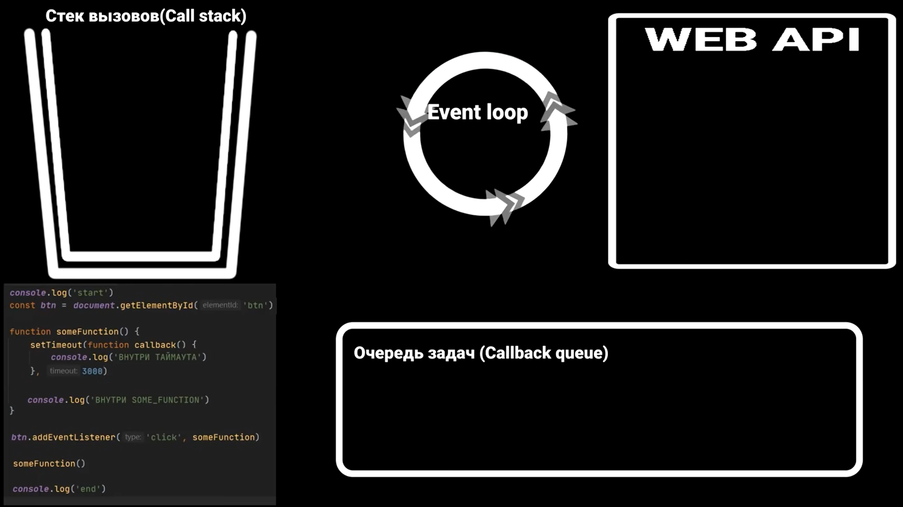

# JavaScript

- [Типы данных в JS](#type-data-in-js)
- [NaN](#nan)
- [Constructor or literal](#constructor-or-literal)
- [HasOwnProperty](#hasownproperty)
- [Use strict](#use-strict)
- [Выражения и инструкции](#expression-and-statement)
- [Cycle for in](#cycle-for-in)
- [Массивы](#array)
- [Функции](#function)
- [Прототип](#prototype)
- [Объекты](#object)
- [Descriptor](#descriptor)
- [Приведение объектов к примитивам](#reduction-to-primitives)
- [Деструктуризация](#destructurization)
- [Spread and Rest](#spread-and-rest)
- [PreventDefault and StopPropagation](#preventdefault-and-stoppropagation)
- [Memoization](#memoization)
- [Symbol](#symbol)
- [Promise](#promise)
- [Асинхронность](#asynchrony)
- [Event Loop](#event-loop)
- [Особенности JavaScript](#features-javascript)
- [Многопоточное и асинхронное программирование](#multithreaded-and-asynchronous-programming)
- [Generators (функции генераторы)](#generators)
- [Итераторы Symbol.iterator](#iterators)

## Данные

## Type data in JS

Примитивные type:

- `null` - null.
- `undefined` - undefined.
- `boolean` - true, false.
- `number` - 2020, 1.5, NaN, Infinity.
- `string` - 'Hello', "Hello".
- `symbol` - Symbol().
- `BigInt`

  Cсылочные type:

- `object` - { name: 'Sergey', age: 30 }
- `array` - [1, 2, 3]
- `date`: new Date()

Особенности:

1. JS динамически типизированный язык.
2. Одна и та же переменная может хранить в себе любой тип данных.
3. Нам не нужно определять тип данных при создании переменных.
4. Если мы хотим использовать статическую типизацию мы можем использовать TypeScript.

> В JavaScript есть примитивные типы и ссылочные типы.
> Примитивные типы включают `number`, `string`, `boolean`, `null`, `undefined`. И ссылочные типы включают объекты, массивы и функции.
> Разница между этими типами заключается в том, что примитивные типы неизменяемы `immutable`, а ссылочные типы изменяемы `mutable`.

> Переменная, которой присвоен объект, хранит не сам объект, а его «адрес в памяти» – другими словами, «ссылку» на него.

Для проверки типов используется - `typeof`:

```JS
    console.log(typeof 42);
    // expected output: "number"
    console.log(typeof 'blubber');
    // expected output: "string"
    console.log(typeof true);
    // expected output: "boolean"
    console.log(typeof undeclaredVariable);
    // expected output: "undefined"
```

В JavaScript существует два оператора сравнения значений которые называется оператором равенства `==`, и `===`, который называется оператором строгого равенства.

> Оператор (равенства) сравнивает значения после преобразования их типов данных, если нужно, перед сравнением.
> Например, если сравнить число и строку с помощью оператора равенства, то строка будет преобразована в число, а затем сравниваться будут два числа:

```javascript
'5' == 5 // true
```

> Оператор (строгого равенства) не выполняет преобразования типов данных и сравнивает объекты только в том случае, если они имеют одинаковый тип данных.
> Например, если сравнить число и строку с помощью оператора строгого равенства, то результатом будет `false`, потому что типы данных не совпадают:

```javascript
'5' === 5 // false
```

Оператор двойного отрицания - `!!` в JavaScript - это простой способ привести значение к типу `Boolean`.
Если вы используете оператор `!!` с любым значением, JavaScript преобразует его в эквивалентное значение типа `Boolean`.

```javascript
console.log(!!0) // false
console.log(!!1) // true
console.log(!!'Hello') // true
console.log(!!null) // false
console.log(!!undefined) // false
```

> Этот оператор часто используется для проверки наличия значения или проверки значения на равенство “true” или “false”. Например, если вы хотите проверить, есть ли значение в переменной “value”, вы можете использовать “!!value”:

```javascript
if (!!value) {
	// Действия, если значение не является "false", "null", "undefined", "0" или ""
}
```

> Такой способ позволяет в краткой и простой форме привести значение к его логическому эквиваленту, который можно использовать в циклах и условиях.
> В целом, использование оператора двойного отрицания - `!!` - помогает сделать код более читаемым и экономит время и усилия при приведении различных типов данных в JavaScript.

[Вернуться к началу статьи](#javascript)

---

## NaN

> `NaN` не равно ни одному значению, даже самому себе.
> Рекомендуемый способ проверить, содержит ли переменная `NaN` — использовать `Number.isNaN(value)`.
> Преобразование числовых строк в числа, в случае неудачи может дать `NaN`.
> Рекомендуется проверять, не возвращают ли `parseInt()`, `parseFloat()` или `Number()` NaN.

- `parseInt()` - принимает строку в качестве аргумента и возвращает целое число в соответствии с указанным основанием системы счисления.
- `parseFloat()` - принимает строку в качестве аргумента и возвращает десятичное число (число с плавающей точкой)

[Вернуться к началу статьи](#javascript)

---

## Constructor or literal

### Что значит создавать переменную через конструктор или через литерал?

> В JS можно создать строковое значение двумя способами, используя литерал или используя конструктор, используя конструктор мы создаем именно объект, а используя литерал мы создаем просто переменную, это действительно важно.

```JS
    let str = 'Its my string';
    let anotherStr = new String('Its my another string');
```

Важно понимать, в каких ситуациях правильно пользоваться литералами, а в каких правильно создавать свои конструкторы

```JS
    let someObj = {};
    let someObj = 'string';
    let someObj = 123;
```

Вся строка в целом называется инструкцией

- `let` - это ключевое слово, определяющее переменную.
- `someObj` - идентификатор, т.е. имя конструкции, которую мы создаем.
- `=` - оператор присваивания.
- `{}, 'string', 123` - литералы.
- `{}` - литерал, который означает, что создается пустой объект.
- `'string'` - строковый литерал.

Один из способов создать объект - с помощью литерала:

```JS
    let user = {}; // создали пустой объект
    user.name = 'admin';
    user.getName = function () {
      return this.name;
    }
```

Есть и другой способ создания объекта: с помощью конструктора и ключевого слова `new`.

```JS
    let user3 = new Object(); // то же самое, что и {}, но на порядок больше кода
    user3.name = 'admin';
    user3.getName = function () {
      return this.name;
    }
```

> Первый вывод, который можно сделать: литералы стоит применять хотя бы потому, что объем кода при этом получается меньше, чем при использовании конструктора.
> В первую очередь это касается создания пустых объектов.
> Но все-таки конструкторы - это системные объекты и некоторые из них тоже стоит использовать, например, конструктор Date().
> Тем более, что с помощью литерала мы не сможем создать конструктор Date().
> Кроме того, конструктор Object() может стать причиной неоднозначности вашего кода.
> На самом деле конструктор Object() является фабрикой и, в зависимости от входящего в него параметра, может полностью поменять принцип своего поведения.

Пользовательские конструкторы

```JS
    function User(name) {
      this.name = name;
      this.isMarred = false;

      this.SayHello = function() {
        console.log(`My name is`, this.name);
      }
    }

    const woman = new User('Kate');
    console.log(woman);
    console.log(woman.SayHello());

    const man = new User('Sergei');
    console.log(man.SayHello());
```

[Вернуться к началу статьи](#javascript)

---

## Dot notation or call in square brackets

### Когда при обращении к свойству объекта стоит использовать точечную нотацию, а когда через строку в квадратных скобках?

### Литералы и свойства

> При использовании литерального синтаксиса {...} мы сразу можем поместить в объект несколько свойств в виде пар «ключ: значение»:

```JS
  let user = {     // объект
    name: "John",  // под ключом "name" хранится значение "John"
    age: 30        // под ключом "age" хранится значение 30
  };

  // получаем свойства объекта:
  alert( user.name ); // John
  alert( user.age ); // 30
```

### Квадратные скобки

> При использовании для доступа к свойствам квадратных скобок можно применять ключи, которые не являются действительными JavaScript-идентификаторами (например, ключ может быть строкой, содержащей пробелы).
> Они могут иметь любое значение, которое можно привести к строке:

```JS
let french = {};
  french["merci beaucoup"] = "thank you very much";
  french["merci beaucoup"]; //"thank you very much"
```

> При попытке обращения к несуществующему свойству объекта сообщения об ошибке не появится, но возвращено будет значение undefined:

```JS
  let obj = {
    message : "A message"
  }
  obj.message //"A message"
  obj["message"] //"A message"

  obj.otherProperty //undefined
```

[Вернуться к началу статьи](#javascript)

---

## HasOwnProperty

> JavaScript метод `hasOwnProperty(`) возвращает логическое значение, которое указывает на то, содержит ли объект указанное cобственное (не унаследованное) свойство, или метод.
> Метод возвращает `true` в том случае, если объект имеет не унаследованное свойство с указанным именем и `false, если объект не имеет свойства с указанным именем или если это свойство он наследует от своего объекта прототипа.
> Обращаю Ваше внимание, что в отличие от оператора in метод hasOwnProperty() не проверяет существование свойств в цепочке прототипов объекта.

`Глобальные переменные` – это такие, которые объявлены в глобальной области видимости. То есть вне блока, функции и модуля.

```JS
  // глобальная переменная сar
  let car = 'Audi';
```

`Локальные переменные` – это такие, которые объявлены в локальной области видимости. Например, внутри блока {...}:

```JS
  {
    // количество просмотров
    let totalViews = 10;
  }

  // Локальные переменные имеют локальную область действия, т.е. они не будут доступны за пределами той области, в которой объявлены:
  {
    let total = 10;
  }
  console.log(totalViews); // Uncaught ReferenceError: totalViews is not defined
```

[Вернуться к началу статьи](#javascript)

---

## Use strict

> На протяжении долгого времени JavaScript развивался без проблем с обратной совместимостью. Новые функции добавлялись в язык, в то время как старая функциональность не менялась.
> Преимуществом данного подхода было то, что существующий код продолжал работать.
> А недостатком – что любая ошибка или несовершенное решение, принятое создателями JavaScript, застревали в языке навсегда.
> Так было до 2009 года, когда появился ECMAScript 5 (ES5).
> Он добавил новые возможности в язык и изменил некоторые из существующих.
> Чтобы устаревший код работал, как и раньше, по умолчанию подобные изменения не применяются.
> Поэтому нам нужно явно их активировать с помощью специальной директивы: "use strict".

[Вернуться к началу статьи](#javascript)

---

## Выражения

## Expression and statement

- `Выражение (англ. expression)` — это код, который после выполнения возвращает какое-либо значение. Например, 5 + 3 вернёт 8, а Math.random() — случайное число.
- `Инструкция (англ. statement)` — это отдельная команда в коде, которая выполняет определённое действие. Например, if позволяет создать ветвление в программе, for позволяет повторять одно и то же действие.

> Условный (тернарный) оператор - единственный оператор в JavaScript, принимающий три операнда: условие, за которым следует знак вопроса (?), затем выражение, которое выполняется, если условие истинно, сопровождается двоеточием (:), и, наконец, выражение, которое выполняется, если условие ложно.

[Вернуться к началу статьи](#javascript)

---

## Cycle for-in

> Цикл for...in возвращает все перечисляемые свойства, включая имеющие не целочисленные имена и наследуемые.
> Так как порядок прохода зависит от реализации, проход по массиву может не произойти в правильном порядке.
> Следовательно, лучше с числовыми индексами использовать циклы for.

Для массива:

- Будут перебираться не только индексы, но и другие свойства. Если вместо массива окажется массивоподобный объект, то может попасться свойство length.
- Если подключены полифилы для массивов (что весьма вероятно), в браузерах, не умеющих делать скрытые свойства, в перебор попадут все эти функции.
- Перебираются только индексы, которые есть в массиве. Если элемент массива удалялся через delete, либо добавление в массив происходило по индексу после его конца, то отсутствующие индексы будут пропущены. Но порядок перебираемых индексов будет верным.

```JS
  let a = [undefined, , 4];
  a[7] = undefined;

  for (var i in a) { // 0 2 7
    console.log(i);
  }
```

- Перебор массива через for in по производительности уступает нормальному циклу в десятки раз.

### ES6

- Для перебора элементов массива (значений, не индексов!) ES6 вводит цикл for of:

```JS
  let a = [undefined, , 4];
  a[7] = undefined;

  for (var x of a) {
    console.log(x);
  }
// 2 раза выводится undefined, затем 4 и ещё 5 раз undefined.
```

Проверяем, определена ли переменная в js?

```JS
  // Проверяют так
  if (typeof variable !== 'undefined') {
  // code
  }

  // Можно и так, ибо все глобальные переменные лежат в window
  if (window.variable !== void 0) {
  // code
  }
```

[Вернуться к началу статьи](#javascript)

---

## Массивы

## Array

Массив - упорядоченные коллекции данных. Особый подвид объектов. Копируется по ссылке.

### 5 способов создать массив в JavaScript

- С помощью литерала массива.
  > `Литерал массива` — это список из нуля или более выражений, каждое из которых представляет элемент массива, заключенный в квадратные скобки ( [] ). Когда вы создаете массив, используя литерал массива, он инициализируется с помощью переданных значений, которые будут являться его элементами, длина массива будет равна числу переданных аргументов.

```
 [element0, element1, ..., elementN];
```

Можно указывать не все значения, пропущенные элементы будут иметь значение undefined

```JS
  const array = [0, ,2];
```

- Через конструктор Array()

```
  new Array(element0, element1[, ...[, elementN]])
  new Array(arrayLength)
```

```JS
  const array = new Array();
```

```JS
  // массив с инициализацией (в примере массив с двумя элементами.
  // Значение первого элемента — 1, значение второго элемента — 2).
  // Данная запись возможна только при числе элементов от двух.
  const array = new Array(1,2);
```

```JS
  // массив с заданной длинной, но не инициализированным(-и) значением(-ями).
  // В данном примере длина массива (array.length) будет 3 элемента, значение элементов - undefined.
  const array = new Array(3);
```

- С помощью метода Array.of()

```
  Array.of(element0[, element1[, ...[, elementN]]])
```

Этот метода создаёт новый экземпляр массива Array из произвольного числа аргументов.

- Создание массива с помощью метода from()

> Функция Array.from() создаёт новый массив на основе переданного объекта. Объект должен быть либо массивоподобным (как строка или объект arguments), либо итерируемым (как Set или Map).

```JS
  // Массив из строки
  const arr = Array.from('дока')
  console.log(arr)
  // ['д', 'о', 'к', 'а']

  // Массив из Set
  const uniqueNumbers = new Set()
  uniqueNumbers.add(1)
  uniqueNumbers.add(2)
  uniqueNumbers.add(3)

  const arr = Array.from(uniqueNumbers)
  // [1, 2, 3]

  // Массив из NodeList
  const linkElements = document.getElementsByTagName('a')
  const arrLinks = Array.from(linkElements, function(a) { return a.href })

```

> Array.from() работает не со всеми объектами. Объект должен обладать одним из двух свойств, чтобы его получилось превратить в массив:

- Элементы объекта проиндексированы и объект имеет свойство length.
  Такие объекты называют массивоподобными, потому что именно эти свойства присущи массиву.
  Этим свойством обладают объекты `arguments`, `NodeList`, `HTMLCollection`.
- Объект итерируемый, то есть реализует интерфейс Iterable. Этим свойством обладают объекты Set и Map.

### Перебор массива

```javascript
// С помощью цикла for:
let arr = [1, 2, 3]

for (let i = 0; i < arr.length; i++) {
	console.log(arr[i])
}

// С помощью метода forEach():
let arr = [1, 2, 3]

arr.forEach(function (item) {
	console.log(item)
})
```

> В методе forEach() нельзя прервать обход элементов массива раньше времени, так как этот метод не возвращает никаких значений и не предоставляет возможности изменять порядок перебора элементов.
> Можно использовать стандартный цикл for, чтобы перебирать элементы массива и прервать цикл с помощью оператора break, при выполнении определенного условия.

```javascript
let arr = [1, 2, 3, 4, 5]

for (let i = 0; i < arr.length; i++) {
	console.log(arr[i])

	if (arr[i] === 3) {
		break // обход прерван, когда элемент равен 3
	}
}
```

> Прервать обход элементов массива с можно помощью объекта `some` или `every`.
> Метод `some()` прекращает обход, как только функция обратного вызова (callback) вернет `true`. Метод `every()` также прекращает обход, но когда функция обратного вызова вернет `false`.

```javascript
// Пример использования метода some():
let arr = [1, 2, 3, 4, 5]

arr.some(function (item) {
	console.log(item)
	return item === 3 // обход массива прекращается, когда item равен 3
})

// Пример использования метода every():
let arr = [1, 2, 3, 4, 5]

arr.every(function (item) {
	console.log(item)
	return item < 4 // обход массива прекращается, когда item больше или равен 4
})
```

### Взаимодействие с массивом

```JS
  const colors = ['red', 'green', 'grey', 'blue',];
  // shift - Удаляет из массива первый элемент и возвращает его
  const firstColor = colors.shift(); // 'red'

  // pop - Удаляет последний элемент из массива и возвращает его.
  const colors = ['red', 'green', 'grey', 'blue',];
  const color = colors.pop(); // 'blue'

  const names = ['John', 'Darina', 'Mark', 'Kris'];
  // Нам необходимо удалить из массива второй элемент.
  let name = names.splice(2, 1); // начиная со второго элемента удаляем один элемент
  console.log(names); // [ 'John', 'Darina', 'Kris' ]
  console.log(name); // [ 'Mark' ]

  let arr = ["t", "e", "s", "t"];
  // Он возвращает новый массив, в который копирует все элементы с индекса start до end
  console.log( arr.slice(1, 3) ); // e,s (копирует с 1 до 3)
  console.log( arr.slice(-2) ); // s,t (копирует с -2 до конца)
```

```JS
  const arr = ['Kety', {name: 'Sergei'}, false, function(){ console.log(`Hello`) },];
  arr[3](); // Вызов функции из массива
```

> В любой момент вы можете установить свойство `length` для обрезки массива.
> Когда вы расширяете массив, изменяя его свойство length, реальное количество элементов в массиве увеличивается; например, если вы установите свойство length в 3, когда оно равно 2, массив будет из 3 элементов, где значение третьего элемента будет равно undefined .
> Способ обнуления длины массива - arr.length = 0 работает точно так же, как и splice, элементы остаются в памяти, пока сборщик мусора до них не дойдет.

```JS
  const a = [1, 2, 3];
  a[10] = 4; // установили длину в 10 и добавили еще один элемент [ 1, 2, 3, <7 empty items>, 4 ]
  a[10] = 5; // перезапишет предыдущие значение.

  console.log(a.length) // 11
  console.log(a) // [ 1, 2, 3, <7 empty items>, 5 ]

  let colors = ['синий', 'красный', 'желтый', 'белый', 'черный'];
  console.log(colors.length)  // выводит 5

  delete colors[0]; // удаляем первый элемент 'синий'.

  console.log(colors) // [ <1 empty item>, 'красный', 'желтый', 'белый', 'черный' ]
  console.log(colors.length)  // по-прежнему выводит 5, потому что максимальный индекс 4
```

### Преобразование массива

- `map` - Можно создавать новые массивы и заносить их в новые переменные, служит для преобразования текушего массива в новый.

```JS
  const newPeople = people.map(person => {
    return `${person.name}: ${person.budget}`;
  });
```

- `filter` - Служит для фильтрации исходного массива по определенным условиям.
  По сути нужно чтобы callback вернул `true` или `false`.
  `true` записывается в новый массив.

```JS
  const adulstAll = people.filter(person => person.age < 21);
```

- `reduce` - Служит для получения финального значения совершив итерацию по какому-то массиву.

```JS
  const amount = people.reduce((total, person) => {
    return total += person.budget;
  }, 0);
```

- `forEach` - Служит для перебора массива и позволяет запускать функцию для каждого элемента массива, без изменения текущего и создания нового массива.

```JS
  people.forEach(person => {
    person.city = 'kaluga';
  });
```

- `sort` - сортирует массив на месте, меняя в нём порядок элементов

```JS
  const arr = [1, 5, 47, 3, 37, 2, 7];
  arr.sort((a, b) => {return a - b}); // [1, 2, 3, 5, 7, 37, 47] Для корректной сотрировки
```

- `some` - Метод массива some() позволяет узнать, есть ли в массиве хотя бы один элемент, удовлетворяющий условию в функции-колбэке.

```JS
  const nums = [3, 5, 7, 8, 9, 11]
  const hasEvenNumber = nums.some(num => {
    return num % 2 === 0
  })
  console.log(hasEvenNumber) // true
```

- `every` - Метод массива `.every()` позволяет узнать, удовлетворяют ли все элементы в массиве условию в функции-колбэке.
  Результатом вызова метода `.every()` будет boolean-значение `true` или `false`.
  Если хотя бы один элемент не будет удовлетворять условию, то результат будет `false`.

```JS
  const users = [
  { name: 'Анна', online: true },
  { name: 'Михаил', online: true },
  { name: 'Саша', online: true },
]
  const isAllUsersOnline = users.every(user => {
    return user.online
  })
  console.log(isAllUsersOnline)// true
```

- `splip` - `split(", ")` разбивает строку на массив по заданному разделителю. Вызов `split("")` с пустым аргументом, разбил бы строку на массив букв.

```JS
  const names = "Kate, Sergei, Max";
  const arr = names.split(", ");
  console.log(arr) // ["Kate", "Sergei", "Max"]
```

- `join` - создаёт строку из элементов arr, по указанному разделителю `", "` между ними.

```JS
  const arr = ["Kate", "Sergei", "Max",];
  const newArr = arr.join("; ");
  console.log(newArr)  // Kate; Sergei; Max
```

### C помощью метода `indexOf()` можно определить позицию подмассива в массиве.

Для этого необходимо передать в метод indexOf() искомый подмассив в качестве аргумента.

```javascript
let arr = [1, 2, 3, 4, 5, 6]
let subArr = [3, 4, 5]

let index = arr.indexOf(subArr)

console.log(index)
// Вывод: -1
```

### В JavaScript можно применять методы массивов для строк.

```javascript
let str = 'Hello, world!'
let arr = str.split('') // разделение строки на массив символов
console.log(arr) // ['H', 'e', 'l', 'l','o', ',', ' ', 'w','o', 'r', 'l', 'd','!']

console.log(str.length) // вывод длины строки (количество символов)
// Вывод: 13

let newStr = arr.join('-') // объединение массива символов обратно в строку, с разделителем "-"
console.log(newStr)
// Вывод: "H-e-l-l-o-,- -w-o-r-l-d-!"
```

### Удаляем значения `null` или `undefined` из массива.

```javascript
// Метод filter() создает новый массив, состоящий только из элементов исходного массива,
// для которых функция обратного вызова возвращает значение true.
let arr = [1, null, 2, undefined, 3]
let filteredArr = arr.filter(function (el) {
	return el !== null && el !== undefined
})

console.log(filteredArr) // Вывод: [1, 2, 3]
```

### Преобразование массивоподобного объекта к массиву.

```javascript
// Array.from() создает новый экземпляр массива из массивоподобного объекта или итерируемого объекта, преобразуя его в настоящий массив
let obj = { 0: 'a', 1: 'b', 2: 'c', length: 3 }
let arr = Array.from(obj)

console.log(arr) // Вывод: ["a", "b", "c"]

// С помощью оператора расширения (spread operator ...) можно быстро и удобно преобразовать массивоподобный объект в массив
let obj = { 0: 'a', 1: 'b', 2: 'c', length: 3 }
let arr = [...obj]

console.log(arr) // Вывод: ["a", "b", "c"]
```

[Вернуться к началу статьи](#javascript)

---

## Function

### Чистые функции (2 важные составляющие)

- Каждый раз функция возвращает одинаковый результат, когда она вызывается с тем же набором аргументов
- Нет побочных эффектов(Не влияет на окружающие переменные)

> В JavaScript функции являются объектами, поэтому, как и любой другой объект, функции можно создавать с помощью конструктора.
> Конструктор функции в JavaScript - это функция, которая используется для создания объектов функций.
> Конструктор функции имеет свойство `prototype`, которое является объектом, содержащим свойства и методы, которые наследуются всеми экземплярами функции, созданными с помощью этого конструктора.

### Что такое `всплытие` объявления переменных, и в каком случае у функций тут появляются особенности?

> `Всплытие` объявления переменных (Hoisting) - это поведение в JavaScript, когда объявления переменных и функций перемещаются вверх внутри области видимости перед выполнением кода.
> В случае функций, всплытие может привести к так называемому `Function Hoisting` (всплытие функции), когда объявление функции перемещается вверх в области видимости перед выполнением кода.
> Особенностью здесь является то, что это позволяет использовать функции в коде до их объявления. Однако, если функция объявляется внутри блока условия или цикла, ее область видимости ограничивается этим блоком и может вызвать ошибки, если вы пытаетесь обратиться к этой функции вне этого блока.
> Таким образом, важно иметь в виду всплытие при написании кода на JavaScript, чтобы не допустить ошибок и не навредить функциональности вашего кода

### Влияние директивы `use strict` на `всплытие`.

> Директива `use strict` влияет на всплытие (hoisting) в JavaScript, а именно, строгое режим (strict mode) отключает всплытие необъявленных переменных, т.е. переменные, которые не были объявлены, не будут автоматически созданы и объявлены как глобальные.
> Кроме того, в строгом режиме функции, объявленные как объявление функции (function declaration), не могут иметь одноименных параметров и свойств, т.к. это приведет к ошибке выполнения.
> Таким образом, использование директивы ‘use strict’ может помочь избежать ошибок, связанных с всплытием необъявленных переменных и одноименными параметрами и свойствами функций, и сделать код более надежным и безопасным.

### IIFE (Immediately Invoked Function Expression)

> IIFE (Immediately Invoked Function Expression) - это выражение функции, которая вызывается сразу после определения. Это позволяет создавать локальную область видимости для переменных и функций, которые могут быть использованы внутри этой функции без конфликтов с другими частями кода.

```javascript
;(function () {
	//code
})()
```

Преимущества IIFE включают в себя:

- Изолированный скоуп, позволяющий избежать конфликтов имен переменных
- Сокрытие внутренних переменных и функций от глобальной области видимости
- Оптимизация кода и избавление от неиспользуемых переменных

> IIFE также может принимать аргументы, которые могут быть использованы внутри функции, и возвращать значение, которое может быть присвоено переменной, как в следующем примере:

```javascript
let result = (function (x, y) {
	return x + y
})(10, 5)

console.log(result) // 15
```

### Сохранение родительского контекста при вызове IIFE.

> Чтобы сохранить родительский контекст при вызове IIFE, необходимо передать необходимые значения в функцию, используя аргументы, и затем вызвать эту функцию сразу после объявления.

```javascript
function parentFunction() {
	var x = 5

	;(function childFunction(y) {
		console.log(x + y)
	})(3)
}

parentFunction() // Output: 8
```

> В этом примере мы объявляем функцию «childFunction» внутри функции «parentFunction» и передаем переменную «x» в качестве родительского контекста и переменную «y» как аргумент. Затем мы вызываем «childFunction» сразу после ее определения, передавая ей значение 3. Когда функция вызывается, она получает доступ к переменной «x» в родительском контексте и выводит 8 в консоль, соединив значение x и y.

> Таким образом, передача значений в IIFE в виде аргументов позволяет сохранять родительский контекст при вызове функции, что позволяет избежать создания глобальной переменной или привязки функции к объекту, чтобы сохранить ее контекст.

### Cпособы привязать контекст `this` и в чем их различия (bind/call/apply)

1. `bind()` создает новую функцию с привязанным контекстом (this), которой можно передать аргументы. bind() не вызывает функции сразу, а возвращает новую функцию с привязанным контекстом:

```javascript
const obj = {
	x: 10,
}

function test() {
	console.log(this.x)
}

const bindTest = test.bind(obj) // привязываем контекст obj
bindTest() // Output: 10
```

2. `call()` вызывает функцию с указанным контекстом (this) и переданными аргументами:

```javascript
const obj = {
	x: 10,
}

function test(y) {
	console.log(this.x + y)
}

test.call(obj, 5) // указываем контекст obj и передаем аргумент y = 5
// Output: 15
```

3. apply() вызывает функцию с указанным контекстом (this) и аргументами, которые передаются в виде массива:

```javascript
const obj = {
	x: 10,
}

function test(y, z) {
	console.log(this.x + y + z)
}

test.apply(obj, [5, 2]) // указываем контекст obj и передаем аргументы в виде массива
// Output: 17
```

> Разница между call() и apply() заключается только в том, как передаются аргументы в функцию, call() принимает список аргументов, apply() принимает массив аргументов.
> Все три способа привязки контекста позволяют определить нужный контекст для функции, чтобы она правильно выполнила свою работу.

### Наиболее простой паттерн, позволяющий облегчить читаемость функции, когда у нее огромное количество аргументов.

> Один из наиболее простых паттернов для облегчения читаемости функции с большим количеством аргументов - это использование объекта в качестве аргумента, который включает в себя все необходимые параметры. Это позволяет передавать параметры с именами, что улучшает читаемость кода и позволяет упростить вызов функции

```javascript
function updateUser(options) {
	const { id, name, email, address, phone } = options

	return options
	//обновляем пользователя с указанным id в базе данных
	//используя другие переданные параметры
}

const user = updateUser({
	id: 123,
	name: 'John Doe',
	email: 'john.doe@example.com',
	address: '123 Main Street',
	phone: '555-1234',
})

console.log(user) // { id: 123, name: 'John Doe', email: 'john.doe@example.com', address: '123 Main Street', phone: '555-1234'}
```

### Пример создания объекта функции через конструктор:

```JS
  function MyFunction() {
    this.name = "My Function";
    this.sayHello = function() {
      console.log("Hello from " + this.name);
    }
  }

  const myFunc = new MyFunction();
  myFunc.sayHello();
```

### Поверхностное и полное копирование объекта

#### В JavaScript есть 4 основных способа вызова функций, которые задают контекст выполнения функции. Эти способы называются:

- Поверхностное копирование копирует только ссылку на объект, а не сам объект. Это означает, что новый объект и исходный объект ссылаются на одни и те же данные.

```javascript
const obj1 = {
	//исходный объект
	a: 1,
	b: 2,
	c: {
		d: 3,
		e: 4,
	},
}

const obj2 = Object.assign({}, obj1) //поверхностное копирование

obj2.c.d = 5 //изменяем значение свойства в новом объекте
console.log(obj1.c.d) // Output: 5 (меняется значение исходного объекта, так как obj1 и obj2 ссылаются на один и тот же вложенный объект)
```

- Для полного копирования объекта необходимо создать новый объект, который содержит копию всех вложенных объектов. Это можно сделать с помощью рекурсивной функции.

```javascript
const obj1 = {
	//исходный объект
	a: 1,
	b: 2,
	c: {
		d: 3,
		e: 4,
	},
}

function deepCopy(obj) {
	//рекурсивная функция
	const newObj = {}

	for (let prop in obj) {
		if (typeof obj[prop] === 'object') {
			newObj[prop] = deepCopy(obj[prop]) //рекурсивный вызов для вложенных объектов
		} else {
			newObj[prop] = obj[prop] //копируем свойство, если это примитив
		}
	}

	return newObj
}

const obj2 = deepCopy(obj1) //полное копирование

obj2.c.d = 5 //изменяем значение свойства в новом объекте
console.log(obj2.c.d) // Output: 5
console.log(obj1.c.d) // Output: 3 (значение исходного объекта не изменилось)
```

2.

```javascript
// У этого метода есть ограничение — копируемые данные должны быть сериализуемы.
// Несериализуемые данные: примитив undefined, функция, symbol - при вызове JSON.stringify получаем undefined
// Массивы и объекты - сериализуемы.
const itemsInCart = [
	{ product: 'Носки', quantity: 3 },
	{ product: 'Штаны', quantity: 1 },
	{ product: 'Кепка', quantity: 1 },
]

const clonedCart = [...itemsInCart]

const deep = JSON.parse(JSON.stringify(itemsInCart))
console.log(itemsInCart[1] === deep[1]) // false
```

> `Вызов функции как функции`.
> Это самый простой способ вызова функции, который происходит, когда функция вызывается без контекста объекта.
> В этом случае `this` будет ссылаться на глобальный объект, если функция не использует `use strict`, в противном случае - на `undefined.`

```JS
  function myFunction() {
    console.log(this);
  }

  myFunction(); // Выводит глобальный объект (window в браузере, global в Node.js)
```

> `Вызов функции как метода объекта`. Когда функция вызывается как метод объекта, `this` ссылается на этот объект.
> `this` в конструкторах и классах ссылается на только что созданный новый объект.

```JS
  const myObject = {
    myMethod() {
      console.log(this);
    }
  };

  myObject.myMethod(); // Выводит объект myObject
```

> `Вызов функции с помощью метода call()`.
> Метод `call()` вызывает функцию с явно заданным значением this.
> Первый аргумент метода `call()` - это объект, на который будет ссылаться `this`, а последующие аргументы - это аргументы, передаваемые в функцию.

```JS
  function myFunction(a, b) {
    console.log(this);
    console.log(a, b);
  }

  const myObject = { myProperty: 'myValue' };

  myFunction.call(myObject, 1, 2); // Выводит объект myObject, затем 1 и 2
```

> `Вызов функции с помощью метода apply()`.
> Метод `apply()` работает так же, как метод `call()`, за исключением того, что аргументы передаются в виде массива.

```JS
  function myFunction(a, b) {
    console.log(this);
    console.log(a, b);
  }

  const myObject = { myProperty: 'myValue' };

  myFunction.apply(myObject, [1, 2]); // Выводит объект myObject, затем 1 и 2
```

Каждый из этих способов определяет значение `this` внутри функции, которое зависит от контекста вызова функции.

> В обычном режиме (use strict не используется), значение this в этих случаях будет равно глобальному объекту.
> Это связано с тем, что в обычном режиме JavaScript пытается автоматически привязать this к глобальному объекту в этих случаях, если он не является явно определенным.
> Однако, в строгом режиме use strict, этот механизм привязки не работает, и this остается неопределенным, если он не был явно привязан к объекту.

### Arguments

> В JavaScript есть специальный объект arguments, который содержит все аргументы, переданные в функцию, включая те, которые не были объявлены в параметрах функции.
> Вы можете использовать объект arguments, чтобы получить доступ к этим аргументам.

Например, следующая функция принимает два аргумента, но может также принимать дополнительные аргументы, которые не объявлены:

```JS
  function myFunction(arg1, arg2) {
    console.log(arg1, arg2);

    // Перебираем дополнительные аргументы с помощью объекта arguments
    for (let i = 2; i < arguments.length; i++) {
      console.log(arguments[i]);
      console.log(arguments); // [Arguments] { '0': 'foo', '1': 'bar', '2': 'baz', '3': 'qux' }
    }
  }

  myFunction('foo', 'bar', 'baz', 'qux'); // Выводит "foo", "bar", "baz", "qux"
```

> В этом примере мы объявляем два параметра (arg1 и arg2), но затем мы используем объект arguments, чтобы получить доступ ко всем аргументам, начиная с индекса 2 (т.е. дополнительных аргументов). Мы можем перебирать эти аргументы с помощью цикла for и выполнять с ними любые операции, которые нам нужны.

> Обратите внимание, что объект arguments имеет некоторые ограничения, такие как отсутствие некоторых методов массивов, поэтому, если вам нужно выполнить сложные операции с аргументами, вам может потребоваться сконвертировать объект arguments в настоящий массив. Это можно сделать, например, с помощью следующего кода:

```JS
  const argsArray = Array.prototype.slice.call(arguments);
```

> Этот код преобразует объект arguments в настоящий массив с помощью метода slice() из прототипа массива.

### Рекурсия

> `Рекурсия` - это техника программирования, при которой функция вызывает сама себя с некоторыми аргументами. В JavaScript, как и в других языках программирования, рекурсия может быть использована для решения ряда задач, таких как обход деревьев, поиск путей, сортировка, генерация перестановок и многих других

> Однако, при использовании рекурсии необходимо быть осторожным, так как она может привести к переполнению стека вызовов (stack overflow), особенно при обработке больших данных или при неправильном использовании.

```JS
  function factorial(n) {
    if (n <= 1) {
      return 1;
    }
    return n * factorial(n - 1);
  }

  console.log(factorial(5)); // Выводит 120

// Рекурсивный способ: упрощение задачи и вызов функцией самой себя:
  function powRec(x, n) {
    return (n == 1) ? x : (x * powRec(x, n - 1));
  }

  powRec(2, 3); // 8
```

> `Контекст выполнения` – специальная внутренняя структура данных,
> которая содержит информацию о вызове функции.
> Она включает в себя конкретное место в коде, на котором находится интерпретатор,
> локальные переменные функции,
> значение `this` (мы не используем его в данном примере) и прочую служебную информацию.

> Обратим внимание на требования к памяти!!!
> Рекурсия приводит к хранению всех данных для неоконченных внешних вызовов в стеке,
> и в данном случае это приводит к тому, что возведение в степень n хранит в памяти n различных контекстов.

### Замыкание

> Замыкание – это функция, которая запоминает свои внешние переменные, то есть своё лексическое окружение и может получить к ним доступ.
> То есть, они автоматически запоминают, где были созданы, с помощью скрытого свойства [[Environment]] и все они могут получить доступ к внешним переменным.
> Лексическое окружение создаётся при выполнении блока кода и содержит локальные переменные для этого блока.
> Лексическое окружение существует для любых блоков кода {...}.

```JS
  function getUrl(url) {
	let domen = '.com';
	return function () {
      return `https://${url}${domen}`;
	};
  }
  let google = getUrl('google');
  let faceBook = getUrl('facebook');
  console.log(google()); // https://google.com
  console.log(faceBook()); // https://facebook.com
```

Замыкания могут быть полезны во многих ситуациях, например:

- Для создания приватных переменных и методов, которые не могут быть доступны извне функции.
- Для создания функций-фабрик, которые возвращают другие функции с предопределенными параметрами.
- Для создания функций высшего порядка (higher-order functions), которые принимают функции в качестве аргументов и/или возвращают функции в качестве результата.
- Для сохранения состояния между вызовами функции.
- Для решения задач, связанных с асинхронным выполнением кода, таких как обработка событий.

> Callback (функция обратного вызова) - это функция, которая передается в качестве аргумента в другую функцию и вызывается после завершения определенной операции. Это означает, что функция-колбэк будет выполнена после того, как функция, которой она была передана, завершит свою работу.

```JS
  // В этом примере функция fetchData принимает два аргумента: url и callback.
  // Она загружает данные по указанному URL-адресу и передает их в функцию-колбэк, которая была передана в качестве аргумента.
  // Функция displayData - это пример функции-колбэка, которая просто выводит данные в консоль
  function fetchData(url, callback) {
    fetch(url)
      .then(response => response.json())
      .then(data => callback(data))
      .catch(error => console.error(error));
  }

  function displayData(data) {
   console.log(data);
  }

  fetchData('https://api.example.com/data', displayData);
```

> Колбэки могут быть использованы для обработки ошибок, событий, асинхронных операций, а также для реализации различных шаблонов проектирования, таких как наблюдатель (observer) и событийный эмиттер (event emitter).
> Однако, излишнее использование колбэков может привести к созданию сложного и трудно поддерживаемого кода, поэтому следует оценивать, когда использование колбэков является наиболее удобным и эффективным решением.

[Вернуться к началу статьи](#javascript)

---

## Prototype

> Функция-конструктор в JavaScript используется для создания новых объектов.
> Она представляет собой особый тип функций, которые используются для создания объектов с определенными свойствами и методами.
> Для создания объекта с помощью функции-конструктора необходимо использовать ключевое слово “new”. Пример:

```JS
  function Person(name, age) {
    this.name = name;
    this.age = age;
    this.greet = function() {
      console.log(`Hello, my name is ${this.name} and I am ${this.age} years old.`);
    }
  }

  let john = new Person("John", 30);
  john.greet(); // выводит "Hello, my name is John and I am 30 years old."

  // Добавляем в его протопип новый метод
  Person.prototype.exit = function () {
    console.log(`Пользователь ${this.name} вышел`);
  };
```

> `[[prototype]]` `(__proto__)` и `function.prototype`.
> `Prototype` - свойство объектов, которое содержит свойство и методы своих родителей и родителей родителя. Prototype это объект(ссылка) содержащий все те же свойства и методы. Он есть у любого объекта.
> Оператор `instanceof` позволяет проверить, к какому классу принадлежит объект, с учётом наследования.
> JavaScript объекты имеют специальное скрытое свойство `[[Prototype]]` (так оно названо в спецификации), которое либо равно null, либо ссылается на другой объект.
> Этот объект называется «прототип». Обратите внимание, что `proto` — не то же самое, что `[[Prototype]]`.
> Это геттер/сеттер для него. Есть только два ограничения:
> Ссылки не могут идти по кругу. JavaScript выдает ошибку, если мы попытаемся назначить proto по кругу.


Методы объекта в JavaScript можно хранить как свойства в самом объекте, так и в его прототипе. Однако, хранение методов в прототипе объекта предпочтительнее из следующих причин:

- Экономия памяти: хранение методов в прототипе позволяет сократить объем занимаемой памяти на каждый новый экземпляр объекта.
  Если методы хранятся в самом объекте, то каждый экземпляр будет иметь свою копию метода, что может привести к значительному расходу памяти, особенно если объект имеет много экземпляров.
- Упрощение обновления методов: если методы хранятся в прототипе объекта, то их можно обновлять для всех экземпляров одновременно, изменив только одну копию в прототипе.
  Если методы хранятся в самом объекте, то для обновления каждого экземпляра придется изменять его копию метода.
- Улучшение производительности: при обращении к методу объекта JavaScript сначала ищет его в самом объекте, а затем производит поиск в прототипе объекта.
  Если метод находится в прототипе объекта, то поиск выполняется быстрее, чем если метод хранится в самом объекте.

Поэтому, хранение методов объекта в прототипе является более эффективным и удобным способом. Кроме того, такой подход является основой для многих паттернов объектно-ориентированного программирования в JavaScript.

### Создание объекта, который не от чего не наследуется

В JavaScript существует несколько способов создания объектов, которые не наследуются от никаких других, например:

1. С помощью `Object.create(null)`:

```JS
  const obj = Object.create(null);
```

> Метод `Object.create(null)` создает объект, который не наследуется от базового объекта Object.prototype, а, следовательно, не имеет свойств и методов, определенных в этом объекте.

2. С помощью функции-конструктора и Object.setPrototypeOf():

```JS
  function MyObject() {
   // ...
  }
  const obj = new MyObject();
  Object.setPrototypeOf(obj, null);
```

- `JavaScript` метод ` setPrototypeOf()``ECMAScript 2015 ` позволяет установить или изменить прототип указанному объекту.
  > С помощью функции-конструктора мы создаем объект `MyObject`.
  > Затем мы устанавливаем прототип объекта `obj`, созданного с помощью этой функции-конструктора, `равным null`, используя метод `Object.setPrototypeOf()`.
  > Такой объект не наследуется от базового объекта `Object.prototype`.

3. С помощью литеральной нотации и Object.setPrototypeOf():

```JS
  const obj = { /* свойства и методы */ };
  Object.setPrototypeOf(obj, null);
```

> Мы создаем объект с помощью литеральной нотации, а затем используем метод `Object.setPrototypeOf()` для установки прототипа равным `null`.

В любом из этих случаев создается объект, который не наследуется от базовых объектов и не имеет свойств и методов, определенных в них. Такой объект называется “чистым объектом”.

### Наследование в JS

1. Прототипное наследование: объект наследует свойства и методы от своего прототипа. Прототип объекта является объектом с определенным набором свойств и методов, которые могут наследоваться на экземпляры этого объекта.

```JS
    function Animal(name) {
      this.name = name;
    }

    Animal.prototype.sayName = function() {
      console.log(`My name is ${this.name}`);
    }

    function Cat(name) {
      Animal.call(this, name);
    }

    Cat.prototype = Object.create(Animal.prototype);
    Cat.prototype.constructor = Cat;

    let myCat = new Cat("Lucy");
    myCat.sayName(); // "My name is Lucy"
    // В этом примере объект Cat наследует свойства и методы от Animal,
    // устанавливая объект Animal в качестве его прототипа и добавляя собственные свойства.
```

2. Классическое наследование: использование ключевого слова extends появилось в ECMAScript 6 и дает возможность явно наследовать классы друг от друга.

```JS
    class Animal {
      constructor(name) {
        this.name = name;
      }

      sayName() {
        console.log(`My name is ${this.name}`);
      }
    }

    class Cat extends Animal {
      speak() {
        console.log("Meow!");
      }
    }

    let myCat = new Cat("Lucy");
    myCat.sayName(); // "My name is Lucy"
    myCat.speak(); // "Meow!"
```

3. Миксины: это способ объединения свойств и методов из нескольких объектов в один. Создается объект, который наследуется и объединяет свойства и методы из двух или более других объектов.

```JS
    let speakMixin = {
      speak() {
        console.log(`${this.name} говорит`);
      }
    };

    class Person {
      constructor(name) {
        this.name = name;
      }
    }

    Object.assign(Person.prototype, speakMixin);

    let person = new Person("John");
    person.speak(); // "John говорит"
  // В этом примере объект speakMixin содержит метод speak, который добавляется к объекту Person с помощью Object.assign.
```

- `JavaScript` метод ` assign()``ECMAScript 2015 ` позволяет произвести поверхностное копирование значений всех перечислимых собственных свойств и методов из одного или нескольких исходных объектов в целевой объект

4. Функциональное наследование: используется создание объекта внутри функции с помощью замыкания. Функция возвращает объект с определенными свойствами и методами, которые могут быть унаследованы.

```JS
    function makePerson(name) {
      let person = {};
      person.name = name;
      person.speak = function() {
        console.log(`${this.name} говорит`);
      }
      return person;
    }

    let person = makePerson("John");
    person.speak(); // "John говорит"
```

[Вернуться к началу статьи](#javascript)

---

## Object

### Что такое геттеры и сеттеры?

> Getter и setter это методы объекта JavaScript, которые позволяют получить и установить значение свойства объекта, соответственно. Getter возвращает значение свойства, а setter устанавливает его значение.

Например, для объекта person со свойством name, вы можете создать геттер и сеттер следующим образом:

```javascript
let person = {
	_name: 'John',
	get name() {
		return this._name
	},
	set name(newName) {
		this._name = newName
	},
}

console.log(person.name) // 'John'
person.name = 'Jane'
console.log(person.name) // 'Jane'
```

---

## Descriptor

### Дескриптор

> Дескриптор свойства в JavaScript - это объект, который определяет атрибуты и функциональность для свойства объекта. Они могут быть использованы для определения того, как свойство работает, как оно может быть изменено, и как оно будет выглядеть при итерации.

> Дескриптор свойства состоит из трех основных составляющих: значение свойства, флагов и функций-геттера и сеттера.

- Значение свойства - это значение, которое хранится в свойстве объекта.
- Флаги определяют поведение свойства, их четыре вида:
  - `writable` : если установлен в true, свойство может быть изменено с помощью оператора присваивания. Если false, свойство доступно только для чтения (read-only).
  - `enumerable` : если установлен в true, свойство будет видимо в for…in или Object.keys(). Если false, свойство скрыто.
  - `configurable` : если установлен в true, свойство может быть изменено с помощью оператора delete и изменены флаги. Если false, свойство защищено от удаления и изменений.
  - `value` : отвечает за установку значения свойства.
- Функции геттера и сеттера - это методы объекта, которые позволяют получить и установить значение свойства. Они могут быть определены через соответствующие ключи get и set.

Дескрипторы свойств позволяют:

- Настраивать операции чтения (`getters`) и записи (`setters`) для свойства
- Сделать свойство доступным только для чтения (`read-only`)
- Сделать свойство не редактируемым
- Сделать свойство не перечисляемым (чтобы оно не выводилось в циклах)
- Удалить свойство из объекта

```javascript
let obj = {}

// Установить свойство foo со значением "bar"
Object.defineProperty(obj, 'foo', {
	value: 'bar',
	writable: false, // делаем свойство read-only
	enumerable: true, // делаем свойство перечисляемым
})

// Получаем значение свойства foo
console.log(obj.foo) // "bar"

// Попытка изменить значение свойства foo
obj.foo = 'baz'
console.log(obj.foo) // "bar" (значение не изменено)

// Удаляем свойство foo из объекта
delete obj.foo
console.log(obj.foo) // undefined
```

> В JavaScript дескрипторы свойств могут быть получены с помощью методов Object.getOwnPropertyDescriptor() и Object.getOwnPropertyDescriptors(). Они также могут быть использованы для определения свойств объекта через методы Object.defineProperty() и Object.defineProperties().

[Вернуться к началу статьи](#javascript)

---

## Reduction to primitives

### Приведение объектов к примитивам.

> Приведение объектов к примитивам в JavaScript происходит автоматически во время выполнения операций, которые ожидают получить примитивное значение.

Когда происходит операция приведения объекта к примитиву, JavaScript последовательно выполняет следующие шаги:

- Если объект имеет метод `Symbol.toPrimitive`, JavaScript вызывает его и возвращает результат. Этот метод позволяет определить нестандартные приведения к примитивам.
- Если объект является датой `Date`, JavaScript преобразует его в строку с помощью метода `toString()`.
- Если объект является числом `Number`, JavaScript преобразует его в число с помощью метода `valueOf()`.
- В остальных случаях JavaScript преобразует объект в строку с помощью метода `toString()`.

> При преобразовании объекта в примитив происходит неявное приведение типов. Это значит, что JavaScript автоматически приводит объект к примитивному типу (строке, числу или логическому значению), если ожидается результат такого типа.

```javascript
let obj = { x: 5, y: 10 }
let sum = obj.x + obj.y // JavaScript автоматически преобразует объект obj в число, чтобы выполнить операцию сложения

console.log(sum) // 15
```

> JavaScript не поддерживает прямое сложение двух объектов. Оператор `+` может использоваться только для выполнения операций со значениями примитивных типов.

> Однако, можно создать специальный метод для объектов, который определит, каким образом должно выполняться сложение. Например, можно создать метод valueOf(), который вернет числовое значение свойства объекта. Затем результатом операции сложения будет сумма значений свойств объектов, как если бы они были числами. Выглядеть это будет следующим образом:

```javascript
const a = {
	x: 3,
	valueOf() {
		return this.x
	},
}
const b = {
	x: 5,
	valueOf() {
		return this.x
	},
}
console.log(a + b) // 8
```

> Метод valueOf() определен в каждом объекте, основанном на числе (Number, Date, Math), чтобы позволить взаимодействие с ними как с примитивным значением.

```javascript
// Как сделать так, чтобы следующее выражение (c==1 && c==2 && c==3) вернуло true?
let c = {
	value: 1,
	valueOf() {
		const val = this.value
		this.value++
		return val
	},
}

console.log(c == 1 && c == 2 && c == 3) // true
```

[Вернуться к началу статьи](#javascript)

---

## Destructurization

### Деструктуризация

> Деструктуризация JavaScript позволяет извлекать значения из массивов и объектов, сохраняя их в переменных с помощью синтаксиса, похожего на массив или объект.

Например, для доступа к свойству объекта можно использовать следующий код:

```javascript
const obj = { name: 'Alice', age: 25 }
const name = obj.name // присваивает значение "Alice" переменной name
```

С использованием деструктуризации это можно сделать более компактно:

```javascript
// Этот код создает новую переменную name, которой присваивается значение Alice.
const { name } = { name: 'Alice', age: 25 }
```

Для массивов деструктуризация выглядит похожим образом:

```javascript
const arr = [1, 2, 3]
const [a, b] = arr // a = 1, b = 2
```

> Деструктуризация может быть очень полезной, когда необходимо обратиться к значениям объекта или массива в нескольких местах кода, или когда необходимо извлечь несколько значений из массивов или объектов сразу.

> Деструктуризация также полезна, когда вы работаете с функциями, возвращающими массивы или объекты. Вы можете сразу же присвоить извлеченные значения переменным внутри функции.

```JavaScript
function getPerson() {
  return {
    name: 'John',
    age: 30,
    city: 'New York'
  };
}

const { name, age, city } = getPerson();

console.log(name); // Вывод: 'John'
console.log(age); // Вывод: 30
console.log(city); // Вывод: 'New York'
```

[Вернуться к началу статьи](#javascript)

---

## Spread and Rest

### Разница между spread-оператором и rest-оператором.

Spread-оператор и Rest-оператор в JavaScript - это два разных оператора, которые используются для работы с массивами и объектами.
Остаточные параметры ...Rest и оператор расширения ...Spread.

> Оператор Spread (…) используется для распаковки элементов массива, объекта или строки в другой массив, объект или функцию.

```javascript
// распаковка элементов массива
const arr1 = [1, 2, 3]
const arr2 = [...arr1, 4, 5, 6] // [1, 2, 3, 4, 5, 6]

// распаковка свойств объекта
const obj1 = { name: 'Alice', age: 25 }
const obj2 = { ...obj1, gender: 'female' } // { name: 'Alice', age: 25, gender: 'female' }

// распаковка аргументов функции
const sum = (a, b, c) => a + b + c
const arr = [1, 2, 3]
const result = sum(...arr) // 6
```

> Оператор Rest (также …) также используется для работы с массивами и объектами, но он выполняет обратную операцию - упаковку значений в массив. Он позволяет объединять любое количество оставшихся аргументов функции в один массив:

```javascript
const sumAll = (...args) => args.reduce((total, num) => total + num)
sumAll(1, 2, 3) // 6
sumAll(4, 5, 6, 7, 8) // 30
```

> Используя оператор Rest, вы можете извлекать часть элементов массива или свойств объекта, которые необходимы, и сохранять оставшиеся элементы в отдельный массив для дальнейшей обработки.

[Вернуться к началу статьи](#javascript)

---

## PreventDefault and StopPropagation

> В JavaScript методы event.preventDefault () и event.stopPropagation () используются для предотвращения выполнения действий по умолчанию браузера при обработке событий.

> Метод `event.preventDefault()` вызывается в обработчике события для отмены действий по умолчанию(обновления страницы). Например, если вы хотите отменить отправку формы при нажатии на кнопку отправки, вы можете использовать preventDefault():

> Метод event.stopPropagation() нужен для предотвращения дальнейшего распространения события на более высокие уровни элементов в иерархии DOM.
> Например, если у вас есть вложенные элементы и обработчики событий для каждого элемента, вы можете использовать stopPropagation() для того, чтобы предотвратить выполнение обработчиков событий на элементах, расположенных “выше” в DOM.

[Вернуться к началу статьи](#javascript)

---

## Memoization

### Мемоизация

> Мемоизация (Memoization) - это техника оптимизации, которая заключается в запоминании результатов выполнения функций для предотвращения повторных вычислений.

> Когда функция вызывается с определенными аргументами, она может занимать значительное время на выполнение вычислений для получения нужного результата. Если эти же аргументы будут переданы в функцию позже, то она должна будет выполнить вычисления снова, даже если результаты уже известны.

> Мемоизация решает эту проблему, запоминая результаты выполнения функции для конкретных наборов входных аргументов. Когда функция вызывается с аргументами, для которых результат уже известен, он возвращается непосредственно из “кэша” (запомненных результатов), тем самым экономя время и ресурсы.

> Для создания мемоизированной функции в JavaScript рекомендуется использовать замыкание. В этом случае обернув функцию в другую функцию, можно создать объект кэша, который будет содержать результаты вычислений функции для различных наборов входных аргументов.

```javascript
function memoize(func) {
	const cache = {}
	return function (...args) {
		const argsKey = JSON.stringify(args)
		if (cache[argsKey]) {
			console.log('return from cache')
			return cache[argsKey]
		}

		console.log('calculate')
		const result = func.apply(this, args)
		cache[argsKey] = result
		return result
	}
}

const factorial = memoize(n => {
	console.log(`factorial for ${n}`)
	return n === 0 ? 1 : n * factorial(n - 1)
})

console.log(factorial(5)) // 120
console.log(factorial(3)) // 6
console.log(factorial(5)) // return from cache 120
```

[Вернуться к началу статьи](#javascript)

---

## Symbol

> В JavaScript (JS) тип Symbol представляет собой уникальный и неизменяемый примитивный тип данных. Символы могут быть использованы в качестве уникальных идентификаторов для свойств объектов.

> Один из основных примеров использования символов в JavaScript - это создание уникальных свойств объектов. Когда вы создаете символ, он всегда будет уникальным, даже если его имя (описательная строка) совпадает с другим символом. Например:

```JavaScript
const id = Symbol('id');
const user = {
  name: 'John',
  [id]: 123
};

console.log(user[id]); // Вывод: 123
```

> Здесь мы создаем символ id и используем его в качестве уникального ключа для свойства объекта user. Мы можем получить доступ к значению свойства, используя этот символ в квадратных скобках.

> Еще один пример использования символов в JavaScript - это использование вместо строк в качестве ключей в объекте Map. Объект Map является структурой данных, где значения сохраняются по ключам. Символы могут быть использованы вместо строк в качестве ключей, обеспечивая уникальность и предотвращая возможные конфликты с другими свойствами объектов.

```javascript
const id1 = Symbol('id')
const id2 = Symbol('id')
const map = new Map()

map.set(id1, 'Value 1')
map.set(id2, 'Value 2')

console.log(map.get(id1)) // Вывод: Value 1
console.log(map.get(id2)) // Вывод: Value 2
```

> В этом примере мы создаем два уникальных символа id1 и id2 и используем их в качестве ключей в объекте Map. Обратите внимание, что хотя описательные строки символов совпадают, символы являются разными иллюстрации типа Symbol в JS предоставляют возможность создавать уникальные идентификаторы и ключи для объектов, предотвращая коллизии и конфликты имен.

[Вернуться к началу статьи](#javascript)

---

## Memory leaks in JavaScript

> Утечки памяти в JavaScript происходят, когда память, которая была выделена для объектов или переменных, не может быть корректно освобождена и остается занята ненужными данными. По мере продолжения выполнения программы, эти утечки могут накапливаться и приводить к исчерпанию доступной памяти, что может стать причиной снижения производительности или даже сбоев программы.

> Утечки памяти в JavaScript могут возникать из-за различных причин, вот некоторые из них:

- `Неправильное использование сборки мусора`: JavaScript использует механизм сборки мусора, который автоматически освобождает память, выделенную для неиспользуемых объектов. Однако, если объекты не являются доступными для сборщика мусора, например, если на них остаются ссылки, даже если они уже не нужны, они будут продолжать занимать память.

- `Циклические ссылки`: Если есть циклические ссылки между объектами, которые не являются доступными из корневого объекта, сборщик мусора не сможет определить, что эти объекты можно освободить, и они будут удерживаться в памяти, приводя к утечке памяти.

- `Нежелательные глобальные переменные`: Создание глобальных переменных, которые не очищаются или удаляются, может привести к утечкам памяти. Глобальные переменные остаются доступными в течение всего времени выполнения программы, и если они содержат большие объемы данных, они будут удерживать память, даже если они больше не нужны.

- `Некорректное управление ресурсами`: Если в JavaScript используются внешние ресурсы, такие как файлы, сетевые соединения или таймеры, и их необходимо явно освобождать или закрывать, неправильное управление этими ресурсами может привести к утечкам памяти. Например, если вы забыли закрыть сетевое соединение или очистить контекст работы с файлами после использования, память, выделенная для этих ресурсов, не будет освобождена.

- `Некорректное использование кэшей или кешированных данных`: Если в коде не управлять кэшированием данных и не обновлять или удалять устаревшие данные из кэша, это может привести к накоплению неиспользуемых данных в памяти.

> Чтобы предотвратить утечки памяти в JavaScript, рекомендуется следить за использованием памяти, правильно управлять ссылками на объекты, избегать циклических ссылок, осуществлять правильное закрытие ресурсов и активно удалять неиспользуемые данные.

> Если вы замечаете, что ваша программа испытывает проблемы с утечкой памяти, полезно использовать инструменты разработчика браузера, такие как инспектор памяти, для профилирования и анализа использования памяти вашей программой.

[Вернуться к началу статьи](#javascript)

---

## Promise

`Promise` (обещание) — это объект в JavaScript, который представляет собой результат асинхронной операции, которая может быть завершена с успехом (resolved) или ошибкой (rejected) в будущем.

`Promise` используется для управления асинхронными операциями и облегчения работы с ними. Он помогает избежать "callback hell" (чрезмерно вложенных коллбэков) и делает асинхронный код более легким для чтения и поддержки.

Основные концепции в Promise:

- Состояния (states) Promise: Promise может быть в трех состояниях:

  - Ожидание (pending): Изначальное состояние, когда Promise выполняется.
  - Завершено успешно (resolved): Promise успешно выполнен с результатом.
  - Завершено с ошибкой (rejected): Promise выполнен с ошибкой.

- Функции-обработчики: Promise предоставляет методы then() и catch(), которые позволяют назначить обработчики для обработки успешного выполнения (resolved) или ошибки (rejected) Promise.

- Цепочка Promise: Методы then() и catch() могут возвращать Promise, что позволяет создавать цепочки Promise-ов для выполнения последовательных асинхронных операций.

```javaScript
function fetchData() {
  return new Promise((resolve, reject) => {
    setTimeout(() => {
      const data = 'Some data from an async operation';
      // Если операция выполнена успешно:
      // resolve(data);

      // Если операция завершилась с ошибкой:
      reject(new Error('An error occurred'));
    }, 2000);
  });
}

// Использование Promise
fetchData()
  .then(data => {
    console.log(data); // Обработка успешного выполнения Promise
  })
  .catch(error => {
    console.error(error); // Обработка ошибки Promise
  });
```

> Promise позволяет структурировать асинхронный код и обрабатывать результаты асинхронных операций с помощью методов then() и catch(). Это помогает создавать код, который является более понятным, поддерживаемым и предсказуемым.

> ⚠️ Нельзя отменить выполнение промиса в стандартном API JavaScript. Promise ведет свой жизненный цикл, и после того, как он запущен, его выполнение продолжается до завершения или возникновения ошибки.

1.  `Promise.resolve(value)`: Создает промис, который выполняется успешно с переданным значением value. Если value сам является промисом, то Promise.resolve возвращает переданный промис без изменений.

```javaScript
const promise = Promise.resolve('Success');
 promise.then(result => {
 console.log(result); // Выведет 'Success'
});
```

2.  `Promise.reject(reason)`: Создает промис, который завершается с ошибкой, с переданным значением reason. Как и в случае с Promise.resolve, если reason является промисом, то он возвращается без изменений.

```javaScript
const promise = Promise.reject(new Error('Something went wrong'));
 promise.catch(error => {
 console.error(error); // Выведет ошибку 'Something went wrong'
});
```

3.  `Promise.all(promises)` : Принимает массив промисов promises и возвращает новый промис, который выполняется успешно, когда все промисы в массиве успешно выполняются, и его результатом является массив результатов каждого промиса. Если хотя бы один из промисов завершается с ошибкой, возвращаемый промис завершается с первой пойманной ошибкой.

```javaScript
const promise1 = Promise.resolve('One');
const promise2 = Promise.resolve('Two');

Promise.all([promise1, promise2])
  .then(results => {
    console.log(results); // Выведет ['One', 'Two']
  });

```

4. `Promise.race(promises)` : Принимает массив промисов promises и возвращает новый промис, который завершается при завершении любого из промисов в массиве. Независимо от того, успешно ли промис или завершился с ошибкой, результатом будет значение завершившегося промиса.

```javaScript
const promise1 = new Promise(resolve => setTimeout(resolve, 1000, 'One'));
const promise2 = new Promise(resolve => setTimeout(resolve, 2000, 'Two'));

Promise.race([promise1, promise2])
  .then(result => {
    console.log(result); // Выведет 'One' (promise1 завершился раньше)
  });
```

Преимущества и недостатки коллбэков и промисов:

Преимущества коллбэков:

- Простота использования, особенно для асинхронных операций, не связанных с последовательностью или комбинированием результатов.

Недостатки коллбэков:

- Закрытие (closure) коллбэков может стать проблемой и привести к утечке памяти или сложностям в отладке кода.
- Коллбэки могут быть многоуровневыми (callback hell) и вызывать проблемы с читаемостью и поддержкой кода.
- Отсутствие поддержки механизма обработки ошибок, что является частой проблемой в программировании асинхронного кода.

Преимущества промисов:

- Промисы обеспечивают более понятный и линейный подход к обработке асинхронных операций.
- Удобно использовать методы, такие как then() и catch() для обработки успешного выполнения или ошибок.
- Позволяют легко комбинировать и последовательно выполнять последовательности асинхронных операций.
- Обработка ошибок становится более структурированной и легче отслеживается.

Недостатки промисов:

- Не все старые браузеры и окружения полностью поддерживают промисы, поэтому возможно понадобится полифил.
- В некоторых случаях может потребоваться больше кода по сравнению с коллбэками, особенно при выполнении сложных последовательностей асинхронных операций.

[Вернуться к началу статьи](#javascript)

---

## Asynchrony

> JavaScript является одно-поточным языком. Асинхронность в JavaScript — это способ выполнения операций, не блокирующих основной поток программирования. Это означает, что код может выполнять долгие операции (например, сетевые запросы, чтение файлов и т.д.) параллельно, не ожидая их завершения, что позволяет улучшить отзывчивость и производительность приложения

Полезность асинхронности:

- Отзывчивость: Асинхронный код позволяет пользователям взаимодействовать с интерфейсом, пока выполняется долгий процесс (например, загрузка данных). Это улучшает пользовательский опыт, так как приложение не "замерзает".

- Эффективность: Асинхронные операции позволяют использовать время ожидания (например, при запросах к серверу) для выполнения других задач, что может увеличить общую производительность приложения.

- Управление параллелизмом: Асинхронность позволяет обрабатывать несколько операций одновременно, например, отправлять несколько запросов к API и получать результаты, как только они будут готовы.

- Упрощение сложных операций: Использование промисов и async/await позволяет легко писать и читать асинхронный код, что упрощает работу с многоэтапными асинхронными процессами.

Примеры асинхронных механизмов в JavaScript:

- `Callbacks`: Функции обратного вызова, которые передаются в другие функции и вызываются после завершения асинхронной операции.

- `Promises`: Объекты, представляющие результат асинхронной операции. Они могут находиться в одном из трех состояний: ожидание, выполнено или отклонено.

- `Async/Await`: Синтаксический сахар для работы с промисами, позволяющий писать асинхронный код в более синхронном стиле, что делает его более читабельным.

Минусы асинхронности:

- Сложность кода: Асинхронный код может быть сложнее для понимания и отладки, особенно при использовании колбеков. Это может привести к "адской CALLBACK" ситуации, когда колбеки вложены друг в друга, что делает код трудным для чтения.

- Обработка ошибок: Ошибки в асинхронном коде могут быть труднее отслеживать и обрабатывать. В классических синхронных вызовах ошибки можно просто "поймать" с помощью try/catch, тогда как в асинхронных вызовах нужно использовать другие механизмы (например, обработчики ошибок промисов).

- Проблемы с состоянием: При использовании асинхронных операций может быть сложно отслеживать состояние приложения, особенно если несколько операций выполняются одновременно. Это может привести к состояниям гонки и непредсказуемому поведению.

- Потенциальные утечки памяти: Если не очистить ссылки на колбеки или не удалить обработчики событий, это может привести к утечкам памяти, так как ненужные ссылки будут сохраняться в памяти.

- Сложность тестирования: Асинхронный код может быть сложнее тестировать, так как необходимо учитывать временные задержки и порядок выполнения операций, что требует дополнительных усилий при написании тестов.

- Зависимость от внешних ресурсов: Асинхронные операции часто зависят от внешних ресурсов, таких как API или базы данных. Если они медленные или недоступны, это может негативно сказаться на работе приложения.

[Вернуться к началу статьи](#javascript)

---

## Event Loop

> `Event Loop` (цикл событий) — это механизм в JavaScript, который позволяет выполнять асинхронный код, не блокируя основной поток выполнения. Он играет ключевую роль в однопоточной архитектуре JavaScript, обеспечивая выполнение вашего кода, обработку событий и управление асинхронными операциями.



Вот как работает Event Loop:

- `Стек вызовов (Call Stack)` : JavaScript использует стек вызовов для управления выполнением функций. Когда функция вызывается, она добавляется в стек, а когда она завершает выполнение, она удаляется из стека. Операции всегда попадают на вершину стека и с этой же вершины они выполняются. "Последним пришел, первым вышел"

- `Веб API` : Асинхронные операции, такие как сетевые запросы, таймеры `setTimeout или setInterval`, слушатели событий `eventListener`, `Promise`, ведут себя так, что выполняются вне стека вызовов. API регистрирует все вызовы асинхронных событий.

- `Callback queue (очередь задач)` : Когда асинхронная операция завершает выполнение (закончился таймер или был активирован какой-то eventListener), эта операция передается в очередь задач `Callback queue` и находится так до тех пор, пока не закончатся операции в `Call Stack` сколько бы их там не было. Задачи из очереди всегда ждут опустошения `Call Stack`. В очереди задач, в отличии от стека вызовов в первую очередь выполнятся те операции, которые попали туда первыми.

- `Event Loop` : `Event Loop` постоянно проверяет стек вызовов и очередь задач. Если стек вызовов пуст, `Event Loop` берет первый элемент из очереди задач и добавляет его в стек вызовов, а затем выполняет его. Это происходит, пока в очереди задач есть элементы и стек вызовов пуст.



> Таким образом, Event Loop обеспечивает асинхронное выполнение кода и позволяет JavaScript обрабатывать события, такие как клики мыши, таймеры или ответы от серверов, не блокируя при этом основной поток выполнения.

> Важно отметить, что поскольку JavaScript работает в однопоточном режиме, нельзя выполнять несколько операций одновременно. Однако Event Loop позволяет организовать асинхронное выполнение, что делает приложение более отзывчивым и эффективным!

### Почему для асинхронных действий не получится использовать try..catch?

> Использовать try...catch для обработки ошибок в асинхронных действиях может быть проблематично, потому что try...catch работает в синхронном контексте. Это означает, что он может поймать только ошибки, возникающие в пределах блока try во время синхронного выполнения кода.

- Асинхронные операции: Когда вы вызываете асинхронную функцию (например, с использованием `setTimeout`, промисов или `async/await`), её выполнение начинается, и контроль возвращается сразу, не дожидаясь завершения асинхронной операции. Таким образом, если ошибка произойдет в рамках этой асинхронной операции, `try...catch` не сможет её поймать.

- Обработка ошибок с промисами: Для промисов, если вы хотите обработать ошибки, вызванные асинхронным кодом, вам нужно использовать метод `.catch()` на самом промисе или обрабатывать ошибки внутри `async` функции с помощью `try...catch`, но уже в контексте выполнения самой асинхронной функции.

```javaScript
  async function myAsyncFunction() {
      try {
          const result = await someAsyncOperation(); // асинхронная операция
          console.log(result);
      } catch (error) {
          console.error('Произошла ошибка:', error); // обработка ошибки
      }
  }
```

- События: Если ошибка возникает в обработчике событий, `try...catch` в основном коде не может поймать её. Для этого вам нужно либо обрабатывать ошибки внутри самого обработчика событий, либо использовать глобальные обработчики ошибок, такие как `window.onerror` в браузере.

### Какие есть способы выполнить функцию асинхронно?

В JavaScript есть несколько способов выполнения функции асинхронно:

1. Использование `setTimeout` :

```javaScript
  setTimeout(() => {
      console.log('Функция выполнена асинхронно');
  }, 1000); // Выполнится через 1000 мс (1 секунда)
```

2. Использование `Promises` :

```javaScript
  function myAsyncFunction() {
      return new Promise((resolve, reject) => {
          // Асинхронная операция
          setTimeout(() => {
              resolve('Асинхронный результат');
          }, 1000);
      });
  }

  myAsyncFunction().then(result => console.log(result));
```

3. Использование `async/await` :

```javaScript
  async function execute() {
      const result = await myAsyncFunction();
      console.log(result);
  }

  execute();
```

4. Использование `fetch` для асинхронного получения данных который возвращает promise :

```javaScript
  async function fetchData() {
      try {
          const response = await fetch('https://api.example.com/data');
          const data = await response.json();
          console.log(data);
      } catch (error) {
          console.error('Ошибка при получении данных:', error);
      }
  }

  fetchData();
```

[Вернуться к началу статьи](#javascript)

---

## Features JavaScript

### Почему язык JavaScript считается событийным и неблокирующим?

1. Событийная модель:

- JavaScript разработан для работы в контексте веб-браузера, где взаимодействие с пользователем (например, клики мыши, нажатия клавиш) является основным источником событий. Эти события обрабатываются с помощью слушателей событий (event listeners), что позволяет программе реагировать на действия пользователя без необходимости прерывать выполнение других задач.

- Код JavaScript может зарегистрировать слушатели, которые будут вызваны при наступлении определенных событий, что делает его событийным

2. Асинхронная обработка:

- JavaScript использует асинхронную модель, которая позволяет выполнять задачи в фоновом режиме. Когда вы инициируете асинхронную операцию (например, сетевой запрос), управление сразу же передается обратно в основной поток выполнения, и программа не блокируется, ожидая завершения этой операции.
- Например, при использовании setTimeout, Promises, или async/await, JavaScript может продолжать выполнять другой код, пока асинхронная операция выполняется в фоновом режиме.

3. Однопоточное выполнение:

- JavaScript работает в однопоточном режиме, что означает, что он может выполнять только одну задачу за раз. Однако за счет использования событийного цикла (event loop) и очереди задач (task queue), он может обрабатывать асинхронные операции и события без блокировки основного потока.
- Когда асинхронная задача завершается, соответствующий колбек добавляется в очередь задач, и после завершения текущего выполнения стека вызовов, события из очереди могут быть обработаны.

4. Событийный цикл (event loop):

- Это ключевой механизм, который позволяет JavaScript управлять асинхронным кодом. Событийный цикл проверяет стек вызовов и очередь задач и обеспечивает их правильное выполнение без блокировки.

### Обработка событий в JavaScript

> Обработка событий в JavaScript осуществляется с помощью слушателей событий `event listeners`. Слушатели позволяют выполнять определённые действия в ответ на события, такие как нажатия клавиш, клики мыши, изменения полей ввода и многие другие.

- Выбор элемента: Сначала необходимо выбрать элемент на странице, к которому вы хотите добавить обработчик события. Это можно сделать с помощью методов, таких как document.getElementById, document.querySelector и других.

- Использование метода addEventListener: Для добавления обработчика события к выбранному элементу используется метод addEventListener. Он принимает два основных параметра: тип события и функцию-обработчик, которая будет вызвана при возникновении этого события.

- Определение функции-обработчика: Эта функция будет выполняться, когда произойдет указанное событие. В этой функции можно реализовать необходимую логику.

```JavaScript
  // 1. Выбираем элемент кнопки по ID
  const button = document.getElementById('myButton');

  // 2. Определяем функцию-обработчик
  function handleClick(event) {
      alert('Кнопка была нажата!');
  }

  // 3. Добавляем слушатель события 'click' к кнопке
  button.addEventListener('click', handleClick);
```

### Имитация многопоточности в JavaScript

> В JavaScript нет потоков в традиционном смысле, как, например, в языках программирования с многопоточностью, таких как Java или C++. Однако в JavaScript существует механизм, который позволяет выполнять асинхронные операции и обрабатывать их параллельно, используя Web Workers.

Web Workers

- Web Workers — это специальный JavaScript-поток, который выполняется в отдельном контексте и может выполнять длительные задачи без блокировки основного потока (UI).

Пример использования Web Workers:

1. Создайте файл worker.js (это будет ваш воркер):

```JavaScript
  // worker.js
  self.onmessage = function(event) {
      const result = event.data * 2; // Пример обработки данных
      self.postMessage(result); // Отправка результата обратно в основной поток
  };
```

2. Создайте основной файл main.js:

```JavaScript
// main.js
const worker = new Worker('worker.js');

worker.onmessage = function(event) {
    console.log('Результат из воркера:', event.data);
};

worker.postMessage(10); // Отправляем данные воркеру
```

Преимущества Web Workers:

- Выполнение задач в фоновом режиме, не блокируя основной поток.
- Обработка интенсивных вычислений (например, обработка больших массивов данных).
- Упрощение работы с асинхронными операциями.

Ограничения Web Workers:

- Web Workers имеют отдельный контекст выполнения и не могут обращаться к DOM.
- Они используют механизм передачи сообщений, поэтому данные необходимо сериализовать.

[Вернуться к началу статьи](#javascript)

---

## Multithreaded and asynchronous programming

Есть несколько разных понятий, связанных с областью параллельных вычислений.

- Конкурентное исполнение (concurrency)
- Параллельное исполнение (parallel execution)
- Многопоточное исполнение (multithreading)
- Асинхронное исполнение (asynchrony)

1. Конкурентность (concurrency)

- Конкурентность (concurrency) - это наиболее общий термин, который говорит, что одновременно выполняется более одной задачи. Например, вы можете одновременно смотреть телевизор и комментить фоточки.

- Конкурентное исполнение - это самый общий термин, который не говорит о том, каким образом эта конкурентность будет получена: путем приостановки некоторых вычислительных элементов и их переключение на другую задачу, путем действительно одновременного исполнения, путем делегации работы другим устройствам или еще как-то. Это не важно. Конкурентное исполнение говорит о том, что за определенный промежуток времени будет решена более, чем одна задача. Точка.

2. Параллельное исполнение

- Параллельное исполнение (parallel computing) подразумевает наличие более одного вычислительного устройства (например, процессора), которые будут одновременно выполнять несколько задач.

- Параллельное исполнение - это строгое подмножество конкурентного исполнения. Это значит, что на компьютере с одним процессором параллельное программирование - невозможно

3. Многопоточность

- Многопоточность - это один из способов реализации конкурентного исполнения путем выделения абстракции "рабочего потока" (worker thread).

- Потоки "абстрагируют" от пользователя низкоуровневые детали и позволяют выполнять более чем одну работу "параллельно". Операционная система, среда исполнения или библиотека прячет подробности того, будет многопоточное исполнение конкурентным (когда потоков больше чем физических процессоров), или параллельным (когда число потоков меньше или равно числу процессоров и несколько задач физически выполняются одновременно).

4. Асинхронное исполнение

- Асинхронность (asynchrony) подразумевает, что операция может быть выполнена кем-то на стороне: удаленным веб-узлом, сервером или другим устройством за пределами текущего вычислительного устройства.

- Основное свойство таких операций в том, что начало такой операции требует значительно меньшего времени, чем основная работа. Что позволяет выполнять множество асинхронных операций одновременно даже на устройстве с небольшим числом вычислительных устройств.

5. CPU-bound и IO-Bound операции

- Еще один важный момент, с точки зрения разработчика - разница между CPU-bound и IO-bound операциями. CPU-Bound операции нагружают вычислительные мощности текущего устройства, а IO-Bound позволяют выполнить задачу вне текущей железки.

- Разница важна тем, что число одновременных операций зависит от того, к какой категории они относятся. Вполне нормально запустить параллельно сотни IO-Bound операций, и надеяться, что хватит ресурсов обработать все результаты. Запускать же параллельно слишком большое число CPU-bound операций (больше, чем число вычислительных устройств) бессмысленно.

> Возвращаясь к исходному вопросу: нет смысла выполнять в 1000 потоков метод Calc, если он является CPU-Intensive (нагружает центральный процессор), поскольку это приведет к падению общей эффективности вычислений. ОС-ке придется переключать несколько доступных ядер для обслуживания сотен потоков. А этот процесс не является дешевым.

> Самым простым и эффективным способом решения CPU-Intensive задачи, заключается в использовании идиомы Fork-Join: задачу (например, входные данные) нужно разбить на определенное число подзадач, которые можно выполнить параллельно. Каждая подзадача должна быть независимой и не обращаться к разделяемым переменным/памяти. Затем, нужно собрать промежуточные результаты и объединить их.

### ⚠️ P.S. Теперь простое объяснение)))

Вам нужно выкопать во дворе бассейн:

- Вы взяли лопату и копаете. Это `однопоточная` работа
- Вы пригласили друга Васю и копаете вместе, периодически задевая друг-друга лопатами. Это `многопоточная` работа
- Пока вы копаете бассейн, Вася копает канаву под водопровод. Никто никому не мешает. Это `распараллеливание`
- Вы пригласили бригаду землекопов, а сами с Васей пошли пить пиво. Когда бригада все сделает, к вам придут за деньгами. Это `асинхронная` работа

Количество лопат в хозяйстве - это количество ядер в системе

[Вернуться к началу статьи](#javascript)

---

## Generators

> Обычные функции возвращают только одно-единственное значение (или ничего). Генераторы могут порождать (yield) множество значений одно за другим, по мере необходимости. Генераторы отлично работают с перебираемыми объектами и позволяют легко создавать потоки данных.

> Для объявления генератора используется специальная синтаксическая конструкция: `function*`, которая называется «функция-генератор».

```JavaScript
  function* generateSequence() {
    yield 1;
    yield 2;
    return 3;
  }
```

> Функции-генераторы ведут себя не так, как обычные. Когда такая функция вызвана, она не выполняет свой код. Вместо этого она возвращает специальный объект, так называемый «генератор», для управления её выполнением. Функция-генератор создаёт объект `генератор`.

```javaScript
  const generator = generateSequence();
  console.log(generator);
```

> Основным методом генератора является `next()`. При вызове он запускает выполнение кода до ближайшей инструкции yield <значение> (значение может отсутствовать, в этом случае оно предполагается равным undefined). По достижении `yield` выполнение функции приостанавливается, а соответствующее значение – возвращается во внешний код. Результатом метода `next()` всегда является объект с двумя свойствами:

- `value`: значение из yield.
- `done`: true, если выполнение функции завершено, иначе false.

```javaScript
// Здесь мы создаём генератор и получаем первое из возвращаемых им значений:
const one = generator.next();
console.log(one); // {value: 1, done: false}
console.log(JSON.stringify(one)); // {"value":1,"done":false}

// Повторный вызов generator.next() возобновит выполнение кода и вернёт результат следующего yield:
const two = generator.next();
console.log(two); // {value: 2, done: false}
console.log(JSON.stringify(two)); // {"value":2,"done":false}

// И, наконец, последний вызов завершит выполнение функции и вернёт результат return:
const three = generator.next();
console.log(three); // {value: 3, done: true}
console.log(JSON.stringify(three)); // {"value":3,"done":true}
```

> Сейчас генератор полностью выполнен. Мы можем увидеть это по свойству done:true и обработать `value:3` как окончательный результат. Новые вызовы `generator.next()` больше не имеют смысла. Впрочем, если они и будут, то не вызовут ошибки, но будут возвращать один и тот же объект: `{done: true}`

### Перебор генераторов

> Как вы, наверное, уже догадались по наличию метода `next()`, генераторы являются перебираемыми объектами. Возвращаемые ими значения можно перебирать через for..of:

```javaScript
  for(let value of generator) {
    // console.log(value); Перебор не сработате, если гениратор уже вызван через next();
  }


  function* generationNumber() {
    yield 1;
    yield 2;
    yield 3;
    return 4;
  }

  const generationNum = generationNumber();

  for(let value of generationNum) {
    console.log(value); // 1, 2, 3
  }
```

> Так как генераторы являются перебираемыми объектами, мы можем использовать всю связанную с ними функциональность, например оператор расширения ... :

```javaScript
  function* generationString() {
    yield 'one';
    yield 'two';
    yield 'three';
  };

  // ..generateSequence() превращает перебираемый объект-генератор в массив элементов
  const generationStr = ['zero', ...generationString(), 'four'];
  for(let value of generationStr) {
    console.log(value); // zero, one, two, three, four
  }
```

> Использование генераторов для перебираемых объектов. Мы можем использовать функцию-генератор для итерации, указав её в `Symbol.iterator`.

```javaScript
  const range = {
    from: 1,
    to: 5,

    *[Symbol.iterator] () { // краткая запись для [Symbol.iterator]: function*()
      for(let value = this.from; value <= this.to; value++) {
        yield value;
      }
    }

  };

  console.log(...range); // 1 2 3 4 5
```

### Композиция генераторов

> Композиция генераторов – это особенная возможность генераторов, которая позволяет прозрачно «встраивать» генераторы друг в друга.

```javaScript
  // функция для генерации последовательности чисел:
  function* generationsSequence(start, end) {
    for ( let i = start; i < end; i++) {
      yield i;
    }
  };
```

> Для генераторов есть особый синтаксис `yield*`, который позволяет «вкладывать» генераторы один в другой (осуществлять их композицию).

```javaScript
  function* generatePasswordCode() {
    // 0...9
    yield* generationsSequence(48, 57);

    // A...Z
    yield* generationsSequence(65, 90);

    // a...z
    yield* generationsSequence(97, 122);
  }

  let str = '';
  for(let code of generatePasswordCode()) {
    str += String.fromCharCode(code);
  }

  console.log(`srt : `,str); // 012345678ABCDEFGHIJKLMNOPQRSTUVWXYabcdefghijklmnopqrstuvwxy
```

> Директива `yield*` делегирует выполнение другому генератору. Этот термин означает, что `yield* gen` перебирает генератор `gen` и прозрачно направляет его вывод наружу. Как если бы значения были сгенерированы внешним генератором.Композиция генераторов – естественный способ вставлять вывод одного генератора в поток другого. Она не использует дополнительную память для хранения промежуточных результатов.

[Вернуться к началу статьи](#javascript)

---

## Iterators

> `Итераторы в JavaScript` — это специальный объект, который позволяет последовательно проходить по элементам коллекции (например, массивов, строк, карт и других итерируемых объектов) без необходимости знать их внутреннюю структуру. Итераторы работают с помощью метода next(), который возвращает объект с двумя свойствами: value (значение текущего элемента) и done (логическое значение, указывающее, завершен ли обход).

Отличие между итераторами и обычными циклами:

1. Способ обхода данных:

- Итераторы предоставляют абстракцию для последовательного доступа к элементам, и они могут использоваться с различными структурами данных без изменения логики обхода.
- Обычные циклы (например, for, while) требуют знания о структуре данных (например, длина массива или индекс элементов), что может усложнять код.

2. Отложенное выполнение:

- Итераторы могут быть ленивыми, то есть извлечение следующего значения происходит только по запросу. Например, с помощью генераторов можно создавать итераторы, которые вычисляют значения по мере необходимости.
- Обычные циклы требуют предварительного вычисления всех элементов (если мы не используем их в сочетании с функциями, которые возвращают элементы по одному, например, в системах потока данных).

3. Универсальность:

- Итераторы могут использоваться с различными структурами данных и совместимы с такими конструкциями, как for...of, что делает код более читаемым и удобным.
- Обычные циклы более специфичны и часто менее удобны в работе с коллекциями, которые не имеют фиксированной длины.

> Например, у нас есть объект. Это не массив, но он выглядит подходящим для `for..of`. Например, объект `range`, который представляет собой диапазон чисел:

```javaScript
  let range = {
    from: 1,
    to: 5
  };

  // Пока range is not iterable
  for(let num of range) {
    console.log(num) // 1,2,3,4,5
  }
```

> Чтобы сделать `range` итерируемым (и позволить for..of работать с ним), нам нужно добавить в объект метод с именем `Symbol.iterator` (специальный встроенный Symbol, созданный как раз для этого).

- Когда цикл `for..of` запускается, он вызывает этот метод один раз (или выдаёт ошибку, если метод не найден). Этот метод должен вернуть итератор – объект с методом `next`.
- Дальше `for..of` работает только с этим возвращённым объектом.
- Когда `for..of` хочет получить следующее значение, он вызывает метод `next()` этого объекта.
- Результат вызова `next()` должен иметь вид `{done: Boolean, value: any}`, где `done=true` означает, что цикл завершён, в противном случае `value` содержит очередное значение.

Вот полная реализация range с пояснениями:

```javaScript
let range = {
  from: 1,
  to: 5
};

// 1. вызов for..of сначала вызывает эту функцию
  range[Symbol.iterator] = function() {

    // ...она возвращает объект итератора:
    // 2. Далее, for..of работает только с этим итератором,
    // запрашивая у него новые значения
    return {
      current: this.from,
      last: this.to,

      // 3. next() вызывается на каждой итерации цикла for..of
      next() {
        // 4. он должен вернуть значение в виде объекта {done:.., value :...}
        if (this.current <= this.last) {
          return { done: false, value: this.current++ };
        } else {
          return { done: true };
        }
      }
    };
  };

  // теперь работает!
  for (let num of range) {
     console.log(num); // 1, затем 2, 3, 4, 5
  }
```

### Строка – перебираемый объект

> Среди встроенных перебираемых объектов наиболее широко используются массивы и строки.

1. Для строки for..of перебирает символы:

```javaScript
  for (let char of "test") {
    // срабатывает 4 раза: по одному для каждого символа
     console.log( char ); // t, затем e, затем s, затем t
  }
```

2. И он работает корректно даже с суррогатными парами!

```javaScript
  let str = '𝒳😂';
  for (let char of str) {
    console.log( char ); // 𝒳, а затем 😂
  }
```

### Явный вызов итератора

> Чтобы понять устройство итераторов чуть глубже, давайте посмотрим, как их использовать явно. Мы будем перебирать строку точно так же, как цикл `for..of`, но вручную, прямыми вызовами. Нижеприведённый код получает строковый итератор и берёт из него значения:

```javaScript
  let str = "Hello";

  // делает то же самое, что и
  // for (let char of str) console.log(char);

  let iterator = str[Symbol.iterator]();

  while (true) {
    let result = iterator.next();
    if (result.done) break;
     console.log(result.value); // выводит символы один за другим
  }
```

> Такое редко бывает необходимо, но это даёт нам больше контроля над процессом, чем `for..of`. Например, мы можем разбить процесс итерации на части: перебрать немного элементов, затем остановиться, сделать что-то ещё и потом продолжить.

### Итерируемые объекты и псевдомассивы

Есть два официальных термина, которые очень похожи, но в то же время сильно различаются. Поэтому убедитесь, что вы как следует поняли их, чтобы избежать путаницы.

- `Итерируемые объекты` – это объекты, которые реализуют метод Symbol.iterator, как было описано выше.
- `Псевдомассивы` – это объекты, у которых есть индексы и свойство length, то есть, они выглядят как массивы.

> При использовании JavaScript в браузере или других окружениях мы можем встретить объекты, которые являются итерируемыми или псевдомассивами, или и тем, и другим.

- Например, строки итерируемы (для них работает for..of) и являются псевдомассивами (они индексированы и есть length).

- Но итерируемый объект может не быть псевдомассивом. И наоборот: псевдомассив может не быть итерируемым.

- Например, объект `range` из примера выше – итерируемый, но не является псевдомассивом, потому что у него нет индексированных свойств и length.

А вот объект, который является псевдомассивом, но его нельзя итерировать:

```javaScript
  let arrayLike = { // есть индексы и свойство length => псевдомассив
    0: "Hello",
    1: "World",
    length: 2
  };

  // Ошибка (отсутствует Symbol.iterator)
  for (let item of arrayLike) {}
```

> Что у них общего? И итерируемые объекты, и псевдомассивы – это обычно не массивы, у них нет методов push, pop и т.д. Довольно неудобно, если у нас есть такой объект и мы хотим работать с ним как с массивом. Например, мы хотели бы работать с range, используя методы массивов.

### Array.from

> Есть универсальный метод `Array.from`, который принимает итерируемый объект или псевдомассив и делает из него «настоящий» `Array`. После этого мы уже можем использовать методы массивов.

```javaScript
  let arrayLike = {
    0: "Hello",
    1: "World",
    length: 2
  };

  let arr = Array.from(arrayLike); // (*)
  console.log(arr.pop()); // World (метод работает)
```

> `Array.from` в строке (\*) принимает объект, проверяет, является ли он итерируемым объектом или псевдомассивом, затем создаёт новый массив и копирует туда все элементы.

То же самое происходит с итерируемым объектом:

```javaScript
// range взят из примера в начале статьи

let arr = Array.from(range);
console.log(arr); // 1,2,3,4,5 (преобразование массива через toString работает)
```

> Полный синтаксис `Array.from` позволяет указать необязательную «трансформирующую» функцию:

```javaScript
  Array.from(obj[, mapFn, thisArg])
```

> Необязательный второй аргумент может быть функцией, которая будет применена к каждому элементу перед добавлением в массив, а thisArg позволяет установить this для этой функции.

```javaScript
  // range взят из примера в начале статьи

  // возводим каждое число в квадрат
  let arr = Array.from(range, num => num * num);

  console.log(arr); // 1,4,9,16,25
```

### Итого

> Объекты, которые можно использовать в цикле for..of, называются итерируемыми.

- Технически итерируемые объекты должны иметь метод Symbol.iterator.

  - Результат вызова obj[Symbol.iterator] называется итератором. Он управляет процессом итерации.
  - Итератор должен иметь метод next(), который возвращает объект {done: Boolean, value: any}, где done:true сигнализирует об окончании процесса итерации, в противном случае value – следующее значение.

- Метод Symbol.iterator автоматически вызывается циклом for..of, но можно вызвать его и напрямую.

- Встроенные итерируемые объекты, такие как строки или массивы, также реализуют метод Symbol.iterator.

- Строковый итератор знает про суррогатные пары.

> Объекты, имеющие индексированные свойства и length, называются псевдомассивами. Они также могут иметь другие свойства и методы, но у них нет встроенных методов массивов.

> Если мы заглянем в спецификацию, мы увидим, что большинство встроенных методов рассчитывают на то, что они будут работать с итерируемыми объектами или псевдомассивами вместо «настоящих» массивов, потому что эти объекты более абстрактны.

> Array.from(obj[, mapFn, thisArg]) создаёт настоящий Array из итерируемого объекта или псевдомассива obj, и затем мы можем применять к нему методы массивов. Необязательные аргументы mapFn и thisArg позволяют применять функцию с задаваемым контекстом к каждому элементу.

[Вернуться к началу статьи](#javascript)

---
