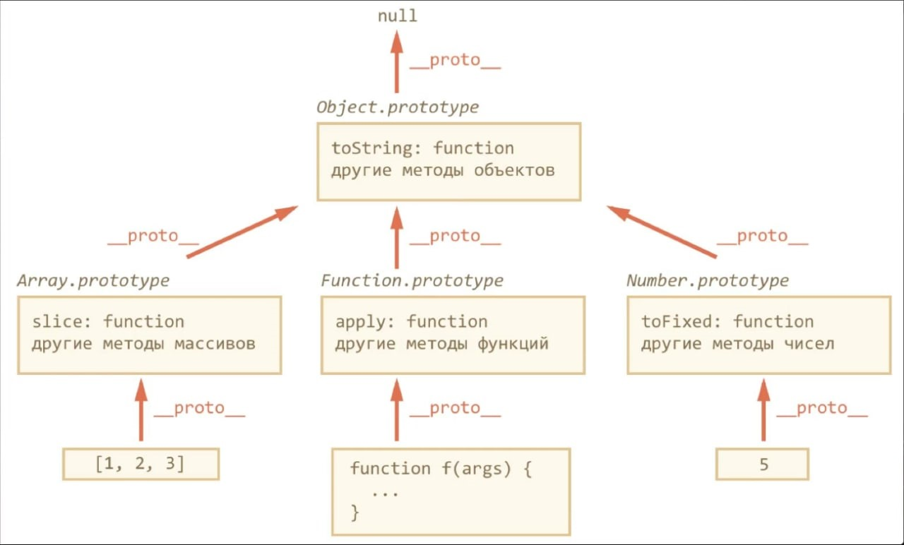

# JavaScript

- [Типы данных в JS](#type-data-in-js)
- [NaN](#nan)
- [Constructor or literal](#constructor-or-literal)
- [HasOwnProperty](#hasownproperty)
- [Use strict](#use-strict)
- [Выражения и инструкции](#expression-and-statement)
- [Cycle for in](#cycle-for-in)
- [Массивы](#array)
- [Function](#function)
- [Прототип](#prototype)
  
## Данные
### **`Type data in JS`**
#### Типы данных JS.

Примитивные type:
- `null` - null.
- `undefined` - undefined.
- `boolean` - true, false.
- `number` - 2020, 1.5, NaN, Infinity.
- `string` - 'Hello', "Hello".
- `symbol` - Symbol().
- `BigInt`

  Cсылочные type:
- `object` - { name: 'Sergey', age: 30 }
- `array` -  [1, 2, 3]
- `date`: new Date()

Особенности:
1. JS динамически типизированный язык.
2. Одна и та же переменная может хранить в себе любой тип данных.
3. Нам не нужно определять тип данных при создании переменных.
4. Если мы хотим использовать статическую типизацию мы можем использовать TypeScript.

> В JavaScript есть примитивные типы и ссылочные типы. 
Примитивные типы включают `number`, `string`, `boolean`, `null`, `undefined`. И ссылочные типы включают объекты, массивы и функции. 
Разница между этими типами заключается в том, что примитивные типы неизменяемы `immutable`, а ссылочные типы изменяемы `mutable`.

> Переменная, которой присвоен объект, хранит не сам объект, а его «адрес в памяти» – другими словами, «ссылку» на него.

Для проверки типов используется - `typeof`:
```JS
    console.log(typeof 42);
    // expected output: "number"
    console.log(typeof 'blubber');
    // expected output: "string"
    console.log(typeof true);
    // expected output: "boolean"
    console.log(typeof undeclaredVariable);
    // expected output: "undefined"
```
[Вернуться к началу статьи](#javascript)

---

### **`NaN`**

> `NaN` не равно ни одному значению, даже самому себе. 
Рекомендуемый способ проверить, содержит ли переменная `NaN` — использовать `Number.isNaN(value)`. 
Преобразование числовых строк в числа, в случае неудачи может дать `NaN`. 
Рекомендуется проверять, не возвращают ли `parseInt()`, `parseFloat()` или `Number()` NaN.
- `parseInt()` - принимает строку в качестве аргумента и возвращает целое число в соответствии с указанным основанием системы счисления.
- `parseFloat()` - принимает строку в качестве аргумента и возвращает десятичное число (число с плавающей точкой)

[Вернуться к началу статьи](#javascript)

---

### **`Constructor or literal`**
#### Что значит создавать переменную через конструктор или через литерал?

> В JS можно создать строковое значение двумя способами, используя литерал или используя конструктор, используя конструктор мы создаем именно объект, а используя литерал мы создаем просто переменную, это действительно важно.

```JS
    let str = 'Its my string';
    let anotherStr = new String('Its my another string');
```

Важно понимать, в каких ситуациях правильно пользоваться литералами, а в каких правильно создавать свои конструкторы
```JS
    let someObj = {};
    let someObj = 'string';
    let someObj = 123;
```
Вся строка в целом называется инструкцией

- `let` - это ключевое слово, определяющее переменную.
- `someObj` - идентификатор, т.е. имя конструкции, которую мы создаем.
- `=` - оператор присваивания.
- `{}, 'string', 123` - литералы.
- `{}` - литерал, который означает, что создается пустой объект.
- `'string'` - строковый литерал.

Один из способов создать объект - с помощью литерала:
```JS
    let user = {}; // создали пустой объект
    user.name = 'admin';
    user.getName = function () {
      return this.name;
    }
```

Есть и другой способ создания объекта: с помощью конструктора и ключевого слова `new`.
```JS
    let user3 = new Object(); // то же самое, что и {}, но на порядок больше кода
    user3.name = 'admin';
    user3.getName = function () {
      return this.name;
    }
```
> Первый вывод, который можно сделать: литералы стоит применять хотя бы потому, что объем кода при этом получается меньше, чем при использовании конструктора. 
В первую очередь это касается создания пустых объектов.
Но все-таки конструкторы - это системные объекты и некоторые из них тоже стоит использовать, например, конструктор Date(). 
Тем более, что с помощью литерала мы не сможем создать конструктор Date().
Кроме того, конструктор Object() может стать причиной неоднозначности вашего кода. 
На самом деле конструктор Object() является фабрикой и, в зависимости от входящего в него параметра, может полностью поменять принцип своего поведения.

Пользовательские конструкторы
```JS
    function User(name) {
      this.name = name;
      this.isMarred = false;
    
      this.SayHello = function() {
        console.log(`My name is`, this.name);
      }
    }
    
    const woman = new User('Kate');
    console.log(woman);
    console.log(woman.SayHello());
    
    const man = new User('Sergei');
    console.log(man.SayHello());
```

[Вернуться к началу статьи](#javascript)

---

### **`Dot notation or call in square brackets`**
#### Когда при обращении к свойству объекта стоит использовать точечную нотацию, а когда через строку в квадратных скобках?

#### `Литералы и свойства`

>При использовании литерального синтаксиса {...} мы сразу можем поместить в объект несколько свойств в виде пар «ключ: значение»:
```JS
  let user = {     // объект
    name: "John",  // под ключом "name" хранится значение "John"
    age: 30        // под ключом "age" хранится значение 30
  };

  // получаем свойства объекта:
  alert( user.name ); // John
  alert( user.age ); // 30
```
#### `Квадратные скобки`

> При использовании для доступа к свойствам квадратных скобок можно применять ключи, которые не являются действительными JavaScript-идентификаторами (например, ключ может быть строкой, содержащей пробелы). 
Они могут иметь любое значение, которое можно привести к строке:
```JS
let french = {};
  french["merci beaucoup"] = "thank you very much";
  french["merci beaucoup"]; //"thank you very much"
```

> При попытке обращения к несуществующему свойству объекта сообщения об ошибке не появится, но возвращено будет значение undefined:
```JS
  let obj = {
    message : "A message"
  }
  obj.message //"A message"
  obj["message"] //"A message"

  obj.otherProperty //undefined
```

[Вернуться к началу статьи](#javascript)

---

### **`HasOwnProperty`**

>JavaScript метод `hasOwnProperty(`) возвращает логическое значение, которое указывает на то, содержит ли объект указанное cобственное (не унаследованное) свойство, или метод.
Метод возвращает `true` в том случае, если объект имеет не унаследованное свойство с указанным именем и `false, если объект не имеет свойства с указанным именем или если это свойство он наследует от своего объекта прототипа.
Обращаю Ваше внимание, что в отличие от оператора in метод hasOwnProperty() не проверяет существование свойств в цепочке прототипов объекта.

`Глобальные переменные` – это такие, которые объявлены в глобальной области видимости. То есть вне блока, функции и модуля.
```JS
  // глобальная переменная сar
  let car = 'Audi';
```
`Локальные переменные` – это такие, которые объявлены в локальной области видимости. Например, внутри блока {...}:
```JS
  {
    // количество просмотров
    let totalViews = 10;
  }
  
  // Локальные переменные имеют локальную область действия, т.е. они не будут доступны за пределами той области, в которой объявлены:
  {
    let total = 10;
  }
  console.log(totalViews); // Uncaught ReferenceError: totalViews is not defined
  ```

[Вернуться к началу статьи](#javascript)

---

### **`Use strict`**
> На протяжении долгого времени JavaScript развивался без проблем с обратной совместимостью. Новые функции добавлялись в язык, в то время как старая функциональность не менялась.
Преимуществом данного подхода было то, что существующий код продолжал работать. 
А недостатком – что любая ошибка или несовершенное решение, принятое создателями JavaScript, застревали в языке навсегда.
Так было до 2009 года, когда появился ECMAScript 5 (ES5). 
Он добавил новые возможности в язык и изменил некоторые из существующих. 
Чтобы устаревший код работал, как и раньше, по умолчанию подобные изменения не применяются. 
Поэтому нам нужно явно их активировать с помощью специальной директивы: "use strict".

[Вернуться к началу статьи](#javascript)

---

## Выражения 
### **`Expression and statement`**
#### Выражения и инструкции

- `Выражение (англ. expression)` — это код, который после выполнения возвращает какое-либо значение. Например, 5 + 3 вернёт 8, а Math.random() — случайное число.
- `Инструкция (англ. statement)` — это отдельная команда в коде, которая выполняет определённое действие. Например, if позволяет создать ветвление в программе, for позволяет повторять одно и то же действие.

>Условный (тернарный) оператор - единственный оператор в JavaScript, принимающий три операнда: условие, за которым следует знак вопроса (?), затем выражение, которое выполняется, если условие истинно, сопровождается двоеточием (:), и, наконец, выражение, которое выполняется, если условие ложно.

[Вернуться к началу статьи](#javascript)

---

### **`Cycle for-in`**
> Цикл for...in возвращает все перечисляемые свойства, включая имеющие не целочисленные имена и наследуемые. 
Так как порядок прохода зависит от реализации, проход по массиву может не произойти в правильном порядке. 
Следовательно, лучше с числовыми индексами использовать циклы for.

Для массива:
- Будут перебираться не только индексы, но и другие свойства. Если вместо массива окажется массивоподобный объект, то может попасться свойство length.
- Если подключены полифилы для массивов (что весьма вероятно), в браузерах, не умеющих делать скрытые свойства, в перебор попадут все эти функции.
- Перебираются только индексы, которые есть в массиве. Если элемент массива удалялся через delete, либо добавление в массив происходило по индексу после его конца, то отсутствующие индексы будут пропущены. Но порядок перебираемых индексов будет верным.

```JS
  let a = [undefined, , 4];
  a[7] = undefined;
  
  for (var i in a) { // 0 2 7
    console.log(i);
  }
```
- Перебор массива через for in по производительности уступает нормальному циклу в десятки раз. 

#### `ES6`
- Для перебора элементов массива (значений, не индексов!) ES6 вводит цикл for of:

```JS
  let a = [undefined, , 4];
  a[7] = undefined;
  
  for (var x of a) {
    console.log(x);
  }
// 2 раза выводится undefined, затем 4 и ещё 5 раз undefined.
```

Проверяем, определена ли переменная в js?

```JS
  // Проверяют так
  if (typeof variable !== 'undefined') {
  // code
  }
  
  // Можно и так, ибо все глобальные переменные лежат в window
  if (window.variable !== void 0) {
  // code
  }
```

[Вернуться к началу статьи](#javascript)

---

## Массивы
### **`Array`**
Массив - упорядоченные коллекции данных. Особый подвид объектов. Копируется по ссылке.
5 способов создать массив в JavaScript

- С помощью литерала массива.
> `Литерал массива` — это список из нуля или более выражений, каждое из которых представляет элемент массива, заключенный в квадратные скобки ( [] ). Когда вы создаете массив, используя литерал массива, он инициализируется с помощью переданных значений, которые будут являться его элементами, длина массива будет равна числу переданных аргументов.

```
 [element0, element1, ..., elementN];
```
Можно указывать не все значения, пропущенные элементы будут иметь значение undefined
```JS
  const array = [0, ,2];
```

- Через конструктор Array()
```
  new Array(element0, element1[, ...[, elementN]])
  new Array(arrayLength)
```
```JS
  const array = new Array();
```
```JS
  // массив с инициализацией (в примере массив с двумя элементами. 
  // Значение первого элемента — 1, значение второго элемента — 2). 
  // Данная запись возможна только при числе элементов от двух.
  const array = new Array(1,2);
```
```JS
  // массив с заданной длинной, но не инициализированным(-и) значением(-ями). 
  // В данном примере длина массива (array.length) будет 3 элемента, значение элементов - undefined.
  const array = new Array(3);
```

- С помощью метода Array.of()
```
  Array.of(element0[, element1[, ...[, elementN]]])
```
Этот метода создаёт новый экземпляр массива Array из произвольного числа аргументов.

- Создание массива с помощью метода from()

> Функция Array.from() создаёт новый массив на основе переданного объекта. Объект должен быть либо массивоподобным (как строка или объект arguments), либо итерируемым (как Set или Map).

```JS
  // Массив из строки
  const arr = Array.from('дока')
  console.log(arr)
  // ['д', 'о', 'к', 'а']

  // Массив из Set
  const uniqueNumbers = new Set()
  uniqueNumbers.add(1)
  uniqueNumbers.add(2)
  uniqueNumbers.add(3)
  
  const arr = Array.from(uniqueNumbers)
  // [1, 2, 3]

  // Массив из NodeList
  const linkElements = document.getElementsByTagName('a')
  const arrLinks = Array.from(linkElements, function(a) { return a.href })

```
> Array.from() работает не со всеми объектами. Объект должен обладать одним из двух свойств, чтобы его получилось превратить в массив:
 - Элементы объекта проиндексированы и объект имеет свойство length. 
   Такие объекты называют массивоподобными, потому что именно эти свойства присущи массиву. 
   Этим свойством обладают объекты `arguments`, `NodeList`, `HTMLCollection`.
 - Объект итерируемый, то есть реализует интерфейс Iterable. Этим свойством обладают объекты Set и Map.

#### Взаимодействие с массивом
```JS
  const colors = ['red', 'green', 'grey', 'blue',];
  // shift - Удаляет из массива первый элемент и возвращает его
  const firstColor = colors.shift(); // 'red'

  // pop - Удаляет последний элемент из массива и возвращает его.
  const colors = ['red', 'green', 'grey', 'blue',];
  const color = colors.pop(); // 'blue'

  const names = ['John', 'Darina', 'Mark', 'Kris'];
  // Нам необходимо удалить из массива второй элемент.
  let name = names.splice(2, 1); // начиная со второго элемента удаляем один элемент
  console.log(names); // [ 'John', 'Darina', 'Kris' ]
  console.log(name); // [ 'Mark' ]
  
  let arr = ["t", "e", "s", "t"];
  // Он возвращает новый массив, в который копирует все элементы с индекса start до end
  console.log( arr.slice(1, 3) ); // e,s (копирует с 1 до 3)
  console.log( arr.slice(-2) ); // s,t (копирует с -2 до конца)
```
```JS
  const arr = ['Kety', {name: 'Sergei'}, false, function(){ console.log(`Hello`) },];
  arr[3](); // Вызов функции из массива
```

> В любой момент вы можете установить свойство `length` для обрезки массива. 
Когда вы расширяете массив, изменяя его свойство length, реальное количество элементов в массиве увеличивается; например, если вы установите свойство length в 3, когда оно равно 2, массив будет из 3 элементов, где значение третьего элемента будет равно undefined .
Способ обнуления длины массива - arr.length = 0 работает точно так же, как и splice, элементы остаются в памяти, пока сборщик мусора до них не дойдет.
```JS
  const a = [1, 2, 3];
  a[10] = 4; // установили длину в 10 и добавили еще один элемент [ 1, 2, 3, <7 empty items>, 4 ]
  a[10] = 5; // перезапишет предыдущие значение.

  console.log(a.length) // 11
  console.log(a) // [ 1, 2, 3, <7 empty items>, 5 ]

  let colors = ['синий', 'красный', 'желтый', 'белый', 'черный'];
  console.log(colors.length)  // выводит 5

  delete colors[0]; // удаляем первый элемент 'синий'.

  console.log(colors) // [ <1 empty item>, 'красный', 'желтый', 'белый', 'черный' ]
  console.log(colors.length)  // по-прежнему выводит 5, потому что максимальный индекс 4
```
#### Преобразование массива
- `map` - Можно создавать новые массивы и заносить их в новые переменные, служит для преобразования текушего массива в новый.
```JS
  const newPeople = people.map(person => {
    return `${person.name}: ${person.budget}`;
  });
```
- `filter` - Служит для фильтрации исходного массива по определенным условиям. 
По сути нужно чтобы callback вернул `true` или `false`. 
`true` записывается в новый массив.
```JS
  const adulstAll = people.filter(person => person.age < 21);
```
- `reduce` - Служит для получения финального значения совершив итерацию по какому-то массиву.
```JS
  const amount = people.reduce((total, person) => {
    return total += person.budget;
  }, 0);
```
- `forEach` - Служит для перебора массива и позволяет запускать функцию для каждого элемента массива, без изменения текущего и создания нового массива. 
```JS
  people.forEach(person => {
    person.city = 'kaluga';
  });
```
- `sort` - сортирует массив на месте, меняя в нём порядок элементов
```JS
  const arr = [1, 5, 47, 3, 37, 2, 7];
  arr.sort((a, b) => {return a - b}); // [1, 2, 3, 5, 7, 37, 47] Для корректной сотрировки
```
- `some` - Метод массива some() позволяет узнать, есть ли в массиве хотя бы один элемент, удовлетворяющий условию в функции-колбэке.
```JS
  const nums = [3, 5, 7, 8, 9, 11]
  const hasEvenNumber = nums.some(num => {
    return num % 2 === 0
  })
  console.log(hasEvenNumber) // true
```
- `every` - Метод массива `.every()` позволяет узнать, удовлетворяют ли все элементы в массиве условию в функции-колбэке. 
Результатом вызова метода `.every()` будет boolean-значение `true` или `false`. 
Если хотя бы один элемент не будет удовлетворять условию, то результат будет `false`.
```JS
  const users = [
  { name: 'Анна', online: true },
  { name: 'Михаил', online: true },
  { name: 'Саша', online: true },
]
  const isAllUsersOnline = users.every(user => {
    return user.online
  })
  console.log(isAllUsersOnline)// true
```
- `splip` - `split(", ")` разбивает строку на массив по заданному разделителю. Вызов `split("")` с пустым аргументом, разбил бы строку на массив букв.
```JS
  const names = "Kate, Sergei, Max";
  const arr = names.split(", ");
  console.log(arr) // ["Kate", "Sergei", "Max"]
```
- `join` - создаёт строку из элементов arr, по указанному разделителю `", "` между ними.
```JS
  const arr = ["Kate", "Sergei", "Max",];
  const newArr = arr.join("; ");
  console.log(newArr)  // Kate; Sergei; Max
```

[Вернуться к началу статьи](#javascript)

---

## Функции
### **`Function`**
#### Чистые функции (2 важные составляющие)
- Каждый раз функция возвращает одинаковый результат, когда она вызывается с тем же набором аргументов
- Нет побочных эффектов(Не влияет на окружающие переменные)

> В JavaScript функции являются объектами, поэтому, как и любой другой объект, функции можно создавать с помощью конструктора.
> Конструктор функции в JavaScript - это функция, которая используется для создания объектов функций. 
> Конструктор функции имеет свойство `prototype`, которое является объектом, содержащим свойства и методы, которые наследуются всеми экземплярами функции, созданными с помощью этого конструктора.

Пример создания объекта функции через конструктор:
```JS
  function MyFunction() {
    this.name = "My Function";
    this.sayHello = function() {
      console.log("Hello from " + this.name);
    }
  }

  const myFunc = new MyFunction();
  myFunc.sayHello();
```

> В JavaScript есть 4 основных способа вызова функций, которые задают контекст выполнения функции. Эти способы называются:

> `Вызов функции как функции`.
  Это самый простой способ вызова функции, который происходит, когда функция вызывается без контекста объекта. 
  В этом случае `this` будет ссылаться на глобальный объект, если функция не использует `use strict`, в противном случае - на `undefined.`
```JS
  function myFunction() {
    console.log(this);
  }

  myFunction(); // Выводит глобальный объект (window в браузере, global в Node.js)
```
> `Вызов функции как метода объекта`. Когда функция вызывается как метод объекта, `this` ссылается на этот объект. 
> `this` в конструкторах и классах ссылается на только что созданный новый объект.
```JS
  const myObject = {
    myMethod() {
      console.log(this);
    }
  };

  myObject.myMethod(); // Выводит объект myObject
```
> `Вызов функции с помощью метода call()`.
  Метод `call()` вызывает функцию с явно заданным значением this. 
  Первый аргумент метода `call()` - это объект, на который будет ссылаться `this`, а последующие аргументы - это аргументы, передаваемые в функцию.
```JS
  function myFunction(a, b) {
    console.log(this);
    console.log(a, b);
  }

  const myObject = { myProperty: 'myValue' };

  myFunction.call(myObject, 1, 2); // Выводит объект myObject, затем 1 и 2
```
> `Вызов функции с помощью метода apply()`.
  Метод `apply()` работает так же, как метод `call()`, за исключением того, что аргументы передаются в виде массива.
```JS
  function myFunction(a, b) {
    console.log(this);
    console.log(a, b);
  }

  const myObject = { myProperty: 'myValue' };

  myFunction.apply(myObject, [1, 2]); // Выводит объект myObject, затем 1 и 2
```
Каждый из этих способов определяет значение `this` внутри функции, которое зависит от контекста вызова функции.

> В обычном режиме (use strict не используется), значение this в этих случаях будет равно глобальному объекту. 
> Это связано с тем, что в обычном режиме JavaScript пытается автоматически привязать this к глобальному объекту в этих случаях, если он не является явно определенным. 
> Однако, в строгом режиме use strict, этот механизм привязки не работает, и this остается неопределенным, если он не был явно привязан к объекту.

#### Arguments
> В JavaScript есть специальный объект arguments, который содержит все аргументы, переданные в функцию, включая те, которые не были объявлены в параметрах функции. 
> Вы можете использовать объект arguments, чтобы получить доступ к этим аргументам.

Например, следующая функция принимает два аргумента, но может также принимать дополнительные аргументы, которые не объявлены:
```JS
  function myFunction(arg1, arg2) {
    console.log(arg1, arg2);

    // Перебираем дополнительные аргументы с помощью объекта arguments
    for (let i = 2; i < arguments.length; i++) {
      console.log(arguments[i]);
      console.log(arguments); // [Arguments] { '0': 'foo', '1': 'bar', '2': 'baz', '3': 'qux' }
    }
  }

  myFunction('foo', 'bar', 'baz', 'qux'); // Выводит "foo", "bar", "baz", "qux"
```
> В этом примере мы объявляем два параметра (arg1 и arg2), но затем мы используем объект arguments, чтобы получить доступ ко всем аргументам, начиная с индекса 2 (т.е. дополнительных аргументов). Мы можем перебирать эти аргументы с помощью цикла for и выполнять с ними любые операции, которые нам нужны.

> Обратите внимание, что объект arguments имеет некоторые ограничения, такие как отсутствие некоторых методов массивов, поэтому, если вам нужно выполнить сложные операции с аргументами, вам может потребоваться сконвертировать объект arguments в настоящий массив. Это можно сделать, например, с помощью следующего кода:
```JS
  const argsArray = Array.prototype.slice.call(arguments);
```
> Этот код преобразует объект arguments в настоящий массив с помощью метода slice() из прототипа массива.

#### Рекурсия
> `Рекурсия` - это техника программирования, при которой функция вызывает сама себя с некоторыми аргументами. В JavaScript, как и в других языках программирования, рекурсия может быть использована для решения ряда задач, таких как обход деревьев, поиск путей, сортировка, генерация перестановок и многих других

> Однако, при использовании рекурсии необходимо быть осторожным, так как она может привести к переполнению стека вызовов (stack overflow), особенно при обработке больших данных или при неправильном использовании.
```JS
  function factorial(n) {
    if (n <= 1) {
      return 1;
    }
    return n * factorial(n - 1);
  }

  console.log(factorial(5)); // Выводит 120

// Рекурсивный способ: упрощение задачи и вызов функцией самой себя:
  function powRec(x, n) {
    return (n == 1) ? x : (x * powRec(x, n - 1));
  }

  powRec(2, 3); // 8
```
> `Контекст выполнения` – специальная внутренняя структура данных,
> которая содержит информацию о вызове функции.
> Она включает в себя конкретное место в коде, на котором находится интерпретатор,
> локальные переменные функции,
> значение `this` (мы не используем его в данном примере) и прочую служебную информацию.

> Обратим внимание на требования к памяти!!!
> Рекурсия приводит к хранению всех данных для неоконченных внешних вызовов в стеке,
> и в данном случае это приводит к тому, что возведение в степень n хранит в памяти n различных контекстов.

#### Замыкание
> Замыкание – это функция, которая запоминает свои внешние переменные, то есть своё лексическое окружение и может получить к ним доступ.
> То есть, они автоматически запоминают, где были созданы, с помощью скрытого свойства [[Environment]] и все они могут получить доступ к внешним переменным.
> Лексическое окружение создаётся при выполнении блока кода и содержит локальные переменные для этого блока.
> Лексическое окружение существует для любых блоков кода {...}.
```JS
  function getUrl(url) {
	let domen = '.com';
	return function () {
      return `https://${url}${domen}`;
	};
  }
  let google = getUrl('google');
  let faceBook = getUrl('facebook');
  console.log(google()); // https://google.com
  console.log(faceBook()); // https://facebook.com
```
Замыкания могут быть полезны во многих ситуациях, например:

- Для создания приватных переменных и методов, которые не могут быть доступны извне функции.
- Для создания функций-фабрик, которые возвращают другие функции с предопределенными параметрами.
- Для создания функций высшего порядка (higher-order functions), которые принимают функции в качестве аргументов и/или возвращают функции в качестве результата.
- Для сохранения состояния между вызовами функции.
- Для решения задач, связанных с асинхронным выполнением кода, таких как обработка событий.

> Callback (функция обратного вызова) - это функция, которая передается в качестве аргумента в другую функцию и вызывается после завершения определенной операции. Это означает, что функция-колбэк будет выполнена после того, как функция, которой она была передана, завершит свою работу.
```JS
  // В этом примере функция fetchData принимает два аргумента: url и callback. 
  // Она загружает данные по указанному URL-адресу и передает их в функцию-колбэк, которая была передана в качестве аргумента. 
  // Функция displayData - это пример функции-колбэка, которая просто выводит данные в консоль
  function fetchData(url, callback) {
    fetch(url)
      .then(response => response.json())
      .then(data => callback(data))
      .catch(error => console.error(error));
  }

  function displayData(data) {
   console.log(data);
  } 

  fetchData('https://api.example.com/data', displayData);
```
> Колбэки могут быть использованы для обработки ошибок, событий, асинхронных операций, а также для реализации различных шаблонов проектирования, таких как наблюдатель (observer) и событийный эмиттер (event emitter). 
> Однако, излишнее использование колбэков может привести к созданию сложного и трудно поддерживаемого кода, поэтому следует оценивать, когда использование колбэков является наиболее удобным и эффективным решением.

[Вернуться к началу статьи](#javascript)

---

## Прототипы
### **`Prototype`**

> Функция-конструктор в JavaScript используется для создания новых объектов. 
> Она представляет собой особый тип функций, которые используются для создания объектов с определенными свойствами и методами.
> Для создания объекта с помощью функции-конструктора необходимо использовать ключевое слово “new”. Пример:
```JS
  function Person(name, age) {
    this.name = name;
    this.age = age;
    this.greet = function() {
      console.log(`Hello, my name is ${this.name} and I am ${this.age} years old.`);
    }
  }

  let john = new Person("John", 30);
  john.greet(); // выводит "Hello, my name is John and I am 30 years old."

  // Добавляем в его протопип новый метод
  Person.prototype.exit = function () {
    console.log(`Пользователь ${this.name} вышел`);
  };
```
> `[[prototype]]` `(__proto__)` и `function.prototype`.
> `Prototype` - свойство объектов, которое содержит свойство и методы своих родителей и родителей родителя. Prototype это объект(ссылка) содержащий все те же свойства и методы. Он есть у любого объекта.
> Оператор `instanceof` позволяет проверить, к какому классу принадлежит объект, с учётом наследования.
> JavaScript объекты имеют специальное скрытое свойство `[[Prototype]]` (так оно названо в спецификации), которое либо равно null, либо ссылается на другой объект. 
> Этот объект называется «прототип». Обратите внимание, что `proto` — не то же самое, что `[[Prototype]]`. 
> Это геттер/сеттер для него. Есть только два ограничения:
> Ссылки не могут идти по кругу. JavaScript выдает ошибку, если мы попытаемся назначить proto по кругу.



Методы объекта в JavaScript можно хранить как свойства в самом объекте, так и в его прототипе. Однако, хранение методов в прототипе объекта предпочтительнее из следующих причин:

- Экономия памяти: хранение методов в прототипе позволяет сократить объем занимаемой памяти на каждый новый экземпляр объекта. 
  Если методы хранятся в самом объекте, то каждый экземпляр будет иметь свою копию метода, что может привести к значительному расходу памяти, особенно если объект имеет много экземпляров.
- Упрощение обновления методов: если методы хранятся в прототипе объекта, то их можно обновлять для всех экземпляров одновременно, изменив только одну копию в прототипе. 
  Если методы хранятся в самом объекте, то для обновления каждого экземпляра придется изменять его копию метода.
- Улучшение производительности: при обращении к методу объекта JavaScript сначала ищет его в самом объекте, а затем производит поиск в прототипе объекта. 
  Если метод находится в прототипе объекта, то поиск выполняется быстрее, чем если метод хранится в самом объекте.

Поэтому, хранение методов объекта в прототипе является более эффективным и удобным способом. Кроме того, такой подход является основой для многих паттернов объектно-ориентированного программирования в JavaScript.

#### Создание объекта, который не от чего не наследуется

В JavaScript существует несколько способов создания объектов, которые не наследуются от никаких других, например:

1. С помощью `Object.create(null)`:
```JS
  const obj = Object.create(null);
```
> Метод `Object.create(null)` создает объект, который не наследуется от базового объекта Object.prototype, а, следовательно, не имеет свойств и методов, определенных в этом объекте.

2. С помощью функции-конструктора и Object.setPrototypeOf():
```JS
  function MyObject() {
   // ...
  }
  const obj = new MyObject();
  Object.setPrototypeOf(obj, null);
```
- `JavaScript` метод `setPrototypeOf()``ECMAScript 2015` позволяет установить или изменить прототип указанному объекту.
> С помощью функции-конструктора мы создаем объект `MyObject`. 
> Затем мы устанавливаем прототип объекта `obj`, созданного с помощью этой функции-конструктора, `равным null`, используя метод `Object.setPrototypeOf()`. 
> Такой объект не наследуется от базового объекта `Object.prototype`.

3. С помощью литеральной нотации и Object.setPrototypeOf():
```JS
  const obj = { /* свойства и методы */ };
  Object.setPrototypeOf(obj, null);
```
> Мы создаем объект с помощью литеральной нотации, а затем используем метод `Object.setPrototypeOf()` для установки прототипа равным `null`.

В любом из этих случаев создается объект, который не наследуется от базовых объектов и не имеет свойств и методов, определенных в них. Такой объект называется “чистым объектом”.

#### Наследование в JS

1. Прототипное наследование: объект наследует свойства и методы от своего прототипа. Прототип объекта является объектом с определенным набором свойств и методов, которые могут наследоваться на экземпляры этого объекта.
```JS
    function Animal(name) {
      this.name = name;
    }
    
    Animal.prototype.sayName = function() {
      console.log(`My name is ${this.name}`);
    }
    
    function Cat(name) {
      Animal.call(this, name);
    }
    
    Cat.prototype = Object.create(Animal.prototype);
    Cat.prototype.constructor = Cat;
    
    let myCat = new Cat("Lucy");
    myCat.sayName(); // "My name is Lucy"
    // В этом примере объект Cat наследует свойства и методы от Animal, 
    // устанавливая объект Animal в качестве его прототипа и добавляя собственные свойства.
```
2. Классическое наследование: использование ключевого слова extends появилось в ECMAScript 6 и дает возможность явно наследовать классы друг от друга.
```JS
    class Animal {
      constructor(name) {
        this.name = name;
      }
    
      sayName() {
        console.log(`My name is ${this.name}`);
      }
    }
    
    class Cat extends Animal {
      speak() {
        console.log("Meow!");
      }
    }
    
    let myCat = new Cat("Lucy");
    myCat.sayName(); // "My name is Lucy"
    myCat.speak(); // "Meow!"
```
3. Миксины: это способ объединения свойств и методов из нескольких объектов в один. Создается объект, который наследуется и объединяет свойства и методы из двух или более других объектов.
```JS
    let speakMixin = {
      speak() {
        console.log(`${this.name} говорит`);
      }
    };
    
    class Person {
      constructor(name) {
        this.name = name;
      }
    }
    
    Object.assign(Person.prototype, speakMixin);
    
    let person = new Person("John");
    person.speak(); // "John говорит"
  // В этом примере объект speakMixin содержит метод speak, который добавляется к объекту Person с помощью Object.assign.
```
- `JavaScript` метод `assign()``ECMAScript 2015` позволяет произвести поверхностное копирование значений всех перечислимых собственных свойств и методов из одного или нескольких исходных объектов в целевой объект

4. Функциональное наследование: используется создание объекта внутри функции с помощью замыкания. Функция возвращает объект с определенными свойствами и методами, которые могут быть унаследованы.
```JS
    function makePerson(name) {
      let person = {};
      person.name = name;
      person.speak = function() {
        console.log(`${this.name} говорит`);
      }
      return person;
    }
    
    let person = makePerson("John");
    person.speak(); // "John говорит"
```

[Вернуться к началу статьи](#javascript)

---


