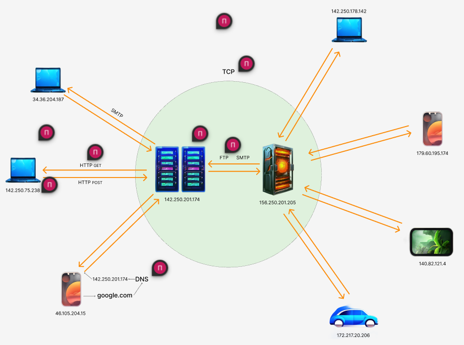

# WEB

- [HTTP](#http)
- [Cookie & Token](#cookie-token)
- [REST](#rest)
- [Что такое SOP?](#sop)
- [Что такое CORS?](#cors)
- [JSONP](#jsonp)

> `Website` (веб-сайт) - совокупность веб-страниц с повторяющимся дизайном,
> объединенных по смыслу, навигационно и физически находящихся на одном веб-сервере.
> Web - в целом можно понимать как всё Интернет-пространство, состоящее из кучи веб-сайтов.
> Мне кажется, это слово web является огрызком целого словосочетания - `World Wide Web (WWW)`, т.е. "всемирная паутина".
> Сейчас под `WWW` понимается весь интернет, хотя на самом деле это только часть сети, в которой использованы специальная группа стандартов, протоколов, т.к. существуют и другие стандарты.

## Основные понятия

`Cессия` - Обычно под сессией понимается «последовательность запросов, сделанных одним конечным пользователем во время посещения определённого сайта»

`CSRF` — Вид атак на посетителей веб-сайтов, использующий недостатки протокола HTTP. Если жертва заходит на сайт, созданный злоумышленником, от её лица тайно отправляется запрос на другой сервер, осуществляющий некую вредоносную операцию.

`Cache-Control` - Это HTTP-заголовок, который определяет количество времени и способ htaccess кэширования файла: Большинство современных сайтов используют Cache-Control для управления кэшированием браузеров.

`Headers` - Заголовки HTTP являются основной частью HTTP-запросов и ответов, и они несут информацию о браузере клиента, запрошенной странице, сервере и многом другом.

Все заголовки разделяются на четыре основных группы:

1. `General Headers (рус.Общие заголовки)` — используются в запросах и ответах.
2. `Request Headers (рус.Заголовки запроса)` — используются только в запросах.
3. `Response Headers (рус.Заголовки ответа)` — используются только в ответах.
4. `Entity Headers (рус.Заголовки сущности)` — сопровождают каждую сущность сообщения. Используются в запросах и ответах.

`Access-Control-* заголовки (Access-Control-Allow-*)` позволяют серверу указать разрешенные параметры доступа к ресурсам в ответе на запросы с других источников. Некоторые распространенные заголовки Access-Control- включают:

- `Access-Control-Allow-Origin`: указывает домены, которым разрешен доступ к ресурсам.
- `Access-Control-Allow-Methods`: указывает разрешенные HTTP-методы для основного запроса.
- `Access-Control-Allow-Headers`: указывает разрешенные заголовки для основного запроса.
- `Access-Control-Allow-Credentials`: указывает, разрешается ли передавать учетные данные (креденшиалы) при основном запросе.

> Заголовки Access-Control-\* важны для установления политики доступа и обеспечения безопасности при выполнении CORS-запросов.

[Вернуться к началу статьи](#web)

---

## HTTP

> `HTTP` — протокол передачи данных, изначально предназначенный для передачи гипертекстовых документов. Аббревиатура HTTP расшифровывается как `HyperText Transfer Protocol`, «протокол передачи гипертекста». В соответствии со спецификацией OSI, HTTP является протоколом прикладного (верхнего, 7-го) уровня.Протокол HTTP предполагает использование клиент-серверной структуры передачи данных.

> `TCP/IP` – это протокол `Transmission Control Protocol` и `Internet Protocol`. Набор правил, входящий в него, позволяет обрабатывать передачу данных и другие детали этого механизма. Сюда входит формирование пакетов, способ их отправки, получения, маршрутизации, распаковки для передачи программному обеспечению.

> `DNS` (англ. Domain Name System «система доменных имён») — компьютерная распределённая система для получения информации о доменах. Чаще всего используется для получения IP-адреса по имени хоста (компьютера или устройства),

## Виды запросов HTTP.

`HTTP` определяет множество методов запроса, которые указывают, какое желаемое действие выполнится для данного ресурса.

`GET` - запрашивает представление ресурса. Запросы с использованием этого метода могут только извлекать данные.

`HEAD` - запрашивает ресурс так же, как и метод GET, но без тела ответа.

`POST` - используется для отправки сущностей к определённому ресурсу. Часто вызывает изменение состояния или какие-то побочные эффекты на сервере.

`PUT` - заменяет все текущие представления ресурса данными запроса.

`DELETE` - удаляет указанный ресурс.

`CONNECT` - устанавливает "туннель" к серверу, определённому по ресурсу.

`OPTIONS` - используется для описания параметров соединения с ресурсом.

`TRACE` - выполняет вызов возвращаемого тестового сообщения с ресурса.

`PATCH` - используется для частичного изменения ресурса.

`Preflight request` - это дополнительный HTTP OPTIONS запрос, отправляемый браузером перед основным запросом (например, запросом типа GET или POST) при выполнении CORS-запросов с определенными параметрами.

1. Зачем нужен preflight request?

- Preflight request используется для проверки, разрешает ли сервер кросс-доменный запрос с определенными параметрами. Он предотвращает нарушение безопасности, обеспечивая серверу возможность принять или отклонить основной запрос на основе предварительной проверки.

2. Какие запросы требуют preflight request?
   Preflight request требуется в следующих случаях:

- Если основной запрос является запросом метода, отличного от GET, POST или HEAD.
- Если основной запрос содержит определенные заголовки (например, заголовок Content-Type), которые могут вызывать ситуации CORS-проблем.

3. Что содержится в preflight request?
   Preflight request содержит следующую информацию:

- HTTP метод и URL основного запроса.
- Заголовки основного запроса.
- Информацию о том, поддерживает ли браузер кросс-доменные запросы, используя заголовок "Origin".

4. Как на него отвечает сервер?

- Сервер должен обрабатывать preflight request и отправлять ответ с заголовками Access-Control-Allow-\* для указания того, разрешается ли основной запрос. Если сервер отвечает положительно (с разрешающими заголовками), то основной запрос отправляется браузером. Если сервер отвечает отрицательно (с ограничивающими заголовками), то браузер блокирует основной запрос и возвращает ошибку.

[Вернуться к началу статьи](#web)

---

## Cookie Token.

Одно из отличий заключается в том, что файлы `cookie` предназначены для отправки и хранения произвольных данных, тогда как токены-носители предназначены специально для отправки данных авторизации.

[Вернуться к началу статьи](#web)

---

## REST

## REST - основные принципы.

`REST API` — это прикладной программный интерфейс (API), который использует `HTTP-запросы` для получения, извлечения, размещения и удаления данных.
Аббревиатура `REST` в контексте API расшифровывается как `«передача состояния представления» (Representational State Transfer)`.

Принципы `REST API` определены его создателем Роем Филдингом.
Основные из них:
• единый интерфейс;
• разграничение клиента и сервера;
• нет сохранения состояния;
• кэширование всегда разрешено;
• многоуровневая система;
• код предоставляется по запросу.

[Вернуться к началу статьи](#web)

---

## Принцип Stateless (без состояния).

Каждый запрос от клиента к серверу должен содержать в себе всю необходимую информацию и не может полагаться на какое-либо состояние, хранящееся на стороне сервера. Таким образом, информация о текущей сессии должна целиком храниться у клиента.

[Вернуться к началу статьи](#web)

---

## SOP

## Что такое SOP?

> `Same-origin policy` (SOP) это политика безопасности, применяемая в веб-браузерах, которая ограничивает взаимодействие между документами с разных источников, как только они находятся в разных источниках (доменах), протоколах или портах. Главная цель SOP заключается в предотвращении несанкционированного доступа к информации и защите пользователя от кросс-сайт скриптинга (XSS) и других атак.

- Ограничения SOP важны для обеспечения безопасности веб-приложений. Применение этой политики уменьшает возможности злоумышленников получить доступ к конфиденциальным данным, хранящимся на других веб-сайтах, и ограничивает выполнение вредоносного кода с помощью скриптов, загружаемых с внешних ресурсов.

- Хотя обход ограничений SOP возможен, это повышает риск уязвимостей и потенциального взлома. Такие методы обхода могут включать использование JSONP (JSON с обратным вызовом), кросс-доменных запросов (CORS), использование серверных прокси и других техник. Однако, рекомендуется быть осторожными с использованием таких методов обхода, поскольку они могут нарушить защиту пользователей и повысить уязвимость системы к атакам.

> ❗️ Важно помнить, что обход ограничений SOP может быть незаконным или противоречить политикам безопасности. Поэтому всегда рекомендуется следовать лучшим практикам и руководствам безопасности при разработке и использовании веб-приложений.

[Вернуться к началу статьи](#web)

---

## CORS

> `CORS (Cross-Origin Resource Sharing)` - это механизм, который позволяет веб-браузерам обмениваться данными между разными источниками (доменами). Он служит для преодоления ограничений Same Origin Policy (SOP), которые запрещают запросы ресурсов с других доменов.

Вот несколько причин, почему CORS полезен:

- Разделение ресурсов: CORS позволяет веб-страницам загружать ресурсы (например, изображения, стили, скрипты, API-запросы) с других доменов. Это полезно, когда вы хотите использовать сторонние сервисы или внешние ресурсы для обогащения ваших веб-страниц.

- API-вызовы: С использованием CORS вы можете делать AJAX-запросы к API с разных доменов. Например, ваш веб-сайт, размещенный на домене example.com, может безопасно вызывать API, размещенное на domain.com.

- Безопасность: CORS применяет политики доступа, контролирует, какие домены имеют разрешение на доступ к ресурсам, и какие запросы разрешены. Это помогает предотвратить несанкционированный доступ к данным и защитить пользователей от атак, таких как кросс-сайт скриптинг (XSS) и кража информации.

- CORS представляет собой мощный механизм, который улучшает безопасность и расширяет возможности веб-приложений, позволяя им взаимодействовать с ресурсами с других доменов.

[Вернуться к началу статьи](#web)

---

## JSONP

> JSONP (JSON with Padding) - это метод отправки данных между доменами при использовании AJAX. Он обеспечивает возможность обойти политику безопасности браузера, которая обычно запрещает выполнение запросов на другой домен.

Зачем нужен JSONP?

> JSONP используется для выполнения кросс-доменных запросов из JavaScript кода в браузере. Обычно браузеры запрещают отправку запросов на другой домен, чтобы предотвратить возможность злоумышленников выполнять запросы от имени пользователя без его согласия. Однако, с помощью JSONP можно отправлять запросы на другой домен, так как он работает по принципу загрузки скрипта.

> JSONP достигается путем включения скрипта на удаленном сервере, который возвращает данные, обернутые в вызов функции. Браузер загружает скрипт с другого домена и выполняет его, передавая данные обратно в код на странице через вызов заданной функции. Это позволяет получать данные с других доменов и использовать их внутри страницы.

> JSONP особенно полезен, когда вам нужно получить данные с удаленного сервера, не поддерживающего CORS или других методов кросс-доменных запросов. Он обеспечивает простое и гибкое решение для обмена данными между доменами при использовании JavaScript.

Однако, следует отметить, что JSONP имеет некоторые ограничения:

> Он работает только с использованием метода GET, поскольку скрипты загружаются через тег `<script>`, а не с помощью XHR-запросов.
> Нет встроенной поддержки обработки ошибок, поскольку JSONP использует механизм загрузки скрипта, который просто выполняет код без отчетов о возникающих ошибках.
> В современных веб-приложениях применяются альтернативные методы, такие как CORS (Cross-Origin Resource Sharing), которые обладают большей гибкостью и безопасностью. Но JSONP все еще может быть полезен в некоторых контекстах, особенно при работе с старыми системами или ограниченными API.

[Вернуться к началу статьи](#web)

---
